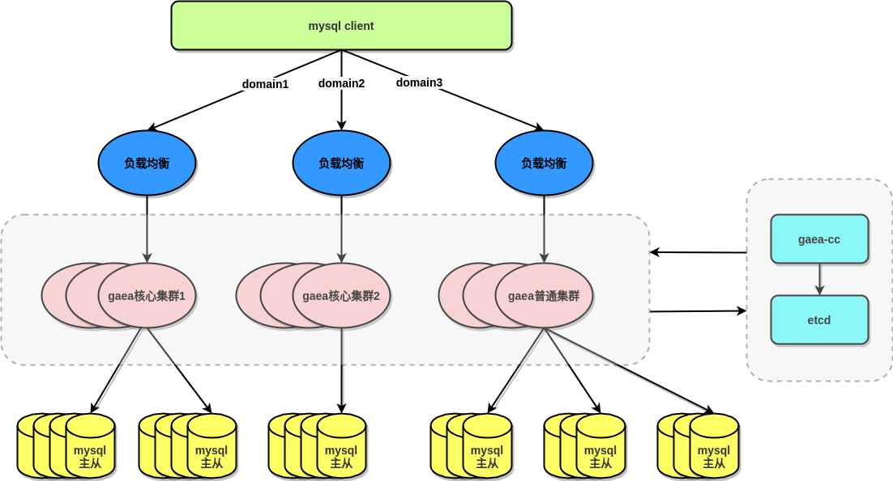

## 简介

Gaea是小米中国区电商研发部研发的基于mysql协议的数据库中间件，目前在小米商城大陆和海外得到广泛使用，包括订单、社区、活动等多个业务。Gaea支持分库分表、sql路由、读写分离等基本特性，更多详细功能可以参照下面的功能列表。其中分库分表方案兼容了mycat和kingshard两个项目的路由方式。Gaea在设计、实现阶段参照了mycat、kingshard和vitess，并使用tidb parser作为内置的sql parser，在此表达诚挚感谢。为了方便使用和学习Gaea，我们也提供了详细的使用和设计文档，也欢迎大家多多参与。

## 功能列表

#### 基础功能

- 多集群
- 多租户
- SQL透明转发
- 慢SQL指纹
- 错误SQL指纹
- 注解路由
- 慢日志
- 读写分离，从库负载均衡
- 自定义SQL拦截与过滤
- 连接池
- 配置热加载
- IP/IP段白名单
- 全局序列号

#### 分库、分表功能

- 分库: 支持mycat分库方式
- 分表: 支持kingshard分表方式
- 聚合函数: 支持max、min、sum、count、group by、order by等
- join: 支持分片表和全局表的join、支持多个分片表但是路由规则相同的join

## 架构图

## 集群部署图  

  

如上图所示, 部署一套gaea-cc和etcd可用来管理多套gaea集群, 负责集群内namespace配置的增删改查.
[gaea-cc的HTTP接口文档](docs/gaea-cc.md)

## 安装使用

- [快速入门](docs/quickstart.md)
- [配置说明](docs/configuration.md)
- [监控配置说明](docs/grafana.md)
- [全局序列号配置说明](docs/sequence-id.md)
- [基本概念](docs/concepts.md)
- [SQL兼容性](docs/compatibility.md)
- [FAQ](docs/faq.md)

## 设计与实现

- [整体架构](docs/architecture.md)
- [多租户的设计与实现](docs/multi-tenant.md)
- [gaea配置热加载设计与实现](docs/config-reloading.md)
- [gaea proxy后端连接池的设计与实现](docs/connection-pool.md)
- [prepare的设计与实现](docs/prepare.md)

## Roadmap

- [x] 支持配置加密存储，开关
- [ ] 支持执行计划缓存
- [ ] 支持事务追踪
- [ ] 支持二级索引
- [ ] 支持分布式事务
- [ ] 支持平滑的扩容、缩容
- [ ] 后端连接池优化 (按照请求时间排队)

## 自有开发模块

- backend  
- cmd  
- log  
- models  
- proxy/plan  
- proxy/router(kingshard路由方式源自kingshard项目本身)  
- proxy/sequence
- server  

## 外部模块

- mysql(google vitess、tidb、kingshard都有引入)  
- parser(tidb)  
- stats(google vitess，打点统计)  
- util(混合)

## 社区

### gitter

### 钉钉

