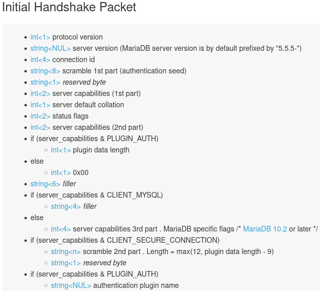
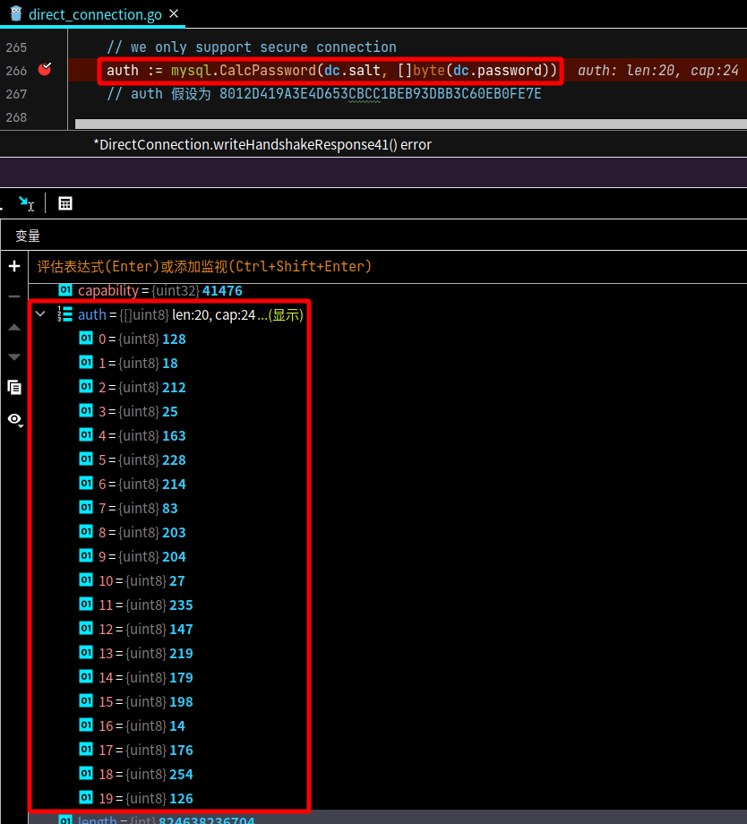
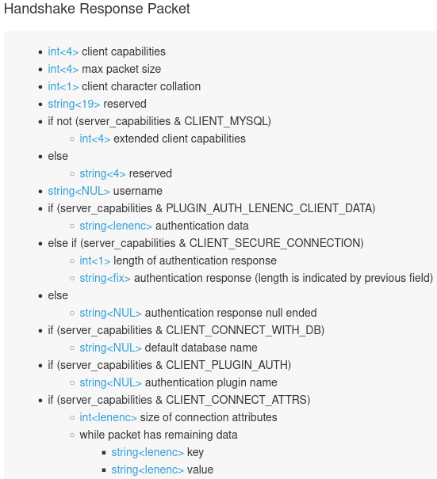
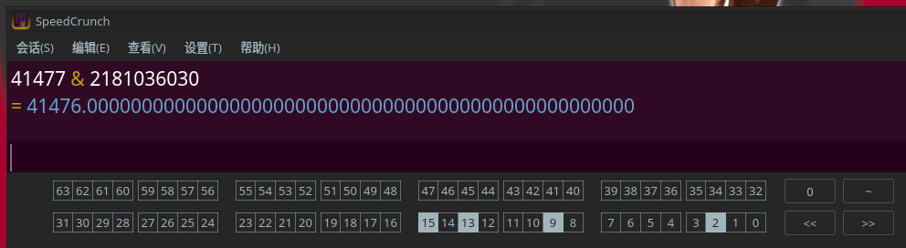
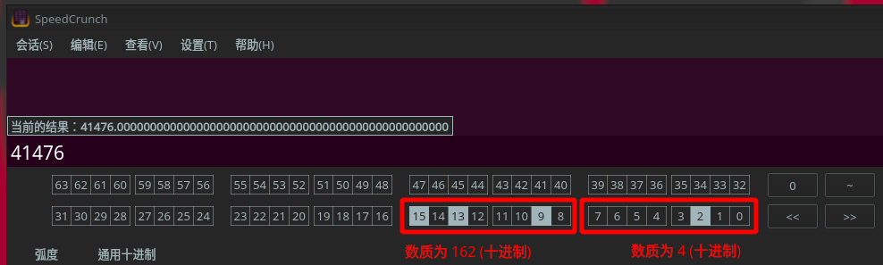
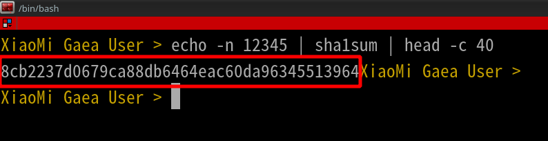
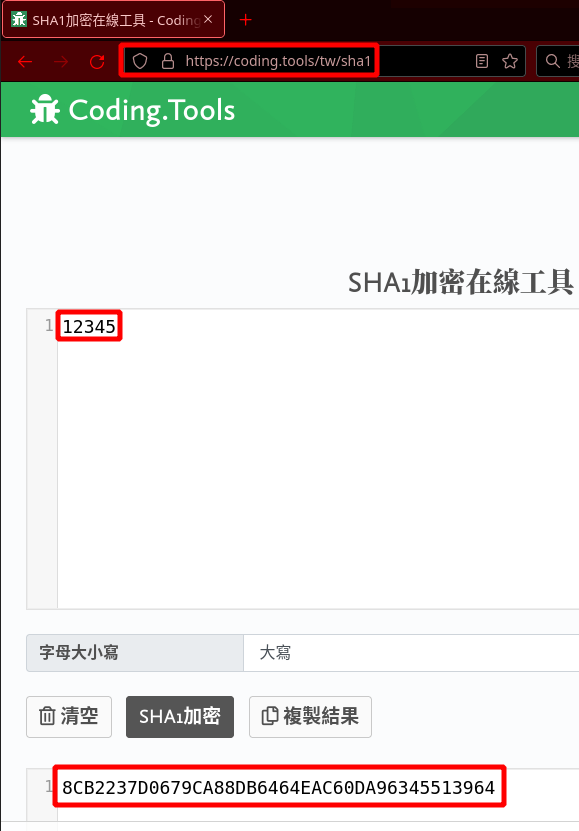
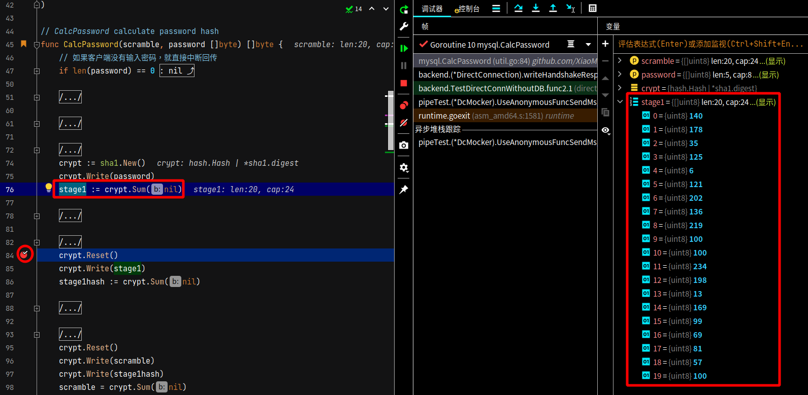

# backend 包的直连 direct_connection

## 代码说明

### 第一步 初始交握，传送讯息方向为 MariaDB 至 Gaea

参考 [官方文档](https://mariadb.com/kb/en/connection/) ，有以下内容

 

根据官方文档，使用范例说明

| 内容                            | 演示范例                                                     |
| ------------------------------- | ------------------------------------------------------------ |
| int<1> protocol version         | 协定 Protocol 版本为 10                                      |
| string<NUL> server version      | 数据库的版本号 version 为<br /><br />[]uint8{<br />53, 46, 53, 46, 53,<br />45, 49, 48, 46, 53,<br />46, 49, 50, 45, 77,<br />97, 114, 105, 97, 68,<br />66, 45, 108, 111, 103<br />}<br /><br />对照 ASCII 表为<br />5.5.5-10.5.12-MariaDB-log |
| int<4> connection id            | 连接编号为<br /><br />[]uint8{16, 0, 0, 0}<br />先反向排列为 []uint8{0, 0, 0, 16}<br /><br />最后求得的连接编号为 []uint32{16} |
| string<8> scramble 1st part     | 第一部份的 Scramble，Scramble 总共需要组成 20 bytes，<br />第一个部份共 8 bytes，其值为 []uint8{81, 64, 43, 85, 76, 90, 97, 91} |
| string<1> reserved byte         | 数值为 0                                                     |
| int<2> server capabilities      | 第一部份的功能标志 capability，数值为 []uint8{254, 247}      |
| int<1> server default collation | 数据库编码 charset 为 33，经<br />以下文 [文档](https://mariadb.com/kb/en/supported-character-sets-and-collations/) 查询<br />或者是 命令 SHOW CHARACTER SET LIKE 'utf8'; 查询，<br />charset 的数值为 utf8_general_ci |
| int<2> status flags             | 服务器状态为 []uint8{2, 0}<br />进行反向排列为[]uint8{0, 2}，再转成二进制为<br />[]uint{0b000000000, 0b00000010}.<br /><br />对照 Gaea/mysql/constants.go 后，得知目前服务器的状况为<br />Autocommit (ServerStatusAutocommit) |
| int<2> server capabilities      | 延伸的功能标志 capability，数值为 []uint8{255, 129}.         |

先对 功能标志 capability 进行计算

```
先把所有的功能标志 capability 的数据收集起来，包含延伸部份

数值分别为 []uint8{254, 247, 255, 129}
并反向排列
数值分别为 []uint8{129, 255, 247, 254}
全部 十进制 转成 二进制，为 []uint8{10000001, 11111111, 11110111, 11111110} (转成十进制数值为 2181036030)

再用 [文档](https://mariadb.com/kb/en/connection/) 进行对照
比如，功能标志 capability 的第一个值为 0，意思为 CLIENT_MYSQL 值为 0，代表是由服务器发出的讯息
```

接续上表

| 项目 | 内容                                                         |
| ---- | ------------------------------------------------------------ |
| 公式 | if (server_capabilities & PLUGIN_AUTH)<br/>    int<1> plugin data length <br/>else<br/>    int<1> 0x00 |
| 范例 | 跳过 1 个 byte                                               |

接续上表

| 项目 | 内容             |
| ---- | ---------------- |
| 公式 | string<6> filler |
| 范例 | 跳过 6 个 bytes  |

接续上表

| 项目 | 内容                                                         |
| ---- | ------------------------------------------------------------ |
| 公式 | if (server_capabilities & CLIENT_MYSQL)<br/>    string<4> filler <br/>else<br/>    int<4> server capabilities 3rd part .<br />    MariaDB specific flags /* MariaDB 10.2 or later */ |
| 范例 | 跳过 4 个 bytes                                              |

接续上表

| 项目 | 内容                                                         |
| ---- | ------------------------------------------------------------ |
| 公式 | if (server_capabilities & CLIENT_SECURE_CONNECTION)<br/>    string<n> scramble 2nd part . Length = max(12, plugin data length - 9)<br/>    string<1> reserved byte |
| 范例 | scramble 一共要 20 个 bytes，第一部份共 8 bytes，所以第二部份共有 20 - 8 = 12 bytes，该数值为 []uint8{34, 53, 36, 85, 93, 86, 117, 105, 49, 87, 65, 125} |

接续上表

| 项目 | 内容                                                         |
| ---- | ------------------------------------------------------------ |
| 公式 | if (server_capabilities & PLUGIN_AUTH)<br/>    string<NUL> authentication plugin name |
| 范例 | 之后的资料都不使用                                           |

合拼所有 Scramble 的资料

```
第一部份 Scramble 为 []uint8{81, 64, 43, 85, 76, 90, 97, 91}
第二部份 Scramble 为 []uint8{34, 53, 36, 85, 93, 86, 117, 105, 49, 87, 65, 125}

两部份 Scramble 合拼后为 []uint8{81, 64, 43, 85, 76, 90, 97, 91, 34, 53, 36, 85, 93, 86, 117, 105, 49, 87, 65, 125}
```

### 第二步 计算用于验证密码的验证码 Auth

参考 [官方文档](https://dev.mysql.com/doc/internals/en/secure-password-authentication.html) ，有整个完整验证码的计算公式说明

验证码的公式如下

```
SHA1( 密码 ) XOR SHA1( "服务器所提供的乱数" <接合> SHA1( SHA1( 密码 ) ) )
    其中
    stage1 = SHA1( 密码 )
    stage1Hash = SHA1( stage1 ) = SHA1( SHA1( 密码 ) )
    scramble = SHA1( scramble <接合> SHA1( stage1Hash ) ) // 第一次修改 scramble 的数值
    scramble = stage1 XOR scramble // 第二次修改 scramble 的数值
```

假设

- 输入密码参数 password 为 12345
- 数据库服务器回传的乱数 scramble为 []uint8{81, 64, 43, 85, 76, 90, 97, 91, 34, 53, 36, 85, 93, 86, 117, 105, 49, 87, 65, 125}，这是用十进位的方式来表示
  如果用十六进位来表示的数值为 []uint8{51, 40, 2B, 55, 4c, 5a, 61, 5b, 22, 35, 24, 55, 5d, 56,  75,  69, 31, 57, 41,  7d}，显示的数值为 51402B554c5A615b223524555d5675693157417d

计算 stage1 为 stage1 = SHA1( 密码 )，使用 bash 进行计算

```bash
# 使用 Linux Bash 去计算和验证 stage1
$ echo -n 12345 | sha1sum | head -c 40 # 把 密码 12345 转成 stage1
8cb2237d0679ca88db6464eac60da96345513964 # 此为 stage1 的值
```

计算 stage1Hash 的数值，公式为 stage1Hash = SHA1( stage1 ) = SHA1( SHA1( 密码 ) )

```bash
# 使用 Linux Bash 去计算和验证 stage1Hash

$ echo -n 12345 | sha1sum | xxd -r -p | sha1sum | head -c 40
00a51f3f48415c7d4e8908980d443c29c69b60c9 # 此为 stage1hash 的值

$ echo -n 8cb2237d0679ca88db6464eac60da96345513964 | xxd -r -p | sha1sum | head -c 40
00a51f3f48415c7d4e8908980d443c29c69b60c9 # 此为 stage1hash 的值
```

计算 "服务器所提供的乱数" 和 SHA1( SHA1( 密码 ) ) 的接合值

```bash
# scramble 的值为 51402B554c5A615b223524555d5675693157417d，为连接的前半段
# stage1Hash 的值为 00a51f3f48415c7d4e8908980d443c29c69b60c9，为连接的后半段

# 计算 "服务器所提供的乱数" <接合> SHA1( SHA1( 密码 ) ) 的接合值
$ echo -n 51402B554c5A615b223524555d5675693157417d 00a51f3f48415c7d4e8908980d443c29c69b60c9 |  sed "s/ //g"
51402B554c5A615b223524555d5675693157417d00a51f3f48415c7d4e8908980d443c29c69b60c9 # 合拼后的接合值
```

计算第一次重写的 scramble，公式为

scramble = SHA1( 接合值) = SHA1( scramble <接合> SHA1( stage1Hash ) )

```bash
# 使用 Linux Bash 去计算和验证 第一次重写 scramble
$ echo -n 51402B554c5A615b223524555d5675693157417d00a51f3f48415c7d4e8908980d443c29c69b60c9 | xxd -r -p | sha1sum | head -c 40
0ca0f764a59d1cdb10a87f0155d61aa54be1c71a # 此为第一次修改的 scramble
```

计算第二次重写的 scramble，公式为 scramble = stage1 XOR scramble

```bash
# 使用 Linux Bash 去计算和验证 第二次重写 scramble
$ stage1=0x8cb2237d0679ca88db6464eac60da96345513964 # 之前计算出来的 stage1 的数值
$ scramble=0x0ca0f764a59d1cdb10a87f0155d61aa54be1c71a # 第一次修改 scramble 的数值
$ echo $(( $stage1^$scramble ))
-7792437067003134338 # 错误答案，精度不足

$ stage1=0x8cb2237d0679ca88db6464eac60da96345513964
$ scramble=0x0ca0f764a59d1cdb10a87f0155d61aa54be1c71a
$ printf "0x%X" $(( (($stage1>>40)) ^ (($scrambleFirst>>40)) ))
0xFFFFFFFFFF93DBB3 # 错误答案，精度不足

# stage1 和 第一次修改的 scramble 分成四段执行 XOR
$ printf "0x%X" $(( ((0x8cb2237d06)) ^ ((0x0ca0f764a5)) ))
$ printf "%X" $(( ((0x79ca88db64)) ^ ((0x9d1cdb10a8)) ))
$ printf "%X" $(( ((0x64eac60da9)) ^ ((0x7f0155d61a)) ))
$ printf "%X" $(( ((0x6345513964)) ^ ((0xa54be1c71a)) ))
0x8012D419A3E4D653CBCC1BEB93DBB3C60EB0FE7E # 正确答案

# scramble 为 []uint8{ 80, 12,  D4, 19,  A3,  E4,  D6, 53,  CB,  CC, 1B,  EB,  93,  DB,  B3,  C6, 0E,  B0,  FE,  7E} // 十六进位
# 用十进位表示为
# scramble 为 []uint8{128, 18, 212, 25, 163, 228, 214, 83, 203, 204, 27, 235, 147, 219, 179, 198, 14, 176, 254, 126} // 十进位 (跟代码产出的答案相同)
```

下图为代码执行的结果，结果和用 Bash 推算的相同

 

### 第三步 回应交握，传送讯息方向为 Gaea 至 MariaDB

参考 [官方文档](https://mariadb.com/kb/en/connection/) ，有以下内容

 

根据官方文档，使用范例说明，先对 Gaea 要处理的功能标志 capability 进行计算，

| capability 项目              | 二进位             | 十进位 |
| ---------------------------- | ------------------ | ------ |
| mysql.ClientProtocol41       | 0b0000001000000000 | 512    |
| mysql.ClientSecureConnection | 0b1000000000000000 | 32768  |
| mysql.ClientLongPassword     | 0b0000000000000001 | 1      |
| mysql.ClientTransactions     | 0b0010000000000000 | 8192   |
| mysql.ClientLongFlag         | 0b0000000000000100 | 4      |
|                              |                    |        |
| 总合                         |                    |        |
| Gaea 支持的 capability       | 0b1010001000000101 | 41477  |

计算 Gaea 和 MariaDB 双方共同支持的 capability

```
在前面第一步里，dc 对象的 capability 为 0b10000001111111111111011111111110 (转成十进制数值为 2181036030)，很明显地，这个 capability 并不支持 mysql.ClientLongPassword

进行 Gaea支持的capability 和 dc.capability 进行 AND 操作
Gaea支持的capability & dc.capability = []uint32{41477} & []uint32{2181036030} = []uint32{41476}
```

 

| 内容                              | 演示范例                                                     |
| --------------------------------- | ------------------------------------------------------------ |
| int<4> client capabilities        | 经由上述计算为 []uint32{41476}，但是传输过程中，会反向排列，所以传送的资料为 []uint8{4, 162, 0, 0}<br /> |
| int<4> max packet size            | 官方文档有提到写入的值都为 0，传送的数值为 []uint8{0, 0, 0, 0} |
| int<1> client character collation | 在 [官方文档](https://mariadb.com/kb/en/supported-character-sets-and-collations/) 里有说明，以这个例子为 46 ，意思为 utf8mb4_bin |
| string<19> reserved               | 全部写入为 0  的数值，传送的数值为 []uint8{<br />                                                                                    0, 0, 0, 0, 0,<br />                                                                                    0, 0, 0, 0, 0,<br />                                                                                    0, 0, 0, 0, 0,<br />                                                                                    0, 0, 0, 0,<br />                                                                               } |

根据官方文档，使用范例说明

| 项目 | 内容                                                         |
| ---- | ------------------------------------------------------------ |
| 公式 | if not (server_capabilities & CLIENT_MYSQL)<br/>    int<4> extended client capabilities <br/>else<br/>    string<4> reserved |
| 范例 | **CLIENT_MYSQL** 意思为这封包是否为客户端的封包，目前为 True，<br />所以 **not (server_capabilities & CLIENT_MYSQL)** 的数值为 False，<br />全部写入为 0 的数值，传送的数值为 []uint8{<br />                                                                                    0, 0, 0, 0,<br />                                                                               } |

接续上表

| 项目 | 内容                                                         |
| ---- | ------------------------------------------------------------ |
| 公式 | string<NUL> username                                         |
| 范例 | 写入登录数据库的用户的名称 xiaomi，但最后再多写一个 0 作为中断结尾，<br />写入的资料为 []uint8{120, 105, 97, 111, 109, 105, 0} |

使用 Bash 进行验证

```bash
$ echo -n xiaomi | od -td1
0000000  120  105   97  111  109  105
0000006
```

接续上表

| 项目 | 内容                                                         |
| ---- | ------------------------------------------------------------ |
| 公式 | if (server_capabilities & PLUGIN_AUTH_LENENC_CLIENT_DATA)<br/>    string<lenenc> authentication data <br/>else if (server_capabilities & CLIENT_SECURE_CONNECTION)<br/>    int<1> length of authentication response<br/>    string<fix> authentication response (length is indicated by previous field) <br/>else<br/>    string<NUL> authentication response null ended |
| 范例 | 目前 Gaea 支持 CLIENT_SECURE_CONNECTION，<br /><br />前面已经计算出来，scramble 为 []uint8{128, 18, 212, 25, 163, 228, 214, 83, 203, 204, 27, 235, 147, 219, 179, 198, 14, 176, 254, 126}<br /><br />但是要先告知 MariaDB 服务器 scramble 的长度为 20<br />所以回传的资料为 []uint8{20, 128, 18, 212, 25, 163, 228, 214, 83, 203, 204, 27, 235, 147, 219, 179, 198, 14, 176, 254, 126} |

接续上表

| 项目 | 内容                                                         |
| ---- | ------------------------------------------------------------ |
| 公式 | if (server_capabilities & CLIENT_CONNECT_WITH_DB)<br/>    string<NUL> default database name |
| 范例 | 目前 Gaea 在直连 dc 要处理的 capabilities 如下<br />mysql.ClientProtocol41<br/>mysql.ClientSecureConnection<br/>mysql.ClientTransactions<br/>mysql.ClientLongFlag<br /><br />先略过此步骤 |

接续上表

| 项目 | 内容                                                         |
| ---- | ------------------------------------------------------------ |
| 公式 | if (server_capabilities & CLIENT_PLUGIN_AUTH)<br/>    string<NUL> authentication plugin name |
| 范例 | 目前 Gaea 在直连 dc 要处理的 capabilities 如下<br />mysql.ClientProtocol41<br/>mysql.ClientSecureConnection<br/>mysql.ClientTransactions<br/>mysql.ClientLongFlag<br /><br />先略过此步骤 |

接续上表

| 项目 | 内容                                                         |
| ---- | ------------------------------------------------------------ |
| 公式 | if (server_capabilities & CLIENT_CONNECT_ATTRS)<br/>    int<lenenc> size of connection attributes<br/>    while packet has remaining data<br/>        string<lenenc> key<br/>        string<lenenc> value |
| 范例 | 目前 Gaea 在直连 dc 要处理的 capabilities 如下<br />mysql.ClientProtocol41<br/>mysql.ClientSecureConnection<br/>mysql.ClientTransactions<br/>mysql.ClientLongFlag<br /><br />先略过此步骤 |

## 测试说明

> 以下会说明在写测试时考量的点

### 匿名函数的考量

在以下代码内有一个 测试函数 t.Run("测试数据库后端连线初始交握后的回应", func(t *testing.T)

此测试函数内含 匿名函数 customFunc

以下代码，匿名函数 customFunc 内的变量将会取 dc 对象的内存位置，考量后，觉得可以这样写

主要是担心 错误的变数或者是错误的数值 会进入 匿名函数

```go
	// 交握第二步 Step2
	t.Run("测试数据库后端连线初始交握后的回应", func(t *testing.T) {
		var connForSengingMsgToMariadb = mysql.NewConn(mockGaea.GetConnWrite())
		dc.conn = connForSengingMsgToMariadb
		dc.conn.StartWriterBuffering()
        
		customFunc := func() {
			err := dc.writeHandshakeResponse41()
			require.Equal(t, err, nil)
			err = dc.conn.Flush()
			require.Equal(t, err, nil)
			err = mockGaea.GetConnWrite().Close()
			require.Equal(t, err, nil)
		}

		fmt.Println(mockGaea.CustomSend(customFunc).ArrivedMsg(mockMariaDB))
	})
```

## 验证

使用 Linux 命令 或者是 网站 去计算 Sha1sum 时，计算出来的结果为 16 进位，只不过 IDE 工具在取中断点时会显示为 10 进位，以下使用 mysql 包里的 CalcPassword 函数中的 stage1 变量为例

### 使用工具和网站把密码转换成验证码

使用 Linux 命令 去产生 stage1 的 sha1sum 验证码

 

使用 [网站](https://coding.tools/tw/sha1) 去计算 stage1 的 sha1sum 验证码

 

### 使用中断点去观察 stage1 变量

使用中断点去取出相对应 stage1 的 sha1sum 验证码

 

### 确认 Sha1sum 验证码的数值

使用下表去对照检查 "中断点" 和 "Linux 命令" 产生的 stage1  验证码，确认其值为正确的

| 数组位置 |  二进位  | 十进位 | 十六进位 |
| :------: | :------: | :----: | :------: |
|    0     | 10001100 |  140   |    8c    |
|    1     | 10110010 |  178   |    b2    |
|    2     | 00100011 |   35   |    23    |
|    3     | 01111101 |  125   |    7d    |
|    4     | 00000110 |   6    |    06    |
|    5     | 01111001 |  121   |    79    |
|    6     | 11001010 |  202   |    ca    |
|    7     | 10001000 |  136   |    88    |
|    8     | 11011011 |  219   |    db    |
|    9     | 01100100 |  100   |    64    |
|    10    | 01100100 |  100   |    64    |
|    11    | 11101010 |  234   |    ea    |
|    12    | 11000110 |  198   |    c6    |
|    13    | 00001101 |   13   |    0d    |
|    14    | 10101001 |  169   |    a9    |
|    15    | 01100011 |   99   |    63    |
|    16    | 01000101 |   69   |    45    |
|    17    | 01010001 |   81   |    51    |
|    18    | 00111001 |   57   |    39    |
|    19    | 01100100 |  100   |    64    |
