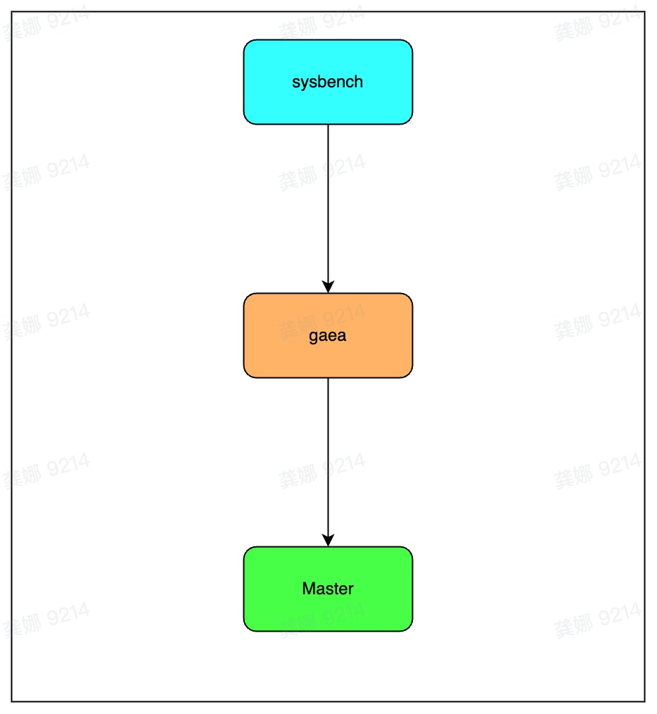

# 1.单主库环境准备

## 1.1 机器部署

中间件部署节点：

- Gaea 环境 v2.3.7 【40c/128G】
- Gaea 环境 v1.2.5 【40c/128G】
- MySQL 部署节点【32c/128G】

注意：

- Gaea v2.3.7和 Gaea v1.2.5 测试时`open_general_log=true`以及`cpu_num=40`。

## 1.2 网络拓扑



## 1.3 准备数据

请替换 `<host>`, `<user>`, `<password>` 为数据库实际信息。

```Bash
sysbench oltp_common --threads=10 --events=0 --mysql-db=<db> --mysql-host=<host> --mysql-port=<port> --mysql-user=<user> --mysql-password=<password> --tables=10 --table_size=1000000 prepare
```

## 1.4 测试结果

### 只读测试（**oltp_read_only**）

```Bash
sysbench oltp_read_only --threads=xx --time=30 --events=0 --mysql-db=<db> --mysql-host=<host> --mysql-port=<port> --mysql-user=<user> --mysql-password=<password>  --tables=10 --table_size=1000000 --percentile=99 run 
```

| 中间件 cpu=4       | 线程数 | qps       | tps     | avg(ms) | max(ms) | p99(ms) | max cpu usage(%) |
| ------------------ | ------ | --------- | ------- | ------- | ------- | ------- | ---------------- |
| mysql              | 4      | 12211.27  | 763.20  | 5.24    | 12.35   | 5.88    | /                |
| gaea-2.3.7（单主） | 4      | 7733.67   | 483.35  | 8.27    | 16.20   | 9.91    | 122%             |
| gaea-1.2.5（单主） | 4      | 5460.09   | 341.26  | 11.72   | 58.26   | 13.22   | 138%             |
| mysql              | 8      | 23983.90  | 1498.99 | 5.33    | 15.28   | 6.09    | /                |
| gaea-2.3.7（单主） | 8      | 14864.06  | 929.00  | 8.61    | 19.95   | 10.46   | 251%             |
| gaea-1.2.5（单主） | 8      | 10537.67  | 658.60  | 12.14   | 22.03   | 13.95   | 285%             |
| mysql              | 16     | 48595.72  | 3037.23 | 5.26    | 15.39   | 6.21    | /                |
| gaea-2.3.7（单主） | 16     | 28086.30  | 1755.39 | 9.11    | 18.15   | 11.24   | 536%             |
| gaea-1.2.5（单主） | 16     | 19542.92  | 1221.43 | 13.09   | 76.52   | 14.73   | 621%             |
| mysql              | 32     | 100138.71 | 6258.67 | 5.11    | 21.73   | 7.56    | /                |
| gaea-2.3.7（单主） | 32     | 51487.51  | 3217.97 | 9.94    | 37.14   | 12.52   | 1076%            |
| gaea-1.2.5（单主） | 32     | 33402.19  | 2087.64 | 15.32   | 55.57   | 17.95   | 1245%            |
| mysql              | 64     | 122629.69 | 7664.36 | 8.34    | 42.24   | 15.27   | /                |
| gaea-2.3.7（单主） | 64     | 73477.71  | 4592.36 | 13.93   | 65.90   | 19.65   | 1820%            |
| gaea-1.2.5（单主） | 64     | 48004.17  | 3000.26 | 21.32   | 60.58   | 27.66   | 1983%            |
| mysql              | 128    | 135103.29 | 8443.96 | 15.14   | 63.73   | 32.53   | /                |
| gaea-2.3.7（单主） | 128    | 91545.52  | 5721.59 | 22.36   | 85.40   | 33.72   | 2123%            |
| gaea-1.2.5（单主） | 128    | 52870.14  | 3304.38 | 38.71   | 118.93  | 56.84   | 2286%            |


### 读写测试（oltp_read_write）

```Bash
sysbench oltp_read_write --threads=xx --time=30 --mysql-db=<db> --mysql-host=<host> --mysql-port=<port> --mysql-user=<user> --mysql-password=<password> --tables=10 --table-size=1000000 --percentile=99 run
```

| 中间件             | 线程数 | qps       | tps     | avg(ms) | max(ms) | p99(ms) | max cpu usage(%) |
| ------------------ | ------ | --------- | ------- | ------- | ------- | ------- | ---------------- |
| mysql              | 4      | 12751.80  | 637.59  | 6.27    | 15.58   | 8.13    | /                |
| gaea-2.3.7（单主） | 4      | 8087.28   | 404.36  | 9.89    | 19.40   | 11.65   | 125%             |
| gaea-1.2.5（单主） | 4      | 5715.44   | 285.77  | 13.99   | 21.06   | 15.83   | 133%             |
| mysql              | 8      | 25150.51  | 1257.53 | 6.36    | 15.93   | 7.70    | /                |
| gaea-2.3.7（单主） | 8      | 15432.33  | 771.62  | 10.36   | 20.36   | 12.52   | 245%             |
| gaea-1.2.5（单主） | 8      | 11124.17  | 556.21  | 14.38   | 23.38   | 16.41   | 266%             |
| mysql              | 16     | 50818.63  | 2540.93 | 6.29    | 16.71   | 8.43    | /                |
| gaea-2.3.7（单主） | 16     | 29369.67  | 1468.48 | 10.89   | 22.20   | 13.70   | 497%             |
| gaea-1.2.5（单主） | 16     | 20283.24  | 1014.16 | 15.77   | 29.24   | 19.29   | 592%             |
| mysql              | 32     | 93985.74  | 4699.29 | 6.81    | 24.00   | 12.30   | /                |
| gaea-2.3.7（单主） | 32     | 52966.13  | 2648.31 | 12.08   | 64.26   | 17.01   | 973%             |
| gaea-1.2.5（单主） | 32     | 34758.88  | 1737.94 | 18.40   | 58.98   | 23.95   | 1191%            |
| mysql              | 64     | 95239.52  | 4761.98 | 13.43   | 3512.26 | 22.69   | /                |
| gaea-2.3.7（单主） | 64     | 74007.05  | 3700.35 | 17.29   | 72.90   | 26.20   | 1643%            |
| gaea-1.2.5（单主） | 64     | 48485.42  | 2424.27 | 26.39   | 105.08  | 34.95   | 1857%            |
| mysql              | 128    | 105833.23 | 5291.66 | 24.15   | 1115.60 | 37.56   | /                |
| gaea-2.3.7（单主） | 128    | 87276.42  | 4363.82 | 29.31   | 125.43  | 44.17   | 1991%            |
| gaea-1.2.5（单主） | 128    | 53510.65  | 2675.53 | 47.81   | 169.71  | 68.05   | 2050%            |


### 只写测试（oltp_write_only）

```Bash
sysbench oltp_write_only --threads=xx --time=30 --mysql-db=<db> --mysql-host=<host> --mysql-port=<port> --mysql-user=<user> --mysql-password=<password> --tables=10 --table-size=1000000 --percentile=99 run
```

| 中间件             | 线程数 | qps       | tps      | avg(ms) | max(ms) | p99(ms) | max cpu usage(%) |
| ------------------ | ------ | --------- | -------- | ------- | ------- | ------- | ---------------- |
| mysql              | 4      | 22331.83  | 3721.97  | 1.07    | 14.34   | 1.37    | /                |
| gaea-2.3.7（单主） | 4      | 12740.16  | 2123.36  | 1.88    | 25.39   | 2.43    | 84.3%            |
| gaea-1.2.5（单主） | 4      | 8428.90   | 1404.82  | 2.84    | 44.54   | 3.75    | 106%             |
| mysql              | 8      | 42700.96  | 7116.83  | 1.12    | 16.01   | 1.52    | /                |
| gaea-2.3.7（单主） | 8      | 24179.67  | 4029.94  | 1.98    | 45.16   | 2.91    | 170%             |
| gaea-1.2.5（单主） | 8      | 16420.31  | 2736.72  | 2.92    | 12.88   | 4.10    | 208%             |
| mysql              | 16     | 68909.64  | 11484.94 | 1.39    | 154.05  | 2.71    | /                |
| gaea-2.3.7（单主） | 16     | 44904.56  | 7484.09  | 2.14    | 44.43   | 3.43    | 356%             |
| gaea-1.2.5（单主） | 16     | 30446.85  | 5074.48  | 3.15    | 53.01   | 4.74    | 442%             |
| mysql              | 32     | 94586.28  | 15764.38 | 2.03    | 271.67  | 7.43    | /                |
| gaea-2.3.7（单主） | 32     | 73961.63  | 12326.94 | 2.59    | 96.80   | 4.41    | 719%             |
| gaea-1.2.5（单主） | 32     | 52332.21  | 8722.04  | 3.67    | 42.87   | 5.88    | 844%             |
| mysql              | 64     | 101542.13 | 16923.69 | 3.78    | 281.98  | 11.45   | /                |
| gaea-2.3.7（单主） | 64     | 91077.98  | 15179.65 | 4.21    | 125.56  | 7.43    | 1155%            |
| gaea-1.2.5（单主） | 64     | 67720.21  | 11286.69 | 5.66    | 135.34  | 9.91    | 1226%            |
| mysql              | 128    | 97611.74  | 16268.62 | 7.86    | 257.91  | 16.71   | /                |
| gaea-2.3.7（单主） | 128    | 91410.19  | 15235.00 | 8.40    | 149.96  | 16.41   | 1178%            |
| gaea-1.2.5（单主） | 128    | 68650.74  | 11441.78 | 11.18   | 200.66  | 22.69   | 1242%            |


### 点查测试（oltp_point_select）

```Bash
sysbench oltp_point_select --threads=xx --time=30 --mysql-db=<db> --mysql-host=<host> --mysql-port=<port> --mysql-user=<user> --mysql-password=<password> --tables=10 --table-size=1000000 --percentile=99 run
```

| 中间件             | 线程数 | qps       | tps       | avg(ms) | max(ms) | p99(ms) | max cpu usage(%) |
| ------------------ | ------ | --------- | --------- | ------- | ------- | ------- | ---------------- |
| mysql              | 4      | 35190.27  | 35190.27  | 0.11    | 3.95    | 0.15    | /                |
| gaea-2.3.7（单主） | 4      | 12870.86  | 12870.86  | 0.31    | 62.19   | 0.34    | 113%             |
| gaea-1.2.5（单主） | 4      | 8922.12   | 8922.12   | 0.45    | 29.35   | 0.64    | 140%             |
| mysql              | 8      | 70198.4   | 70198.4   | 0.11    | 4.55    | 0.15    | /                |
| gaea-2.3.7（单主） | 8      | 27894.76  | 27894.76  | 0.29    | 11.78   | 0.45    | 227%             |
| gaea-1.2.5（单主） | 8      | 17302.88  | 17302.88  | 0.46    | 13.56   | 0.89    | 286%             |
| mysql              | 16     | 131678.46 | 131678.46 | 0.12    | 11.09   | 0.16    | /                |
| gaea-2.3.7（单主） | 16     | 53322.41  | 53322.41  | 0.30    | 9.78    | 0.80    | 498%             |
| gaea-1.2.5（单主） | 16     | 31819.61  | 31819.61  | 0.50    | 5.89    | 1.30    | 631%             |
| mysql              | 32     | 228231.33 | 228231.33 | 0.14    | 12.39   | 0.21    | /                |
| gaea-2.3.7（单主） | 32     | 95535.38  | 95535.38  | 0.33    | 11.93   | 1.15    | 1108%            |
| gaea-1.2.5（单主） | 32     | 52741.48  | 52741.48  | 0.61    | 14.64   | 1.82    | 1186%            |
| mysql              | 64     | 352413.31 | 352413.31 | 0.18    | 22.08   | 0.46    | /                |
| gaea-2.3.7（单主） | 64     | 153702.43 | 153702.43 | 0.42    | 17.51   | 1.58    | 1481%            |
| gaea-1.2.5（单主） | 64     | 62898.85  | 62898.85  | 1.02    | 62.95   | 3.25    | 2206%            |
| mysql              | 128    | 438025.91 | 438025.91 | 0.29    | 23.41   | 2.11    | /                |
| gaea-2.3.7（单主） | 128    | 210410.89 | 210410.89 | 0.61    | 31.40   | 2.76    | 1513%            |
| gaea-1.2.5（单主） | 128    | 65272.06  | 65272.06  | 1.96    | 43.34   | 8.58    | 2735%            |


# 2.主从环境准备

## 2.1 机器部署

- Gaea 环境 v2.3.7 【40c/128G】
- Gaea 环境 v1.2.5 【40c/128G】
- MySQL 部署节点【32c/128G】

注意：

- Gaea v2.3.7和 Gaea v1.2.5 测试时`open_general_log=true`以及`cpu_num=40`。

## 2.2 网络拓扑


## 2.3 准备数据

请替换 `<host>`, `<user>`, `<password>` 为数据库实际信息。

```Bash
sysbench oltp_common --threads=10 --events=0 --mysql-db=<db> --mysql-host=<host> --mysql-port=<port> --mysql-user=<user> --mysql-password=<password> --tables=10 --table_size=1000000 prepare
```

## 2.4 测试结果

### 只读测试（**oltp_read_only**）

```Bash
sysbench oltp_read_only --threads=xx --time=30 --events=0 --mysql-db=<db> --mysql-host=<host> --mysql-port=<port> --mysql-user=<user> --mysql-password=<password>  --tables=10 --table_size=1000000 --percentile=99 run 
```

| 中间件 cpu=4       | 线程数 | qps       | tps     | avg(ms) | max(ms) | p99(ms) | max cpu usage(%) |
| ------------------ | ------ | --------- | ------- | ------- | ------- | ------- | ---------------- |
| mysql              | 4      | 12211.27  | 763.20  | 5.24    | 12.35   | 5.88    | /                |
| gaea-2.3.7（主从） | 4      | 7784.58   | 486.54  | 8.22    | 34.48   | 9.91    | 124%             |
| gaea-1.2.5（主从） | 4      | 5497.74   | 343.61  | 11.64   | 21.18   | 13.22   | 133%             |
| mysql              | 8      | 23983.90  | 1498.99 | 5.33    | 15.28   | 6.09    | /                |
| gaea-2.3.7（主从） | 8      | 14862.67  | 928.92  | 8.61    | 19.38   | 10.46   | 242%             |
| gaea-1.2.5（主从） | 8      | 10709.69  | 669.36  | 11.95   | 33.16   | 13.70   | 266%             |
| mysql              | 16     | 48595.72  | 3037.23 | 5.26    | 15.39   | 6.21    | /                |
| gaea-2.3.7（主从） | 16     | 28560.96  | 1785.06 | 8.96    | 51.24   | 11.24   | 510%             |
| gaea-1.2.5（主从） | 16     | 20495.60  | 1280.98 | 12.49   | 52.30   | 14.46   | 573%             |
| mysql              | 32     | 100138.71 | 6258.67 | 5.11    | 21.73   | 7.56    | /                |
| gaea-2.3.7（主从） | 32     | 52776.13  | 3298.51 | 9.70    | 24.83   | 12.30   | 1084%            |
| gaea-1.2.5（主从） | 32     | 36886.45  | 2305.40 | 13.87   | 54.01   | 15.83   | 1175%            |
| mysql              | 64     | 122629.69 | 7664.36 | 8.34    | 42.24   | 15.27   | /                |
| gaea-2.3.7（主从） | 64     | 75436.79  | 4714.80 | 13.57   | 73.65   | 19.29   | 1760%            |
| gaea-1.2.5（主从） | 64     | 54068.68  | 3379.29 | 18.93   | 61.95   | 24.38   | 1975%            |
| mysql              | 128    | 135103.29 | 8443.96 | 15.14   | 63.73   | 32.53   | /                |
| gaea-2.3.7（主从） | 128    | 94922.81  | 5932.68 | 21.56   | 54.90   | 33.72   | 2106%            |
| gaea-1.2.5（主从） | 128    | 57980.45  | 3623.78 | 35.30   | 94.13   | 52.89   | 2362%            |


### 读写测试（oltp_read_write）

```Bash
sysbench oltp_read_write --threads=xx --time=30 --mysql-db=<db> --mysql-host=<host> --mysql-port=<port> --mysql-user=<user> --mysql-password=<password> --tables=10 --table-size=1000000 --percentile=99 run
```

| 中间件             | 线程数 | qps       | tps     | avg(ms) | max(ms) | p99(ms) | max cpu usage(%) |
| ------------------ | ------ | --------- | ------- | ------- | ------- | ------- | ---------------- |
| mysql              | 4      | 12751.80  | 637.59  | 6.27    | 15.58   | 8.13    | /                |
| gaea-2.3.7（主从） | 4      | 8212.51   | 410.63  | 9.74    | 19.08   | 11.45   | 114%             |
| gaea-1.2.5（主从） | 4      | 5736.10   | 286.80  | 13.94   | 71.98   | 15.55   | 124%             |
| mysql              | 8      | 25150.51  | 1257.53 | 6.36    | 15.93   | 7.70    | /                |
| gaea-2.3.7（主从） | 8      | 15653.90  | 782.70  | 10.22   | 23.06   | 12.30   | 240%             |
| gaea-1.2.5（主从） | 8      | 11187.33  | 559.37  | 14.30   | 53.77   | 16.41   | 251%             |
| mysql              | 16     | 50818.63  | 2540.93 | 6.29    | 16.71   | 8.43    | /                |
| gaea-2.3.7（主从） | 16     | 29825.26  | 1491.26 | 10.72   | 48.90   | 13.70   | 486%             |
| gaea-1.2.5（主从） | 16     | 21274.28  | 1063.71 | 15.04   | 53.76   | 18.28   | 551%             |
| mysql              | 32     | 93985.74  | 4699.29 | 6.81    | 24.00   | 12.30   | /                |
| gaea-2.3.7（主从） | 32     | 54207.34  | 2710.37 | 11.80   | 35.74   | 17.32   | 954%             |
| gaea-1.2.5（主从） | 32     | 37916.59  | 1895.83 | 16.87   | 64.07   | 23.52   | 1097%            |
| mysql              | 64     | 95239.52  | 4761.98 | 13.43   | 3512.26 | 22.69   | /                |
| gaea-2.3.7（主从） | 64     | 75173.75  | 3758.69 | 17.02   | 81.03   | 26.20   | 1633%            |
| gaea-1.2.5（主从） | 64     | 54838.00  | 2741.90 | 23.33   | 66.39   | 32.53   | 1843%            |
| mysql              | 128    | 105833.23 | 5291.66 | 24.15   | 1115.60 | 37.56   | /                |
| gaea-2.3.7（主从） | 128    | 88833.18  | 4441.63 | 28.80   | 171.47  | 44.17   | 1943%            |
| gaea-1.2.5（主从） | 128    | 58197.8   | 2909.89 | 43.96   | 84.36   | 63.32   | 2023%            |


### 只写测试（oltp_write_only）

```Bash
sysbench oltp_read_write --threads=xx --time=30 --mysql-db=<db> --mysql-host=<host> --mysql-port=<port> --mysql-user=<user> --mysql-password=<password> --tables=10 --table-size=1000000 --percentile=99 run
```

| 中间件             | 线程数 | qps       | tps      | avg(ms) | max(ms) | p99(ms) | max cpu usage(%) |
| ------------------ | ------ | --------- | -------- | ------- | ------- | ------- | ---------------- |
| mysql              | 4      | 22331.83  | 3721.97  | 1.07    | 14.34   | 1.37    | /                |
| gaea-2.3.7（主从） | 4      | 12867.21  | 2144.54  | 1.86    | 10.96   | 2.39    | 85.3%            |
| gaea-1.2.5（主从） | 4      | 8464.34   | 1410.72  | 2.83    | 56.03   | 3.55    | 101%             |
| mysql              | 8      | 42700.96  | 7116.83  | 1.12    | 16.01   | 1.52    | /                |
| gaea-2.3.7（主从） | 8      | 24156.07  | 4026.01  | 1.99    | 12.23   | 2.86    | 172%             |
| gaea-1.2.5（主从） | 8      | 16394.17  | 2732.36  | 2.93    | 42.65   | 4.10    | 200%             |
| mysql              | 16     | 68909.64  | 11484.94 | 1.39    | 154.05  | 2.71    | /                |
| gaea-2.3.7（主从） | 16     | 44251.25  | 7375.21  | 2.17    | 103.42  | 3.43    | 335%             |
| gaea-1.2.5（主从） | 16     | 31221.77  | 5203.63  | 3.07    | 42.69   | 4.65    | 412%             |
| mysql              | 32     | 94586.28  | 15764.38 | 2.03    | 271.67  | 7.43    | /                |
| gaea-2.3.7（主从） | 32     | 73412.09  | 12235.32 | 2.61    | 148.23  | 4.33    | 696%             |
| gaea-1.2.5（主从） | 32     | 54830.50  | 9138.42  | 3.50    | 52.42   | 5.77    | 820%             |
| mysql              | 64     | 101542.13 | 16923.69 | 3.78    | 281.98  | 11.45   | /                |
| gaea-2.3.7（主从） | 64     | 93059.08  | 15509.85 | 4.12    | 122.29  | 7.56    | 1173%            |
| gaea-1.2.5（主从） | 64     | 71905.85  | 11984.29 | 5.33    | 202.55  | 9.56    | 1183%            |
| mysql              | 128    | 97611.74  | 16268.62 | 7.86    | 257.91  | 16.71   | /                |
| gaea-2.3.7（主从） | 128    | 91703.20  | 15283.85 | 8.37    | 116.97  | 16.41   | 1177%            |
| gaea-1.2.5（主从） | 128    | 72172.38  | 12028.73 | 10.63   | 317.04  | 21.50   | 1193%            |


### 点查测试（oltp_point_select）

```Bash
sysbench oltp_read_only --threads=xx --time=30 --events=0 --mysql-db=<db> --mysql-host=<host> --mysql-port=<port> --mysql-user=<user> --mysql-password=<password>  --tables=10 --table_size=1000000 --percentile=99 run 
```

| 中间件             | 线程数 | qps       | tps       | avg(ms) | max(ms) | p99(ms) | max cpu usage(%) |
| ------------------ | ------ | --------- | --------- | ------- | ------- | ------- | ---------------- |
| mysql              | 4      | 35190.27  | 35190.27  | 0.11    | 3.95    | 0.15    | /                |
| gaea-2.3.7（主从） | 4      | 13971.36  | 13971.36  | 0.29    | 10.93   | 0.36    | 108%             |
| gaea-1.2.5（主从） | 4      | 9141.40   | 9141.40   | 0.44    | 23.93   | 0.59    | 123%             |
| mysql              | 8      | 70198.4   | 70198.4   | 0.11    | 4.55    | 0.15    | /                |
| gaea-2.3.7（主从） | 8      | 27121.79  | 27121.79  | 0.29    | 21.24   | 0.43    | 232%             |
| gaea-1.2.5（主从） | 8      | 17641.69  | 17641.69  | 0.45    | 4.23    | 0.72    | 261%             |
| mysql              | 16     | 131678.46 | 131678.46 | 0.12    | 11.09   | 0.16    | /                |
| gaea-2.3.7（主从） | 16     | 52938.15  | 52938.15  | 0.30    | 9.91    | 0.70    | 492%             |
| gaea-1.2.5（主从） | 16     | 33859.82  | 33859.82  | 0.47    | 20.19   | 1.08    | 543%             |
| mysql              | 32     | 228231.33 | 228231.33 | 0.14    | 12.39   | 0.21    | /                |
| gaea-2.3.7（主从） | 32     | 96820.29  | 96820.29  | 0.33    | 46.84   | 1.21    | 1107%            |
| gaea-1.2.5（主从） | 32     | 61850.09  | 61850.09  | 0.52    | 13.33   | 1.52    | 1146%            |
| mysql              | 64     | 352413.31 | 352413.31 | 0.18    | 22.08   | 0.46    | /                |
| gaea-2.3.7（主从） | 64     | 160535.00 | 160535.00 | 0.40    | 40.16   | 1.50    | 1362%            |
| gaea-1.2.5（主从） | 64     | 70758.98  | 70758.98  | 0.90    | 63.48   | 3.07    | 2162%            |
| mysql              | 128    | 438025.91 | 438025.91 | 0.29    | 23.41   | 2.11    | /                |
| gaea-2.3.7（主从） | 128    | 222424.15 | 222424.15 | 0.57    | 20.36   | 2.66    | 1380%            |
| gaea-1.2.5（主从） | 128    | 70015.00  | 70015.00  | 1.83    | 28.43   | 8.28    | 2744%            |


