# 1.gaea-2.3.7(单主) vs mysql-5.7.26

## 1.1 机器部署

Gaea 环境：Gaea 2.3.7【40c/128G】
MySQL-Master环境: mysql-5.7.26 【32c/128G】


## 1.2 网络拓扑

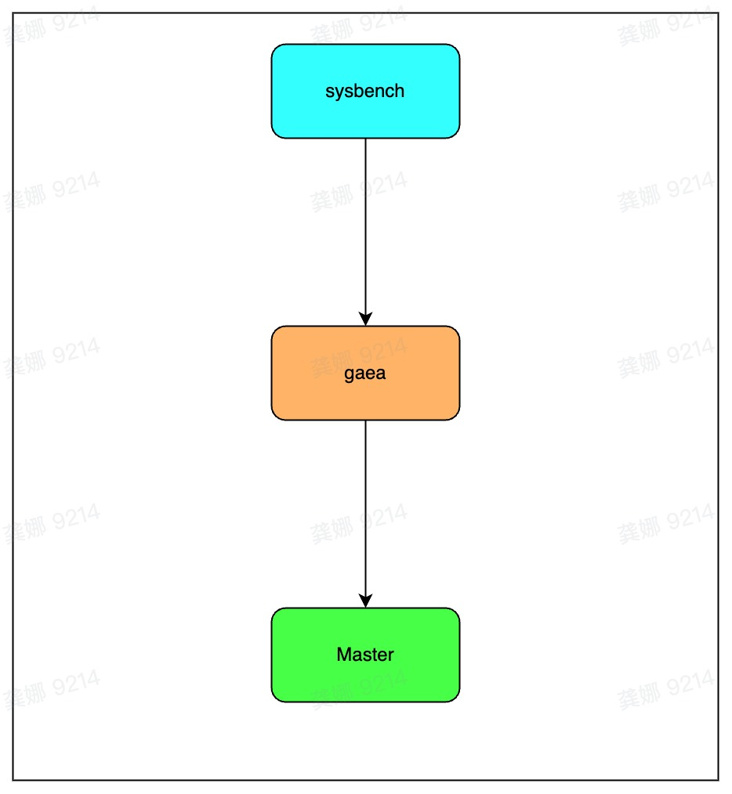


## 1.3 准备数据

替换 <host>, <user>, <password> 为数据库实际信息。
```shell
sysbench oltp_common --threads=10 --events=0 --mysql-db=<db> --mysql-host=<host> --mysql-port=<port> --mysql-user=<user> --mysql-password=<password> --tables=10 --table_size=1000000 prepare
```

## 1.4 测试结果

#### 1.4.1 只读测试（oltp_read_only）

```Bash
sysbench oltp_read_only --threads=xx --time=30 --events=0 --mysql-db=<db> --mysql-host=<host> --mysql-port=<port> --mysql-user=<user> --mysql-password=<password>  --tables=10 --table_size=1000000 --percentile=99 run 
```

| 中间件 cpu=4 | 线程数 | qps       | tps     | avg(ms) | max(ms) | p99(ms) |
| ------------ | ------ | --------- | ------- | ------- | ------- | ------- |
| mysql        | 4      | 12211.27  | 763.20  | 5.24    | 12.35   | 5.88    |
| gaea-2.3.7   | 4      | 7806.37   | 487.90  | 8.19    | 14.77   | 9.73    |
| mysql        | 8      | 23983.90  | 1498.99 | 5.33    | 15.28   | 6.09    |
| gaea-2.3.7   | 8      | 14968.99  | 935.56  | 8.55    | 15.77   | 10.27   |
| mysql        | 16     | 48595.72  | 3037.23 | 5.26    | 15.39   | 6.21    |
| gaea-2.3.7   | 16     | 28342.0   | 1771.38 | 9.03    | 17.04   | 11.04   |
| mysql        | 32     | 100138.71 | 6258.67 | 5.11    | 21.73   | 7.56    |
| gaea-2.3.7   | 32     | 52670.79  | 3291.92 | 9.72    | 19.59   | 12.30   |
| mysql        | 64     | 122629.69 | 7664.36 | 8.34    | 42.24   | 15.27   |
| gaea-2.3.7   | 64     | 76040.82  | 4752.55 | 13.46   | 36.01   | 18.95   |
| mysql        | 128    | 135103.29 | 8443.96 | 15.14   | 63.73   | 33.72   |
| gaea-2.3.7   | 128    | 91917.72  | 5744.86 | 22.27   | 60.54   | 33.72   |


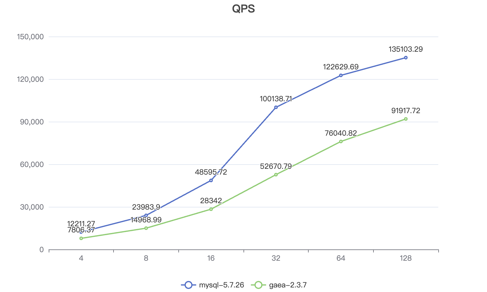

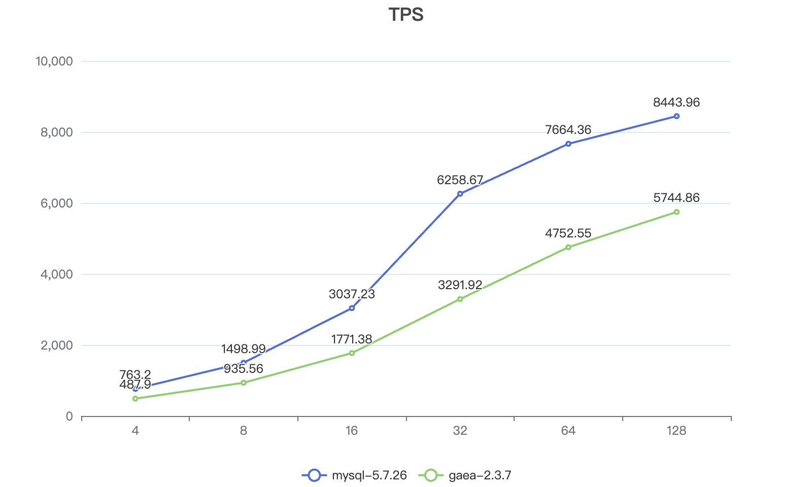

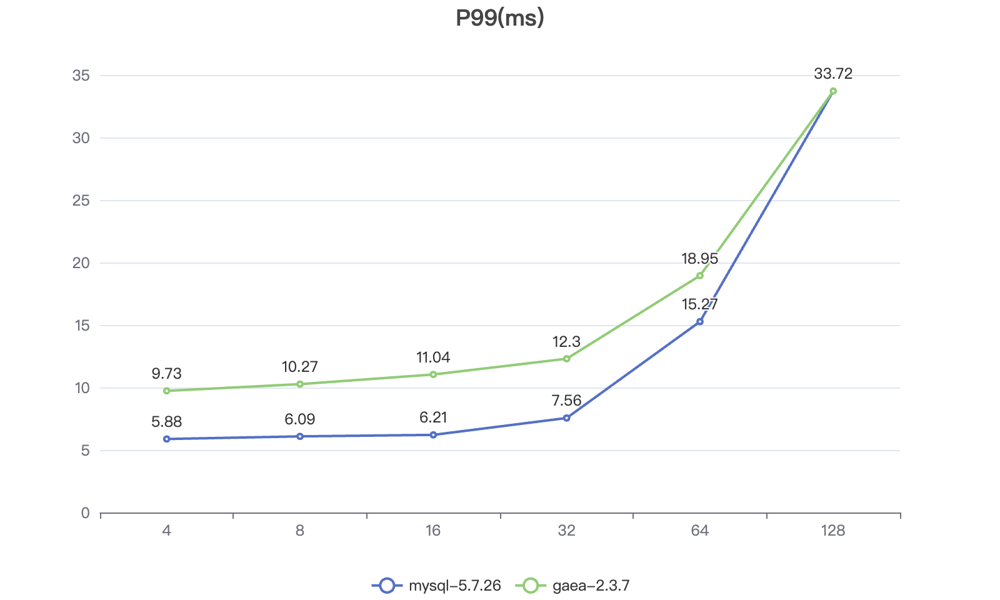

#### 1.4.2 读写测试（oltp_read_write）

```Bash
sysbench oltp_read_write --threads=xx --time=30 --mysql-db=<db> --mysql-host=<host> --mysql-port=<port> --mysql-user=<user> --mysql-password=<password> --tables=10 --table-size=1000000 --percentile=99 run
```

| 中间件     | 线程数 | qps       | tps     | avg(ms) | max(ms) | p99(ms) |
| ---------- | ------ | --------- | ------- | ------- | ------- | ------- |
| mysql      | 4      | 12751.80  | 637.59  | 6.27    | 15.58   | 8.13    |
| gaea-2.3.7 | 4      | 8199.80   | 409.99  | 9.75    | 19.32   | 11.45   |
| mysql      | 8      | 25150.51  | 1257.53 | 6.36    | 15.93   | 7.70    |
| gaea-2.3.7 | 8      | 15685.99  | 784.30  | 10.20   | 20.62   | 12.30   |
| mysql      | 16     | 50818.63  | 2540.93 | 6.29    | 16.71   | 8.43    |
| gaea-2.3.7 | 16     | 30016.43  | 1500.82 | 10.66   | 25.76   | 13.46   |
| mysql      | 32     | 93985.74  | 4699.29 | 6.81    | 24.00   | 12.30   |
| gaea-2.3.7 | 32     | 54266.52  | 2713.33 | 11.79   | 71.54   | 17.63   |
| mysql      | 64     | 95239.52  | 4761.98 | 13.43   | 3512.26 | 22.69   |
| gaea-2.3.7 | 64     | 77431.3   | 3871.57 | 16.52   | 40.52   | 24.83   |
| mysql      | 128    | 105833.23 | 5291.66 | 24.15   | 1115.60 | 37.56   |
| gaea-2.3.7 | 128    | 88746.61  | 4437.30 | 28.83   | 70.06   | 44.17   |


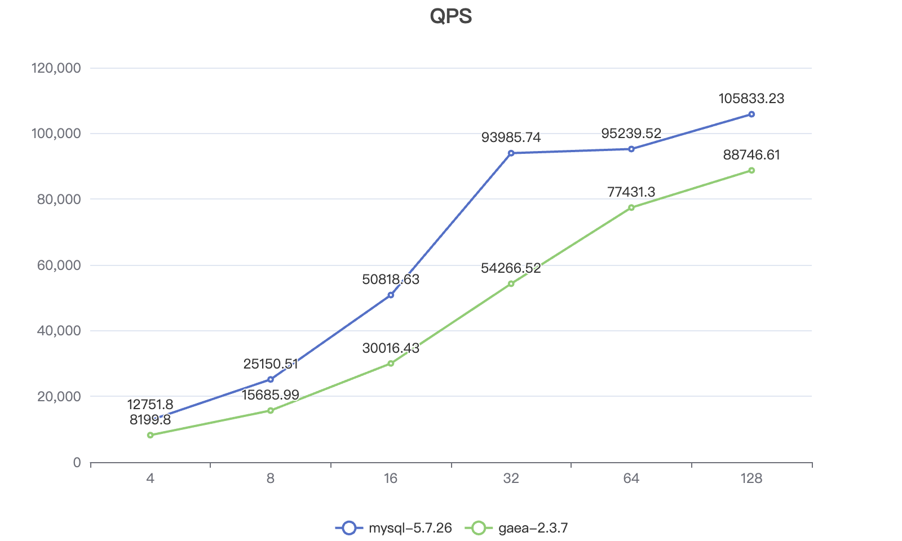

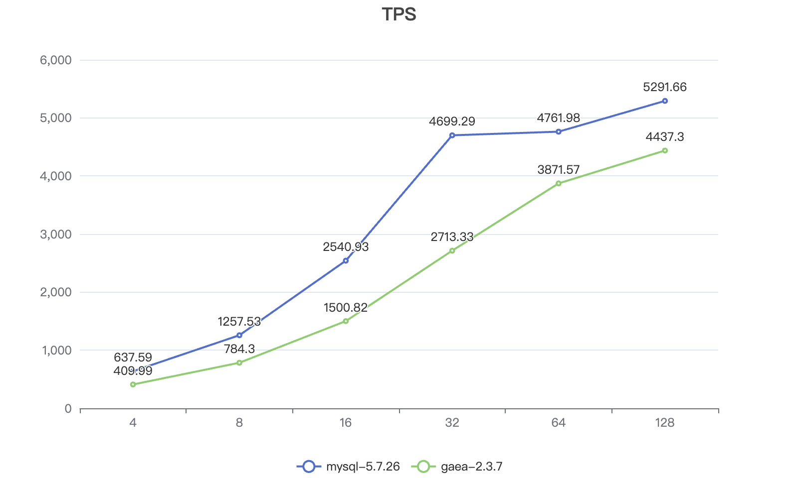

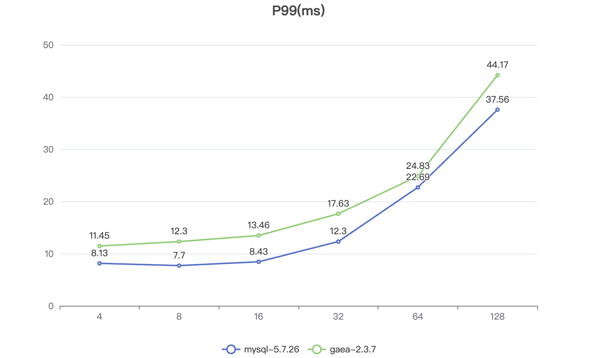

#### 1.4.3 只写测试（oltp_write_only）

```Bash
sysbench oltp_write_only --threads=xx --time=30 --mysql-db=<db> --mysql-host=<host> --mysql-port=<port> --mysql-user=<user> --mysql-password=<password> --tables=10 --table-size=1000000 --percentile=99 run
```

| 中间件     | 线程数 | qps       | tps      | avg(ms) | max(ms) | p99(ms) |
| ---------- | ------ | --------- | -------- | ------- | ------- | ------- |
| mysql      | 4      | 22331.83  | 3721.97  | 1.07    | 14.34   | 1.37    |
| gaea-2.3.7 | 4      | 13063.62  | 2177.27  | 1.84    | 11.07   | 2.43    |
| mysql      | 8      | 42700.96  | 7116.83  | 1.12    | 16.01   | 1.52    |
| gaea-2.3.7 | 8      | 24578.62  | 4096.44  | 1.95    | 14.55   | 2.86    |
| mysql      | 16     | 68909.64  | 11484.94 | 1.39    | 154.05  | 2.71    |
| gaea-2.3.7 | 16     | 45247.13  | 7541.19  | 2.12    | 40.71   | 3.30    |
| mysql      | 32     | 94586.28  | 15764.38 | 2.03    | 271.67  | 7.43    |
| gaea-2.3.7 | 32     | 73765.92  | 12294.29 | 2.60    | 250.99  | 4.33    |
| mysql      | 64     | 101542.13 | 16923.69 | 3.78    | 281.98  | 11.45   |
| gaea-2.3.7 | 64     | 93188.54  | 15531.40 | 4.12    | 385.23  | 7.43    |
| mysql      | 128    | 97611.74  | 16268.62 | 7.86    | 257.91  | 16.71   |
| gaea-2.3.7 | 128    | 92935.88  | 15489.30 | 8.26    | 388.10  | 15.55   |


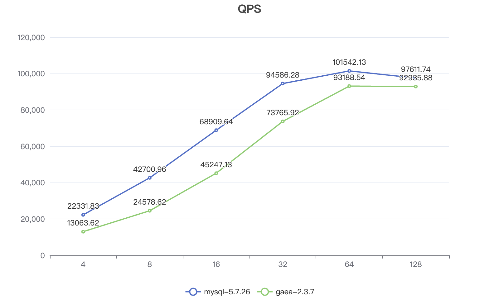

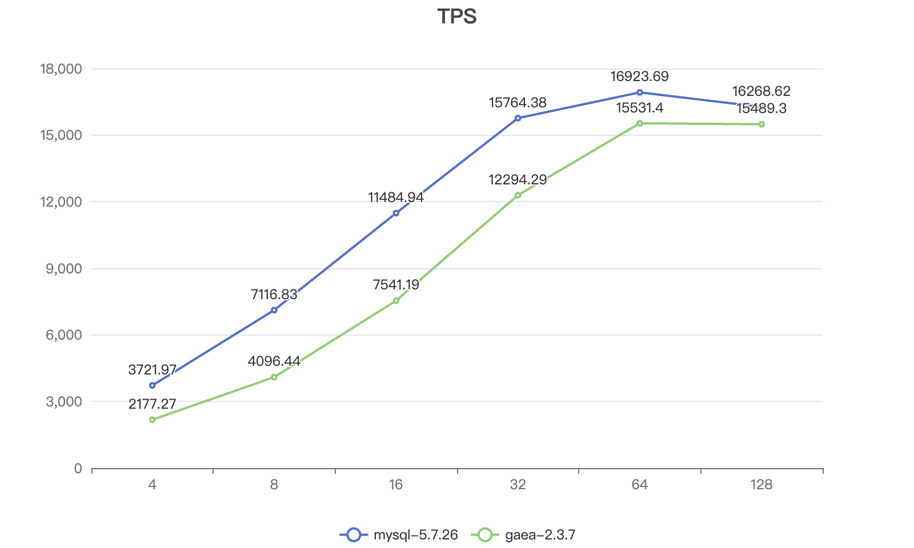

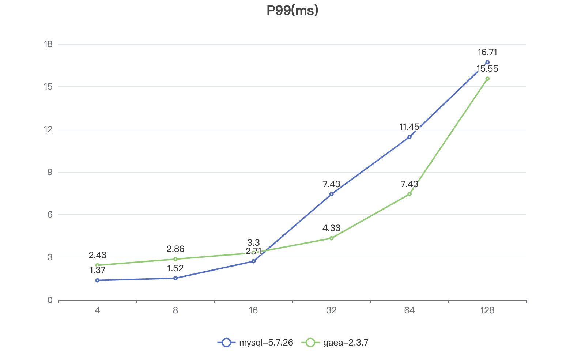


#### 1.4.4 点查测试（oltp_point_select）

```Bash
sysbench oltp_point_select --threads=xx --time=30 --mysql-db=<db> --mysql-host=<host> --mysql-port=<port> --mysql-user=<user> --mysql-password=<password> --tables=10 --table-size=1000000 --percentile=99 run
```

| 中间件     | 线程数 | qps       | tps       | avg(ms) | max(ms) | p99(ms) |
| ---------- | ------ | --------- | --------- | ------- | ------- | ------- |
| mysql      | 4      | 35190.27  | 35190.27  | 0.11    | 3.95    | 0.15    |
| gaea-2.3.7 | 4      | 14767.19  | 14767.19  | 0.27    | 5.87    | 0.36    |
| mysql      | 8      | 70198.4   | 70198.4   | 0.11    | 4.55    | 0.15    |
| gaea-2.3.7 | 8      | 28718.67  | 28718.67  | 0.28    | 4.40    | 0.42    |
| mysql      | 16     | 131678.46 | 131678.46 | 0.12    | 11.09   | 0.16    |
| gaea-2.3.7 | 16     | 55071.25  | 55071.25  | 0.29    | 8.42    | 0.70    |
| mysql      | 32     | 228231.33 | 228231.33 | 0.14    | 12.39   | 0.21    |
| gaea-2.3.7 | 32     | 97985.02  | 97985.02  | 0.33    | 11.48   | 1.14    |
| mysql      | 64     | 352413.31 | 352413.31 | 0.18    | 22.08   | 0.46    |
| gaea-2.3.7 | 64     | 162758.02 | 162758.02 | 0.39    | 17.30   | 1.67    |
| mysql      | 128    | 438025.91 | 438025.91 | 0.29    | 23.41   | 2.11    |
| gaea-2.3.7 | 128    | 214551.54 | 214551.54 | 0.60    | 35.12   | 2.66    |


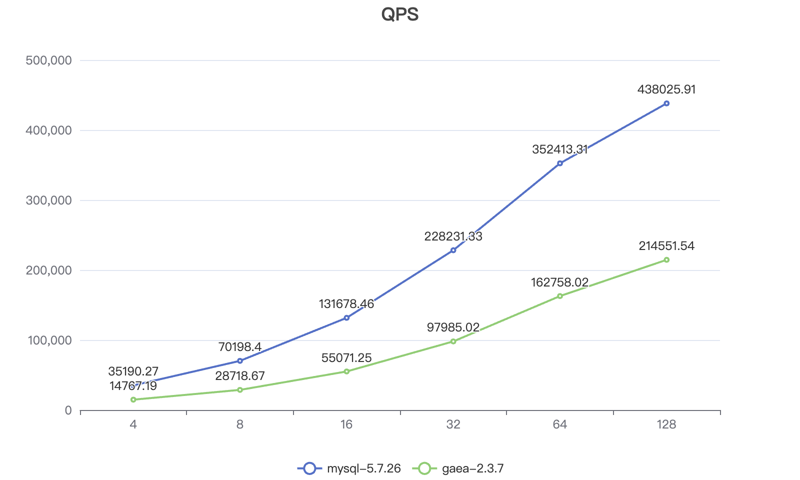

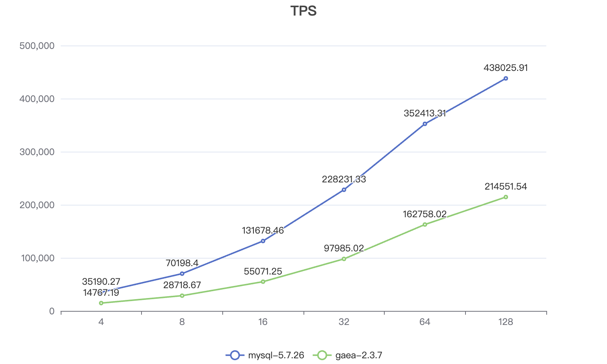

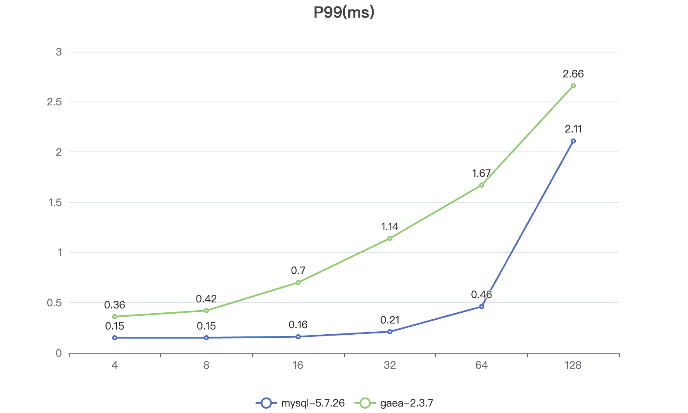


# 2.gaea-2.3.7（单主）vs gaea-2.3.7（主从）

## 2.1 机器部署

Gaea 环境：Gaea 2.3.7【40c/128G】
MySQL-Master环境: mysql-5.7.26 【32c/128G】
MySQL-Slave环境: mysql-5.7.26 【32c/128G】

## 2.2 网络拓扑


## 2.3 准备数据

替换 <host>, <user>, <password> 为数据库实际信息。
```shell
sysbench oltp_common --threads=10 --events=0 --mysql-db=<db> --mysql-host=<host> --mysql-port=<port> --mysql-user=<user> --mysql-password=<password> --tables=10 --table_size=1000000 prepare
```

## 2.4 测试结果

#### 2.4.1只读测试（oltp_read_only）

```Bash
sysbench oltp_read_only --threads=xx --time=30 --events=0 --mysql-db=<db> --mysql-host=<host> --mysql-port=<port> --mysql-user=<user> --mysql-password=<password>  --tables=10 --table_size=1000000 --percentile=99 run 
```

| 中间件 cpu=4       | 线程数 | qps       | tps     | avg(ms) | max(ms) | p99(ms) |
| ------------------ | ------ | --------- | ------- | ------- | ------- | ------- |
| mysql              | 4      | 12211.27  | 763.20  | 5.24    | 12.35   | 5.88    |
| gaea-2.3.7（单主） | 4      | 7806.37   | 487.90  | 8.19    | 14.77   | 9.73    |
| gaea-2.3.7（主从） | 4      | 7710.83   | 481.93  | 8.30    | 38.38   | 9.91    |
| mysql              | 8      | 23983.90  | 1498.99 | 5.33    | 15.28   | 6.09    |
| gaea-2.3.7（单主） | 8      | 14968.99  | 935.56  | 8.55    | 15.77   | 10.27   |
| gaea-2.3.7（主从） | 8      | 14906.38  | 931.65  | 8.58    | 15.16   | 10.27   |
| mysql              | 16     | 48595.72  | 3037.23 | 5.26    | 15.39   | 6.21    |
| gaea-2.3.7（单主） | 16     | 28342.0   | 1771.38 | 9.03    | 17.04   | 11.04   |
| gaea-2.3.7（主从） | 16     | 28218.90  | 1763.68 | 9.07    | 56.16   | 11.04   |
| mysql              | 32     | 100138.71 | 6258.67 | 5.11    | 21.73   | 7.56    |
| gaea-2.3.7（单主） | 32     | 52670.79  | 3291.92 | 9.72    | 19.59   | 12.30   |
| gaea-2.3.7（主从） | 32     | 52647.58  | 3290.47 | 9.72    | 40.53   | 12.30   |
| mysql              | 64     | 122629.69 | 7664.36 | 8.34    | 42.24   | 15.27   |
| gaea-2.3.7（单主） | 64     | 76040.82  | 4752.55 | 13.46   | 36.01   | 18.95   |
| gaea-2.3.7（主从） | 64     | 75525.94  | 4720.37 | 13.55   | 43.02   | 19.29   |
| mysql              | 128    | 135103.29 | 8443.96 | 15.14   | 63.73   | 33.72   |
| gaea-2.3.7（单主） | 128    | 91917.72  | 5744.86 | 22.27   | 60.54   | 33.72   |
| gaea-2.3.7（主从） | 128    | 92000.47  | 5750.03 | 22.25   | 74.90   | 33.72   |


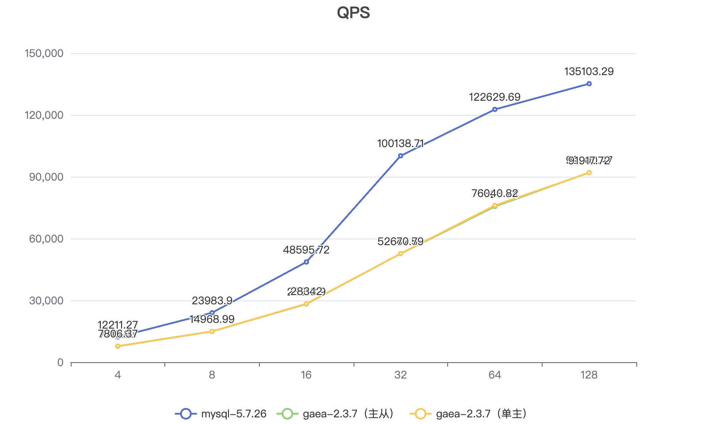

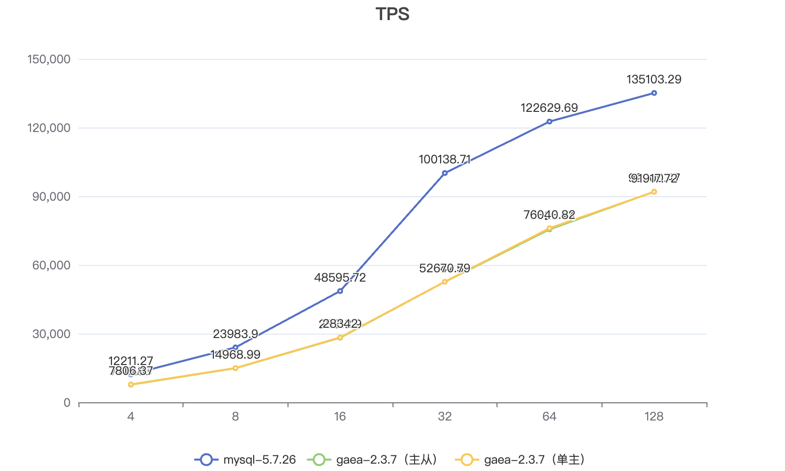

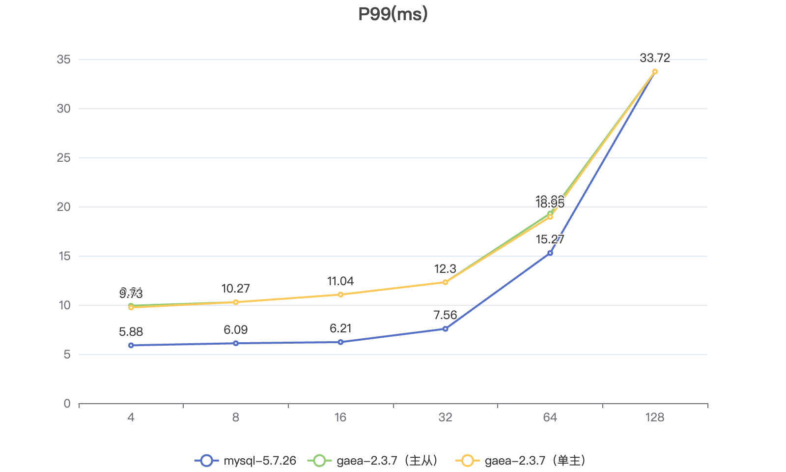


#### 2.4.2 读写测试（oltp_read_write）

```Bash
sysbench oltp_read_write --threads=xx --time=30 --mysql-db=<db> --mysql-host=<host> --mysql-port=<port> --mysql-user=<user> --mysql-password=<password> --tables=10 --table-size=1000000 --percentile=99 run
```

| 中间件             | 线程数 | qps       | tps     | avg(ms) | max(ms) | p99(ms) |
| ------------------ | ------ | --------- | ------- | ------- | ------- | ------- |
| mysql              | 4      | 12751.80  | 637.59  | 6.27    | 15.58   | 8.13    |
| gaea-2.3.7（主从） | 4      | 8280.82   | 414.04  | 9.66    | 17.78   | 11.24   |
| gaea-2.3.7（单主） | 4      | 8199.80   | 409.99  | 9.75    | 19.32   | 11.45   |
| mysql              | 8      | 25150.51  | 1257.53 | 6.36    | 15.93   | 7.70    |
| gaea-2.3.7（主从） | 8      | 15618.44  | 780.92  | 10.24   | 19.85   | 12.30   |
| gaea-2.3.7（单主） | 8      | 15685.99  | 784.30  | 10.20   | 20.62   | 12.30   |
| mysql              | 16     | 50818.63  | 2540.93 | 6.29    | 16.71   | 8.43    |
| gaea-2.3.7（主从） | 16     | 30153.45  | 1507.67 | 10.61   | 23.45   | 13.70   |
| gaea-2.3.7（单主） | 16     | 30016.43  | 1500.82 | 10.66   | 25.76   | 13.46   |
| mysql              | 32     | 93985.74  | 4699.29 | 6.81    | 24.00   | 12.30   |
| gaea-2.3.7（主从） | 32     | 54594.10  | 2729.70 | 11.72   | 30.33   | 17.32   |
| gaea-2.3.7（单主） | 32     | 54266.52  | 2713.33 | 11.79   | 71.54   | 17.63   |
| mysql              | 64     | 95239.52  | 4761.98 | 13.43   | 3512.26 | 22.69   |
| gaea-2.3.7（主从） | 64     | 76844.90  | 3842.25 | 16.65   | 132.13  | 25.28   |
| gaea-2.3.7（单主） | 64     | 77431.3   | 3871.57 | 16.52   | 40.52   | 24.83   |
| mysql              | 128    | 105833.23 | 5291.66 | 24.15   | 1115.60 | 37.56   |
| gaea-2.3.7（主从） | 128    | 89307.14  | 4465.33 | 28.65   | 63.57   | 43.39   |
| gaea-2.3.7（单主） | 128    | 88746.61  | 4437.30 | 28.83   | 70.06   | 44.17   |


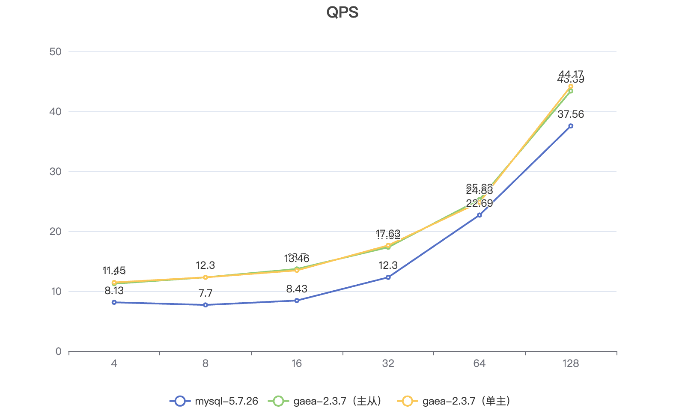

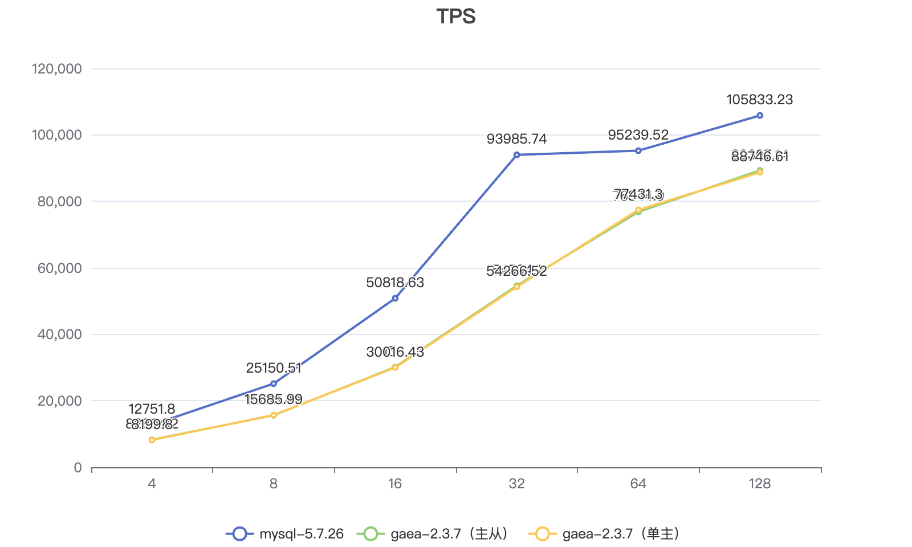

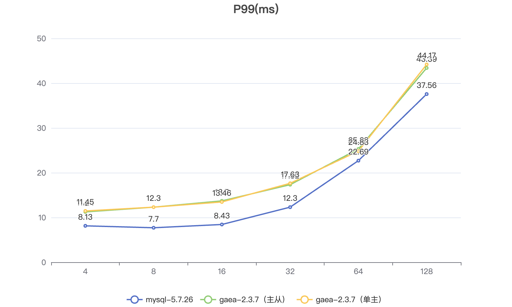

#### 2.4.3 只写测试（oltp_write_only）

```Bash
sysbench oltp_write_only --threads=xx --time=30 --mysql-db=<db> --mysql-host=<host> --mysql-port=<port> --mysql-user=<user> --mysql-password=<password> --tables=10 --table-size=1000000 --percentile=99 run
```

| 中间件             | 线程数 | qps       | tps      | avg(ms) | max(ms) | p99(ms) |
| ------------------ | ------ | --------- | -------- | ------- | ------- | ------- |
| mysql              | 4      | 22331.83  | 3721.97  | 1.07    | 14.34   | 1.37    |
| gaea-2.3.7（主从） | 4      | 13121.17  | 2186.86  | 1.83    | 11.52   | 2.39    |
| gaea-2.3.7（单主） | 4      | 13063.62  | 2177.27  | 1.84    | 11.07   | 2.43    |
| mysql              | 8      | 42700.96  | 7116.83  | 1.12    | 16.01   | 1.52    |
| gaea-2.3.7（主从） | 8      | 24600.35  | 4100.06  | 1.95    | 49.74   | 2.86    |
| gaea-2.3.7（单主） | 8      | 24578.62  | 4096.44  | 1.95    | 14.55   | 2.86    |
| mysql              | 16     | 68909.64  | 11484.94 | 1.39    | 154.05  | 2.71    |
| gaea-2.3.7（主从） | 16     | 45652.70  | 7608.78  | 2.10    | 21.98   | 3.30    |
| gaea-2.3.7（单主） | 16     | 45247.13  | 7541.19  | 2.12    | 40.71   | 3.30    |
| mysql              | 32     | 94586.28  | 15764.38 | 2.03    | 271.67  | 7.43    |
| gaea-2.3.7（主从） | 32     | 73410.90  | 12235.15 | 2.61    | 206.46  | 4.49    |
| gaea-2.3.7（单主） | 32     | 73765.92  | 12294.29 | 2.60    | 250.99  | 4.33    |
| mysql              | 64     | 101542.13 | 16923.69 | 3.78    | 281.98  | 11.45   |
| gaea-2.3.7（主从） | 64     | 89012.94  | 14835.49 | 4.31    | 211.78  | 8.43    |
| gaea-2.3.7（单主） | 64     | 93188.54  | 15531.40 | 4.12    | 385.23  | 7.43    |
| mysql              | 128    | 97611.74  | 16268.62 | 7.86    | 257.91  | 16.71   |
| gaea-2.3.7（主从） | 128    | 91228.35  | 15204.73 | 8.41    | 385.88  | 16.41   |
| gaea-2.3.7（单主） | 128    | 92935.88  | 15489.30 | 8.26    | 388.10  | 15.55   |


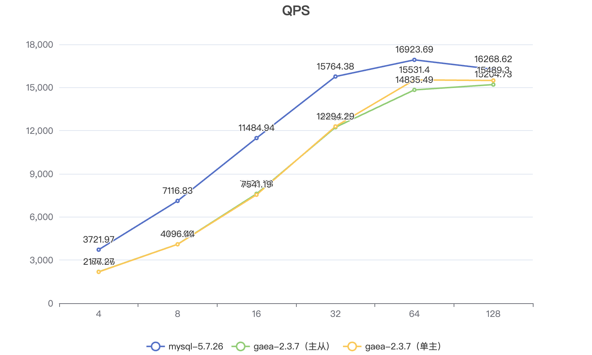


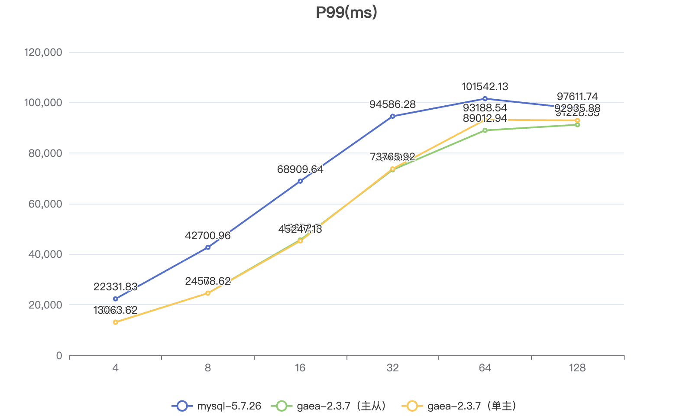


#### 2.4.4 点查测试（oltp_point_select）

```Bash
sysbench oltp_point_select --threads=xx --time=30 --mysql-db=<db_name> --mysql-host=<host> --mysql-port=<port> --mysql-user=<user> --mysql-password=<password> --tables=10 --table-size=1000000 --percentile=99 run
```

| 中间件             | 线程数 | qps       | tps       | avg(ms) | max(ms) | p99(ms) |
| ------------------ | ------ | --------- | --------- | ------- | ------- | ------- |
| mysql              | 4      | 35190.27  | 35190.27  | 0.11    | 3.95    | 0.15    |
| gaea-2.3.7（主从） | 4      | 14778.30  | 14778.30  | 0.27    | 4.02    | 0.36    |
| gaea-2.3.7（单主） | 4      | 14767.19  | 14767.19  | 0.27    | 5.87    | 0.36    |
| mysql              | 8      | 70198.4   | 70198.4   | 0.11    | 4.55    | 0.15    |
| gaea-2.3.7（主从） | 8      | 28280.01  | 28280.01  | 0.28    | 6.86    | 0.42    |
| gaea-2.3.7（单主） | 8      | 28718.67  | 28718.67  | 0.28    | 4.40    | 0.42    |
| mysql              | 16     | 131678.46 | 131678.46 | 0.12    | 11.09   | 0.16    |
| gaea-2.3.7（主从） | 16     | 54622.85  | 54622.85  | 0.29    | 9.23    | 0.72    |
| gaea-2.3.7（单主） | 16     | 55071.25  | 55071.25  | 0.29    | 8.42    | 0.70    |
| mysql              | 32     | 228231.33 | 228231.33 | 0.14    | 12.39   | 0.21    |
| gaea-2.3.7（主从） | 32     | 98037.40  | 98037.40  | 0.33    | 54.16   | 1.14    |
| gaea-2.3.7（单主） | 32     | 97985.02  | 97985.02  | 0.33    | 11.48   | 1.14    |
| mysql              | 64     | 352413.31 | 352413.31 | 0.18    | 22.08   | 0.46    |
| gaea-2.3.7（主从） | 64     | 162489.16 | 162489.16 | 0.39    | 15.97   | 1.64    |
| gaea-2.3.7（单主） | 64     | 162758.02 | 162758.02 | 0.39    | 17.30   | 1.67    |
| mysql              | 128    | 438025.91 | 438025.91 | 0.29    | 23.41   | 2.11    |
| gaea-2.3.7（主从） | 128    | 215692.85 | 215692.85 | 0.59    | 99.98   | 2.66    |
| gaea-2.3.7（单主） | 128    | 214551.54 | 214551.54 | 0.60    | 35.12   | 2.66    |


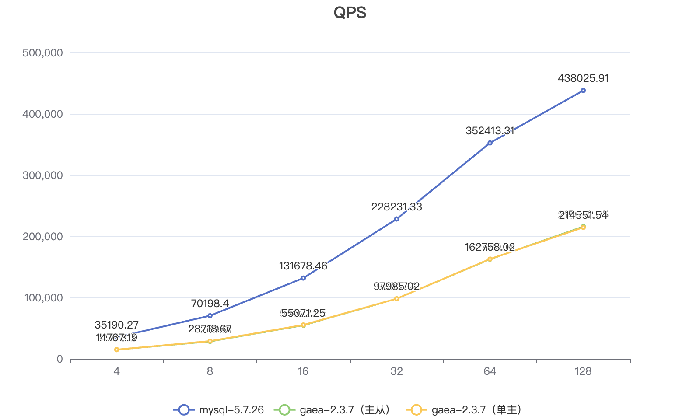

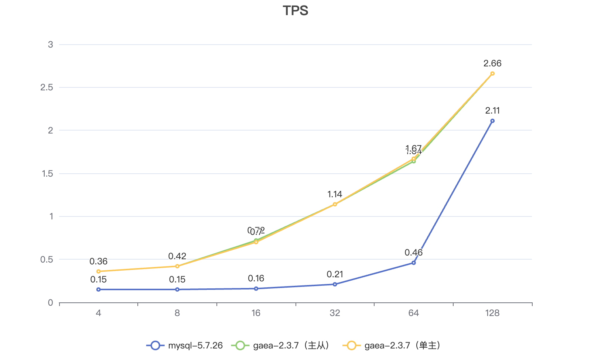


# 3.gaea-2.3.7（主从）vs gaea-1.2.5（主从）

## 3.1 机器部署

Gaea 环境：Gaea 2.3.7【40c/128G】
MySQL-Master环境: mysql-5.7.26 【32c/128G】
MySQL-Slave环境: mysql-5.7.26 【32c/128G】

## 3.2 网络拓扑


## 3.3 准备数据

替换 <host>, <user>, <password> 为数据库实际信息。
```shell
sysbench oltp_common --threads=10 --events=0 --mysql-db=<db> --mysql-host=<host> --mysql-port=<port> --mysql-user=<user> --mysql-password=<password> --tables=10 --table_size=1000000 prepare
```

## 3.4 测试结果

#### 3.4.1 只读测试（oltp_read_only）

```Bash
sysbench oltp_read_only --threads=xx --time=30 --events=0 --mysql-db=<db> --mysql-host=<host> --mysql-port=<port> --mysql-user=<user> --mysql-password=<password>  --tables=10 --table_size=1000000 --percentile=99 run 
```

| 中间件 cpu=4       | 线程数 | qps       | tps     | avg(ms) | max(ms) | p99(ms) | max cpu usage(%) |
| ------------------ | ------ | --------- | ------- | ------- | ------- | ------- | ---------------- |
| mysql              | 4      | 12211.27  | 763.20  | 5.24    | 12.35   | 5.88    | /                |
| gaea-2.3.7（主从） | 4      | 7710.83   | 481.93  | 8.30    | 38.38   | 9.91    | 122%             |
| gaea-1.2.5（主从） | 4      | 5640.20   | 352.51  | 11.34   | 16.54   | 12.75   | 124%             |
| mysql              | 8      | 23983.90  | 1498.99 | 5.33    | 15.28   | 6.09    | /                |
| gaea-2.3.7（主从） | 8      | 14906.38  | 931.65  | 8.58    | 15.16   | 10.27   | 247%             |
| gaea-1.2.5（主从） | 8      | 11030.10  | 689.38  | 11.60   | 19.16   | 13.22   | 248%             |
| mysql              | 16     | 48595.72  | 3037.23 | 5.26    | 15.39   | 6.21    | /                |
| gaea-2.3.7（主从） | 16     | 28218.90  | 1763.68 | 9.07    | 56.16   | 11.04   | 504%             |
| gaea-1.2.5（主从） | 16     | 21000.50  | 1312.53 | 12.19   | 20.68   | 13.95   | 561%             |
| mysql              | 32     | 100138.71 | 6258.67 | 5.11    | 21.73   | 7.56    | /                |
| gaea-2.3.7（主从） | 32     | 52647.58  | 3290.47 | 9.72    | 40.53   | 12.30   | 1040%            |
| gaea-1.2.5（主从） | 32     | 38659.22  | 2416.20 | 13.24   | 72.41   | 15.27   | 1185%            |
| mysql              | 64     | 122629.69 | 7664.36 | 8.34    | 42.24   | 15.27   | /                |
| gaea-2.3.7（主从） | 64     | 75525.94  | 4720.37 | 13.55   | 43.02   | 19.29   | 1666%            |
| gaea-1.2.5（主从） | 64     | 61151.87  | 3821.99 | 16.74   | 60.29   | 21.89   | 2127%            |
| mysql              | 128    | 135103.29 | 8443.96 | 15.14   | 63.73   | 33.72   | /                |
| gaea-2.3.7（主从） | 128    | 92000.47  | 5750.03 | 22.25   | 74.90   | 33.72   | 2152%            |
| gaea-1.2.5（主从） | 128    | 78260.57  | 4891.29 | 26.14   | 72.62   | 38.94   | 2489%            |


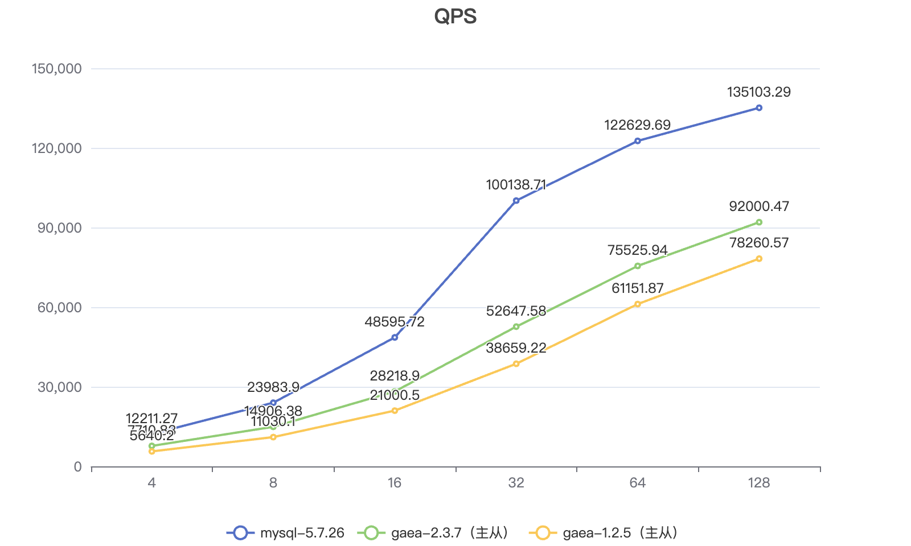

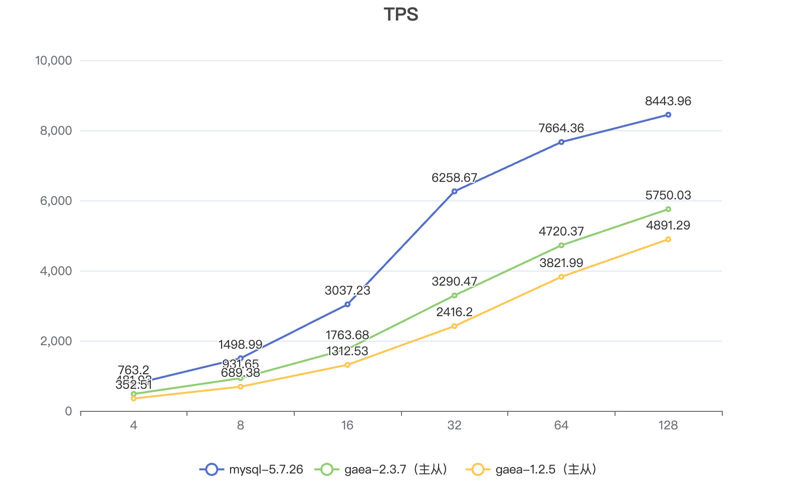

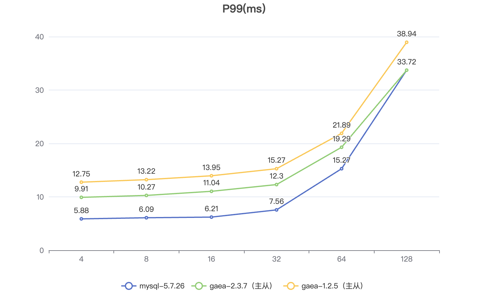

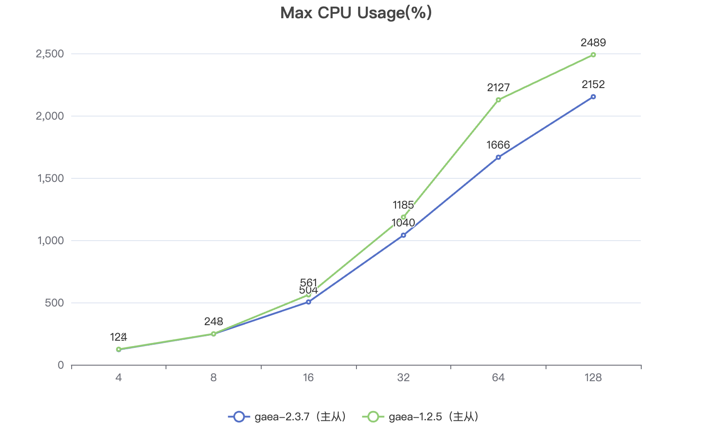

#### 3.4.2 读写测试（oltp_read_write）

```Bash
sysbench oltp_read_write --threads=xx --time=30 --mysql-db=<db> --mysql-host=<host> --mysql-port=<port> --mysql-user=<user> --mysql-password=<password> --tables=10 --table-size=1000000 --percentile=99 run
```

| 中间件             | 线程数 | qps       | tps     | avg(ms) | max(ms) | p99(ms) | max cpu usage(%) |
| ------------------ | ------ | --------- | ------- | ------- | ------- | ------- | ---------------- |
| mysql              | 4      | 12751.80  | 637.59  | 6.27    | 15.58   | 8.13    | /                |
| gaea-2.3.7（主从） | 4      | 8280.82   | 414.04  | 9.66    | 17.78   | 11.24   | 117%             |
| gaea-1.2.5（主从） | 4      | 5870.58   | 293.53  | 13.62   | 21.23   | 15.27   | 119%             |
| mysql              | 8      | 25150.51  | 1257.53 | 6.36    | 15.93   | 7.70    | /                |
| gaea-2.3.7（主从） | 8      | 15618.44  | 780.92  | 10.24   | 19.85   | 12.30   | 235%             |
| gaea-1.2.5（主从） | 8      | 11569.72  | 578.49  | 13.82   | 23.52   | 16.12   | 231%             |
| mysql              | 16     | 50818.63  | 2540.93 | 6.29    | 16.71   | 8.43    | /                |
| gaea-2.3.7（主从） | 16     | 30153.45  | 1507.67 | 10.61   | 23.45   | 13.70   | 486%             |
| gaea-1.2.5（主从） | 16     | 22201.25  | 1110.06 | 14.41   | 55.02   | 16.71   | 525%             |
| mysql              | 32     | 93985.74  | 4699.29 | 6.81    | 24.00   | 12.30   | /                |
| gaea-2.3.7（主从） | 32     | 54594.10  | 2729.70 | 11.72   | 30.33   | 17.32   | 966%             |
| gaea-1.2.5（主从） | 32     | 41000.09  | 2050.00 | 15.60   | 56.81   | 21.11   | 1120%            |
| mysql              | 64     | 95239.52  | 4761.98 | 13.43   | 3512.26 | 22.69   | /                |
| gaea-2.3.7（主从） | 64     | 76844.90  | 3842.25 | 16.65   | 132.13  | 25.28   | 1579%            |
| gaea-1.2.5（主从） | 64     | 61992.59  | 3099.63 | 20.63   | 59.54   | 28.67   | 1931%            |
| mysql              | 128    | 105833.23 | 5291.66 | 24.15   | 1115.60 | 37.56   | /                |
| gaea-2.3.7（主从） | 128    | 89307.14  | 4465.33 | 28.65   | 63.57   | 43.39   | 1882%            |
| gaea-1.2.5（主从） | 128    | 77733.50  | 3886.68 | 32.90   | 73.91   | 48.34   | 2386%            |


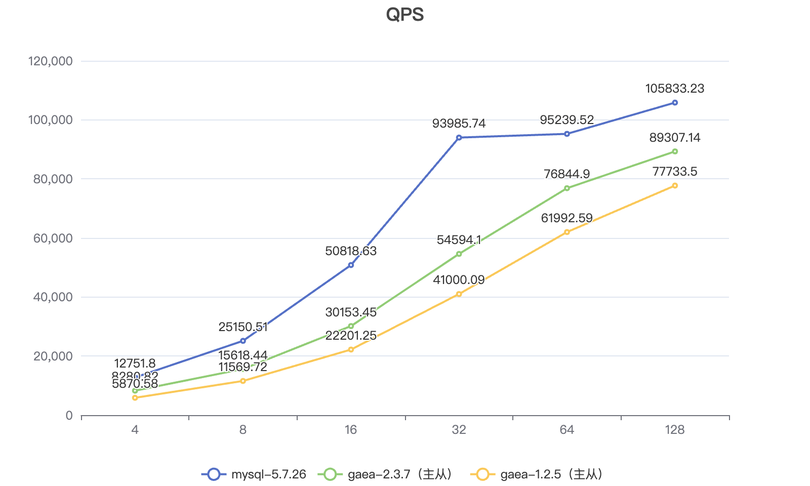

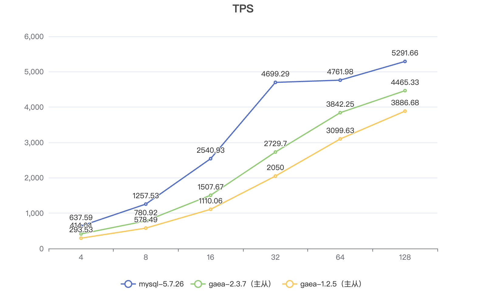

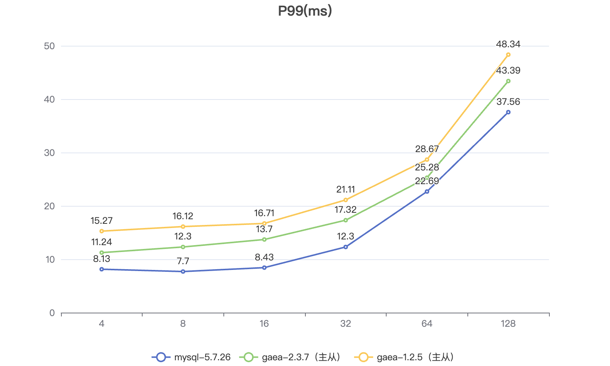


#### 3.4.3 只写测试（oltp_write_only）

```Bash
sysbench oltp_write_only --threads=xx --time=30 --mysql-db=<db> --mysql-host=<host> --mysql-port=<port> --mysql-user=<user> --mysql-password=<password> --tables=10 --table-size=1000000 --percentile=99 run
```

| 中间件             | 线程数 | qps       | tps      | avg(ms) | max(ms) | p99(ms) | max cpu usage(%) |
| ------------------ | ------ | --------- | -------- | ------- | ------- | ------- | ---------------- |
| mysql              | 4      | 22331.83  | 3721.97  | 1.07    | 14.34   | 1.37    | /                |
| gaea-2.3.7（主从） | 4      | 13121.17  | 2186.86  | 1.83    | 11.52   | 2.39    | 107%             |
| gaea-1.2.5（主从） | 4      | 8815.70   | 1469.28  | 2.72    | 11.76   | 3.30    | 87.5%            |
| mysql              | 8      | 42700.96  | 7116.83  | 1.12    | 16.01   | 1.52    | /                |
| gaea-2.3.7（主从） | 8      | 24600.35  | 4100.06  | 1.95    | 49.74   | 2.86    | 204%             |
| gaea-1.2.5（主从） | 8      | 17438.76  | 2906.46  | 2.75    | 13.04   | 3.68    | 168%             |
| mysql              | 16     | 68909.64  | 11484.94 | 1.39    | 154.05  | 2.71    | /                |
| gaea-2.3.7（主从） | 16     | 45652.70  | 7608.78  | 2.10    | 21.98   | 3.30    | 390%             |
| gaea-1.2.5（主从） | 16     | 33053.72  | 5508.95  | 2.90    | 133.64  | 4.25    | 352%             |
| mysql              | 32     | 94586.28  | 15764.38 | 2.03    | 271.67  | 7.43    | /                |
| gaea-2.3.7（主从） | 32     | 73410.90  | 12235.15 | 2.61    | 206.46  | 4.49    | 723%             |
| gaea-1.2.5（主从） | 32     | 59186.28  | 9864.38  | 3.24    | 91.51   | 5.18    | 694%             |
| mysql              | 64     | 101542.13 | 16923.69 | 3.78    | 281.98  | 11.45   | /                |
| gaea-2.3.7（主从） | 64     | 89012.94  | 14835.49 | 4.31    | 211.78  | 8.43    | 1049%            |
| gaea-1.2.5（主从） | 64     | 85108.59  | 14184.74 | 4.51    | 122.82  | 8.58    | 1171%            |
| mysql              | 128    | 97611.74  | 16268.62 | 7.86    | 257.91  | 16.71   | /                |
| gaea-2.3.7（主从） | 128    | 91228.35  | 15204.73 | 8.41    | 385.88  | 16.41   | 1077%            |
| gaea-1.2.5（主从） | 128    | 89861.02  | 14976.78 | 8.54    | 120.91  | 16.71   | 1319%            |


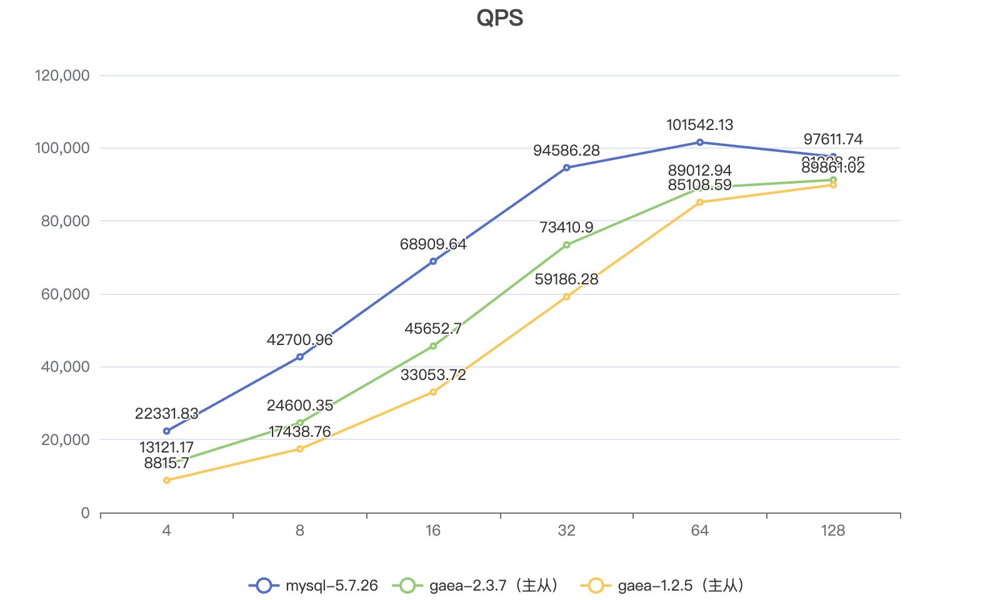

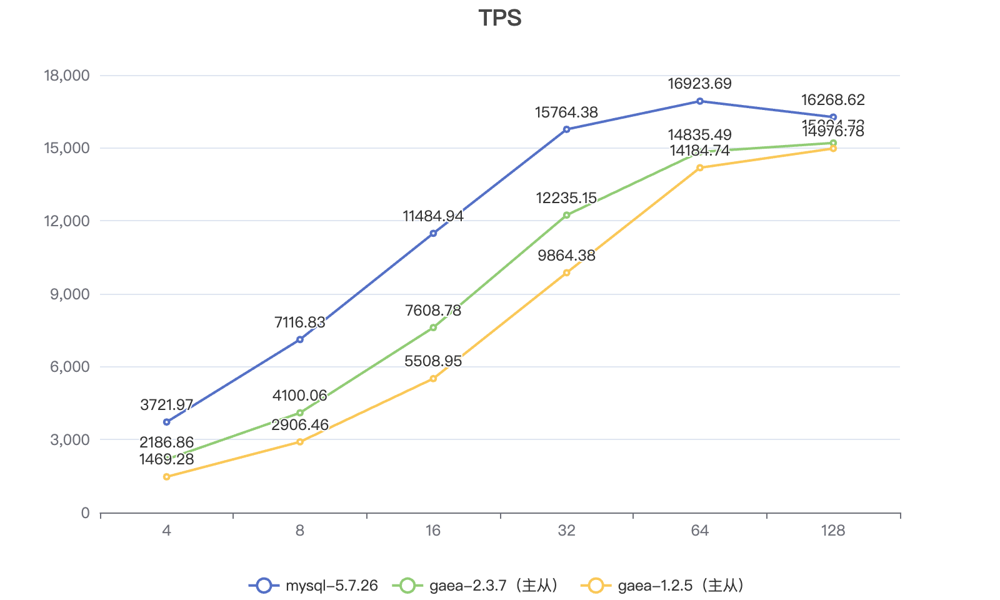

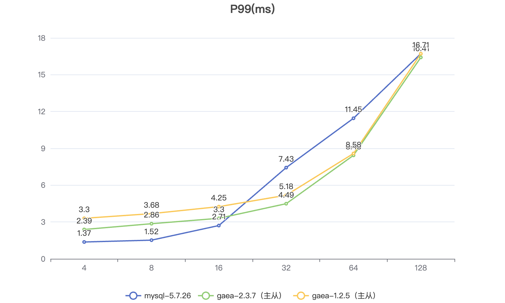

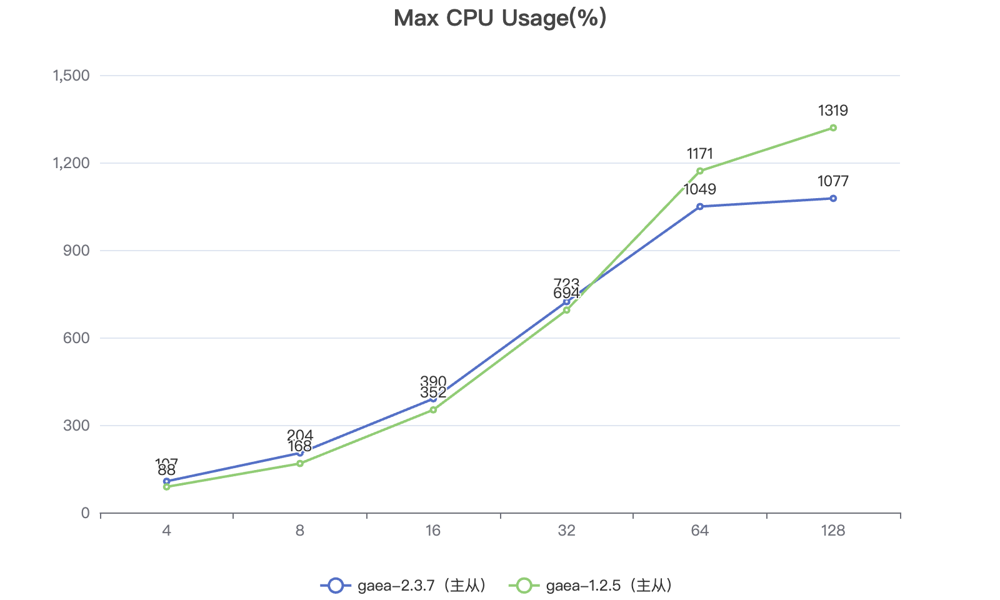

#### 3.4.4 点查测试（oltp_point_select）

```Bash
sysbench oltp_point_select --threads=xx --time=30 --mysql-db=<db_name> --mysql-host=<host> --mysql-port=<port> --mysql-user=<user> --mysql-password=<password> --tables=10 --table-size=1000000 --percentile=99 run
```

| 中间件             | 线程数 | qps       | tps       | avg(ms) | max(ms) | p99(ms) | max cpu usage(%) |
| ------------------ | ------ | --------- | --------- | ------- | ------- | ------- | ---------------- |
| mysql              | 4      | 35190.27  | 35190.27  | 0.11    | 3.95    | 0.15    | /                |
| gaea-2.3.7（主从） | 4      | 14778.30  | 14778.30  | 0.27    | 4.02    | 0.36    | 157%             |
| gaea-1.2.5（主从） | 4      | 9316.67   | 9316.67   | 0.43    | 12.52   | 0.57    | 112%             |
| mysql              | 8      | 70198.4   | 70198.4   | 0.11    | 4.55    | 0.15    | /                |
| gaea-2.3.7（主从） | 8      | 28280.01  | 28280.01  | 0.28    | 6.86    | 0.42    | 291%             |
| gaea-1.2.5（主从） | 8      | 18482.81  | 18482.81  | 0.43    | 11.73   | 0.64    | 223%             |
| mysql              | 16     | 131678.46 | 131678.46 | 0.12    | 11.09   | 0.16    | /                |
| gaea-2.3.7（主从） | 16     | 54622.85  | 54622.85  | 0.29    | 9.23    | 0.72    | 567%             |
| gaea-1.2.5（主从） | 16     | 35788.31  | 35788.31  | 0.45    | 10.20   | 0.99    | 492%             |
| mysql              | 32     | 228231.33 | 228231.33 | 0.14    | 12.39   | 0.21    | /                |
| gaea-2.3.7（主从） | 32     | 98037.40  | 98037.40  | 0.33    | 54.16   | 1.14    | 1353%            |
| gaea-1.2.5（主从） | 32     | 67346.27  | 67346.27  | 0.47    | 12.74   | 1.25    | 1041%            |
| mysql              | 64     | 352413.31 | 352413.31 | 0.18    | 22.08   | 0.46    | /                |
| gaea-2.3.7（主从） | 64     | 162489.16 | 162489.16 | 0.39    | 15.97   | 1.64    | 2445%            |
| gaea-1.2.5（主从） | 64     | 114613.39 | 114613.39 | 0.56    | 40.69   | 1.58    | 2184%            |
| mysql              | 128    | 438025.91 | 438025.91 | 0.29    | 23.41   | 2.11    | /                |
| gaea-2.3.7（主从） | 128    | 215692.85 | 215692.85 | 0.59    | 99.98   | 2.66    | 2435%            |
| gaea-1.2.5（主从） | 128    | 164069.94 | 164069.94 | 0.78    | 62.17   | 2.97    | 2825%            |


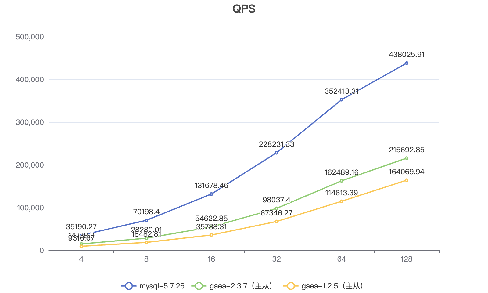


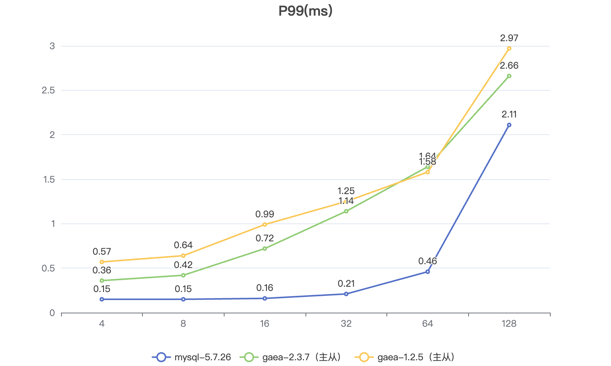

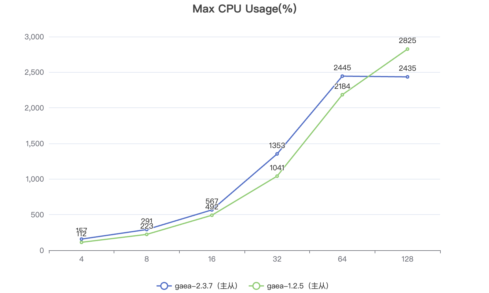

# 4.gaea 2.3.7 vs gaea 1.2.5 主库作为从库分担流量

## 4.1 机器部署

Gaea 环境：Gaea 2.3.7【40c/128G】
MySQL-Master环境: mysql-5.7.26 【32c/128G】
MySQL-Slave环境: mysql-5.7.26 【32c/128G】

## 4.2 网络拓扑

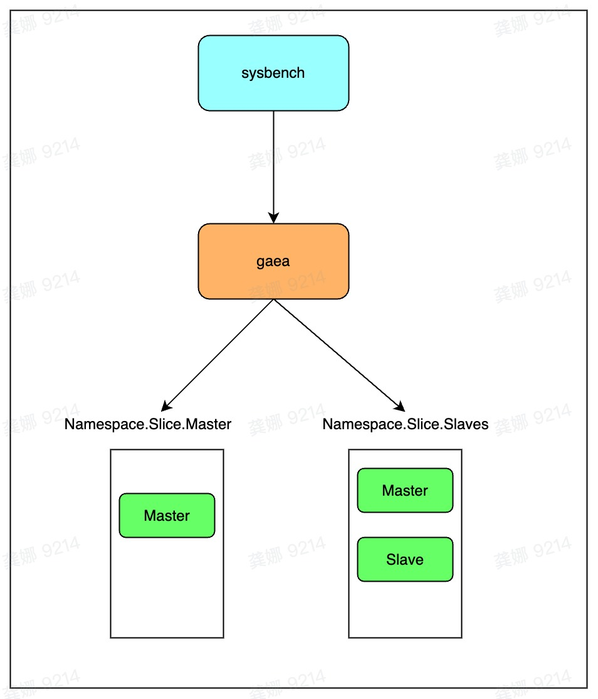

## 4.3 准备数据

替换 <host>, <user>, <password> 为数据库实际信息。

```shell
sysbench oltp_common --threads=10 --events=0 --mysql-db=<db> --mysql-host=<host> --mysql-port=<port> --mysql-user=<user> --mysql-password=<password> --tables=10 --table_size=1000000 prepare
```

## 4.4 测试结果

#### 4.4.1 只读测试（oltp_read_only）

```Bash
sysbench oltp_read_only --threads=xx --time=30 --events=0 --mysql-db=<db> --mysql-host=<host> --mysql-port=<port> --mysql-user=<user> --mysql-password=<password>  --tables=10 --table_size=1000000 --percentile=99 run 
```

| 中间件 cpu=4       | 线程数 | qps       | tps     | avg(ms) | max(ms) | p99(ms) | max cpu usage(%) |
| ------------------ | ------ | --------- | ------- | ------- | ------- | ------- | ---------------- |
| mysql              | 4      | 12211.27  | 763.20  | 5.24    | 12.35   | 5.88    | /                |
| gaea-2.3.7（主从） | 4      | 7772.78   | 485.80  | 8.23    | 15.93   | 9.73    | 116%             |
| gaea-1.2.5（主从） | 4      | 5649.68   | 353.11  | 11.33   | 42.53   | 12.75   | 121%             |
| mysql              | 8      | 23983.90  | 1498.99 | 5.33    | 15.28   | 6.09    | /                |
| gaea-2.3.7（主从） | 8      | 14948.15  | 934.26  | 8.56    | 14.85   | 10.27   | 240%             |
| gaea-1.2.5（主从） | 8      | 11043.60  | 690.23  | 11.59   | 18.84   | 13.22   | 245%             |
| mysql              | 16     | 48595.72  | 3037.23 | 5.26    | 15.39   | 6.21    | /                |
| gaea-2.3.7（主从） | 16     | 28675.09  | 1792.19 | 8.92    | 20.42   | 11.04   | 489%             |
| gaea-1.2.5（主从） | 16     | 21481.84  | 1342.61 | 11.91   | 50.05   | 13.70   | 536%             |
| mysql              | 32     | 100138.71 | 6258.67 | 5.11    | 21.73   | 7.56    | /                |
| gaea-2.3.7（主从） | 32     | 53342.44  | 3333.90 | 9.59    | 19.83   | 12.08   | 1009%            |
| gaea-1.2.5（主从） | 32     | 39958.52  | 2497.41 | 12.81   | 63.21   | 15.00   | 1125%            |
| mysql              | 64     | 122629.69 | 7664.36 | 8.34    | 42.24   | 15.27   | /                |
| gaea-2.3.7（主从） | 64     | 77656.56  | 4853.53 | 13.18   | 71.26   | 18.95   | 1623%            |
| gaea-1.2.5（主从） | 64     | 62997.16  | 3937.32 | 16.25   | 56.07   | 21.89   | 2063%            |
| mysql              | 128    | 135103.29 | 8443.96 | 15.14   | 63.73   | 33.72   | /                |
| gaea-2.3.7（主从） | 128    | 95292.63  | 5955.79 | 21.48   | 69.77   | 33.12   | 2103%            |
| gaea-1.2.5（主从） | 128    | 83314.83  | 5207.18 | 24.56   | 90.03   | 36.24   | 2637%            |


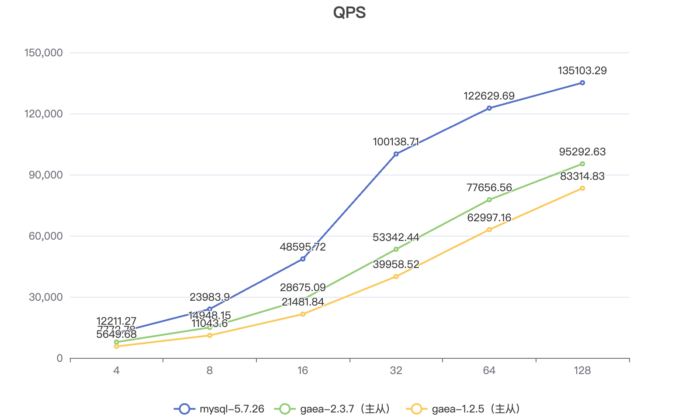

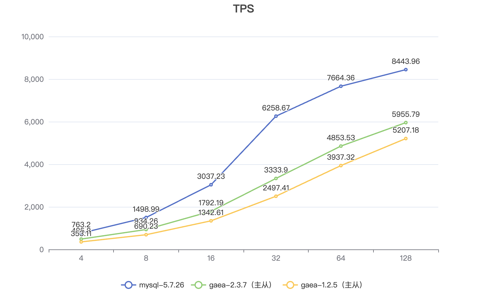

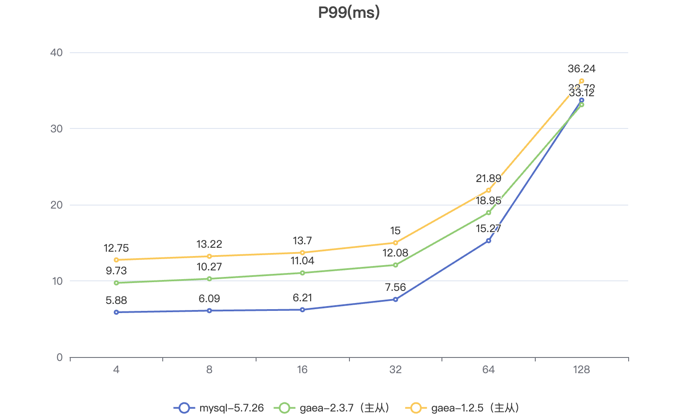

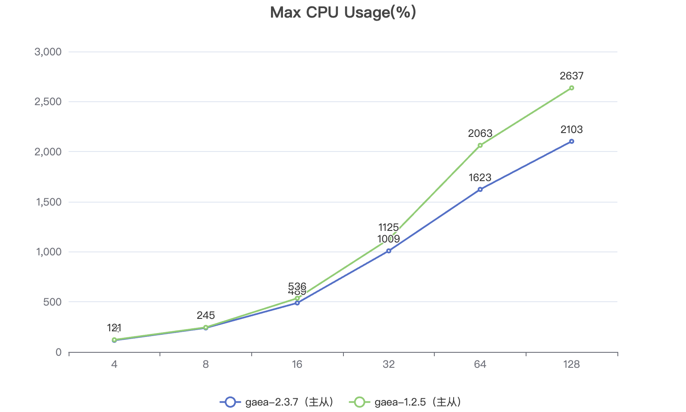

#### 4.4.2 读写测试（oltp_read_write）

```Bash
sysbench oltp_read_write --threads=xx --time=30 --mysql-db=<db> --mysql-host=<host> --mysql-port=<port> --mysql-user=<user> --mysql-password=<password> --tables=10 --table-size=1000000 --percentile=99 run
```

| 中间件             | 线程数 | qps       | tps     | avg(ms) | max(ms) | p99(ms) | max cpu usage(%) |
| ------------------ | ------ | --------- | ------- | ------- | ------- | ------- | ---------------- |
| mysql              | 4      | 12751.80  | 637.59  | 6.27    | 15.58   | 8.13    | /                |
| gaea-2.3.7（主从） | 4      | 8236.81   | 411.84  | 9.71    | 19.98   | 11.45   | 113%             |
| gaea-1.2.5（主从） | 4      | 5892.08   | 294.60  | 13.57   | 21.50   | 15.27   | 116%             |
| mysql              | 8      | 25150.51  | 1257.53 | 6.36    | 15.93   | 7.70    | /                |
| gaea-2.3.7（主从） | 8      | 15714.96  | 785.75  | 10.18   | 42.64   | 12.30   | 235%             |
| gaea-1.2.5（主从） | 8      | 11678.25  | 583.91  | 13.70   | 39.40   | 15.83   | 229%             |
| mysql              | 16     | 50818.63  | 2540.93 | 6.29    | 16.71   | 8.43    | /                |
| gaea-2.3.7（主从） | 16     | 29966.20  | 1498.31 | 10.67   | 22.81   | 13.46   | 460%             |
| gaea-1.2.5（主从） | 16     | 22327.0   | 1116.35 | 14.33   | 53.23   | 16.71   | 507%             |
| mysql              | 32     | 93985.74  | 4699.29 | 6.81    | 24.00   | 12.30   | /                |
| gaea-2.3.7（主从） | 32     | 55437.20  | 2771.86 | 11.54   | 30.90   | 15.83   | 961%             |
| gaea-1.2.5（主从） | 32     | 41241.46  | 2062.07 | 15.51   | 55.78   | 20.74   | 1083%            |
| mysql              | 64     | 95239.52  | 4761.98 | 13.43   | 3512.26 | 22.69   | /                |
| gaea-2.3.7（主从） | 64     | 77396.96  | 3869.85 | 16.53   | 38.36   | 25.28   | 1484%            |
| gaea-1.2.5（主从） | 64     | 63729.74  | 3186.49 | 20.07   | 94.94   | 28.67   | 1985%            |
| mysql              | 128    | 105833.23 | 5291.66 | 24.15   | 1115.60 | 37.56   | /                |
| gaea-2.3.7（主从） | 128    | 89521.78  | 4476.09 | 28.58   | 97.54   | 44.17   | 1808%            |
| gaea-1.2.5（主从） | 128    | 80056.78  | 4002.78 | 31.94   | 177.12  | 48.34   | 2410%            |


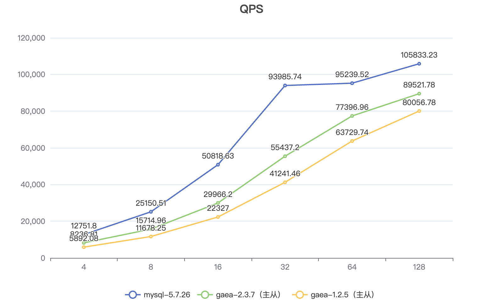


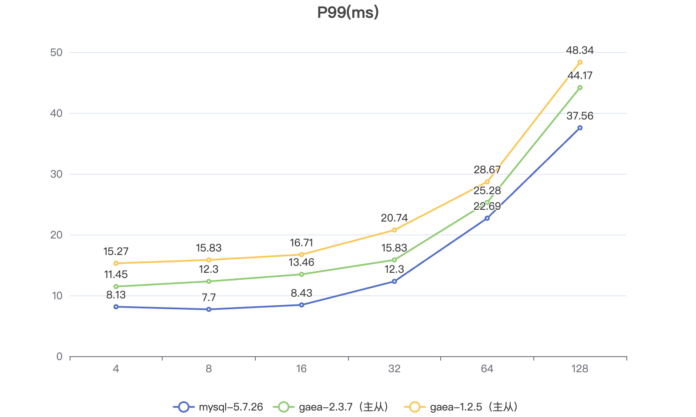

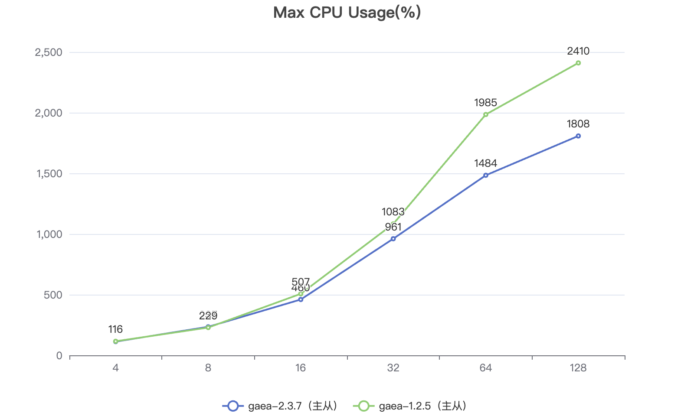


#### 4.4.3 只写测试（oltp_write_only）

```Bash
sysbench oltp_write_only --threads=xx --time=30 --mysql-db=<db> --mysql-host=<host> --mysql-port=<port> --mysql-user=<user> --mysql-password=<password> --tables=10 --table-size=1000000 --percentile=99 run
```

| 中间件             | 线程数 | qps       | tps      | avg(ms) | max(ms) | p99(ms) | max cpu usage(%) |
| ------------------ | ------ | --------- | -------- | ------- | ------- | ------- | ---------------- |
| mysql              | 4      | 22331.83  | 3721.97  | 1.07    | 14.34   | 1.37    | /                |
| gaea-2.3.7（主从） | 4      | 12790.03  | 2131.67  | 1.87    | 57.38   | 2.48    | 107%             |
| gaea-1.2.5（主从） | 4      | 8745.08   | 1457.51  | 2.74    | 42.56   | 3.43    | 84.2%            |
| mysql              | 8      | 42700.96  | 7116.83  | 1.12    | 16.01   | 1.52    | /                |
| gaea-2.3.7（主从） | 8      | 24372.55  | 4062.09  | 1.97    | 33.31   | 2.81    | 200%             |
| gaea-1.2.5（主从） | 8      | 17348.54  | 2891.42  | 2.76    | 12.91   | 3.82    | 169%             |
| mysql              | 16     | 68909.64  | 11484.94 | 1.39    | 154.05  | 2.71    | /                |
| gaea-2.3.7（主从） | 16     | 44810.37  | 7468.39  | 2.14    | 23.45   | 3.36    | 378%             |
| gaea-1.2.5（主从） | 16     | 33094.86  | 5515.81  | 2.90    | 42.46   | 4.33    | 333%             |
| mysql              | 32     | 94586.28  | 15764.38 | 2.03    | 271.67  | 7.43    | /                |
| gaea-2.3.7（主从） | 32     | 74359.59  | 12393.27 | 2.58    | 163.77  | 4.10    | 706%             |
| gaea-1.2.5（主从） | 32     | 58624.05  | 9770.68  | 3.27    | 150.54  | 5.47    | 675%             |
| mysql              | 64     | 101542.13 | 16923.69 | 3.78    | 281.98  | 11.45   | /                |
| gaea-2.3.7（主从） | 64     | 90020.06  | 15003.33 | 4.26    | 205.87  | 8.43    | 1029%            |
| gaea-1.2.5（主从） | 64     | 80827.47  | 13471.23 | 4.75    | 226.21  | 8.90    | 1077%            |
| mysql              | 128    | 97611.74  | 16268.62 | 7.86    | 257.91  | 16.71   | /                |
| gaea-2.3.7（主从） | 128    | 91221.97  | 15203.63 | 8.41    | 247.21  | 16.12   | 1033%            |
| gaea-1.2.5（主从） | 128    | 89708.88  | 14951.48 | 8.55    | 307.77  | 16.71   | 1287%            |


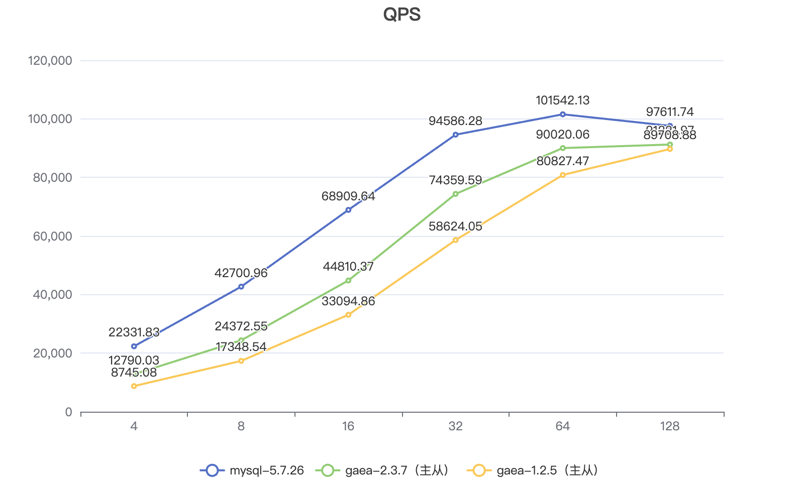

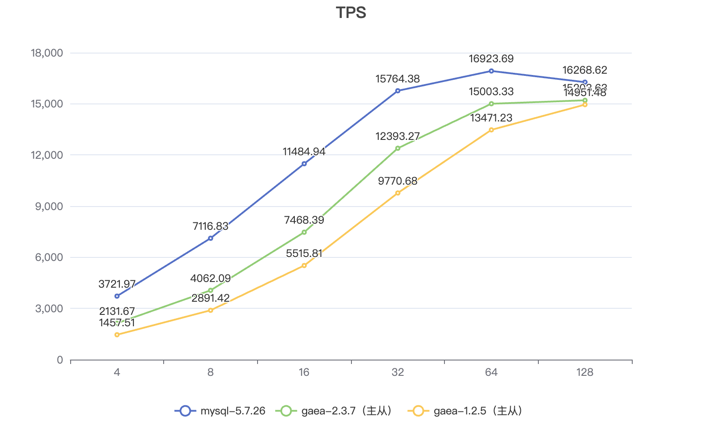

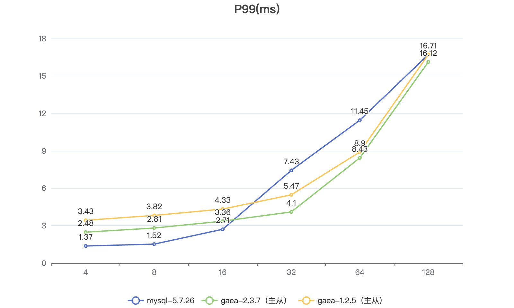

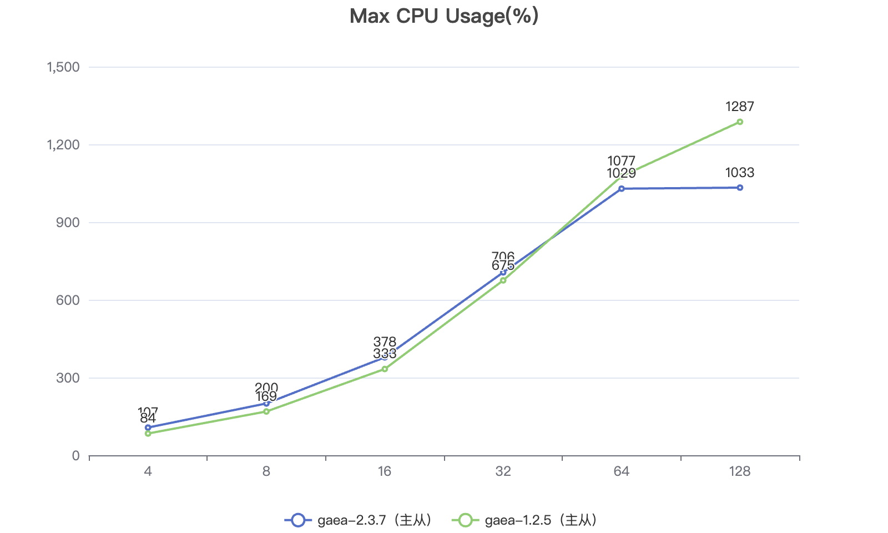

#### 4.4.4 点查测试（oltp_point_select）

```Bash
sysbench oltp_point_select --threads=xx --time=30 --mysql-db=<db_name> --mysql-host=<host> --mysql-port=<port> --mysql-user=<user> --mysql-password=<password> --tables=10 --table-size=1000000 --percentile=99 run
```

| 中间件             | 线程数 | qps       | tps       | avg(ms) | max(ms) | p99(ms) | max cpu usage(%) |
| ------------------ | ------ | --------- | --------- | ------- | ------- | ------- | ---------------- |
| mysql              | 4      | 35190.27  | 35190.27  | 0.11    | 3.95    | 0.15    | /                |
| gaea-2.3.7（主从） | 4      | 14388.87  | 14388.87  | 0.28    | 13.29   | 0.35    | 146%             |
| gaea-1.2.5（主从） | 4      | 9567.43   | 9567.43   | 0.42    | 16.37   | 0.55    | 110%             |
| mysql              | 8      | 70198.4   | 70198.4   | 0.11    | 4.55    | 0.15    | /                |
| gaea-2.3.7（主从） | 8      | 27138.82  | 27138.82  | 0.29    | 12.87   | 0.41    | 294%             |
| gaea-1.2.5（主从） | 8      | 18708.01  | 18708.01  | 0.43    | 15.15   | 0.61    | 228%             |
| mysql              | 16     | 131678.46 | 131678.46 | 0.12    | 11.09   | 0.16    | /                |
| gaea-2.3.7（主从） | 16     | 53295.71  | 53295.71  | 0.30    | 6.22    | 0.63    | 570%             |
| gaea-1.2.5（主从） | 16     | 36512.89  | 36512.89  | 0.44    | 12.14   | 0.92    | 493%             |
| mysql              | 32     | 228231.33 | 228231.33 | 0.14    | 12.39   | 0.21    | /                |
| gaea-2.3.7（主从） | 32     | 96906.74  | 96906.74  | 0.33    | 56.38   | 1.12    | 1273%            |
| gaea-1.2.5（主从） | 32     | 70106.93  | 70106.93  | 0.46    | 56.96   | 1.21    | 1097%            |
| mysql              | 64     | 352413.31 | 352413.31 | 0.18    | 22.08   | 0.46    | /                |
| gaea-2.3.7（主从） | 64     | 161266.06 | 161266.06 | 0.40    | 21.15   | 1.61    | 2375%            |
| gaea-1.2.5（主从） | 64     | 120596.16 | 120596.16 | 0.53    | 39.74   | 1.50    | 2222%            |
| mysql              | 128    | 438025.91 | 438025.91 | 0.29    | 23.41   | 2.11    | /                |
| gaea-2.3.7（主从） | 128    | 221337.53 | 221337.53 | 0.58    | 112.63  | 2.61    | 2415%            |
| gaea-1.2.5（主从） | 128    | 174735.94 | 174735.94 | 0.73    | 62.40   | 2.91    | 2910%            |


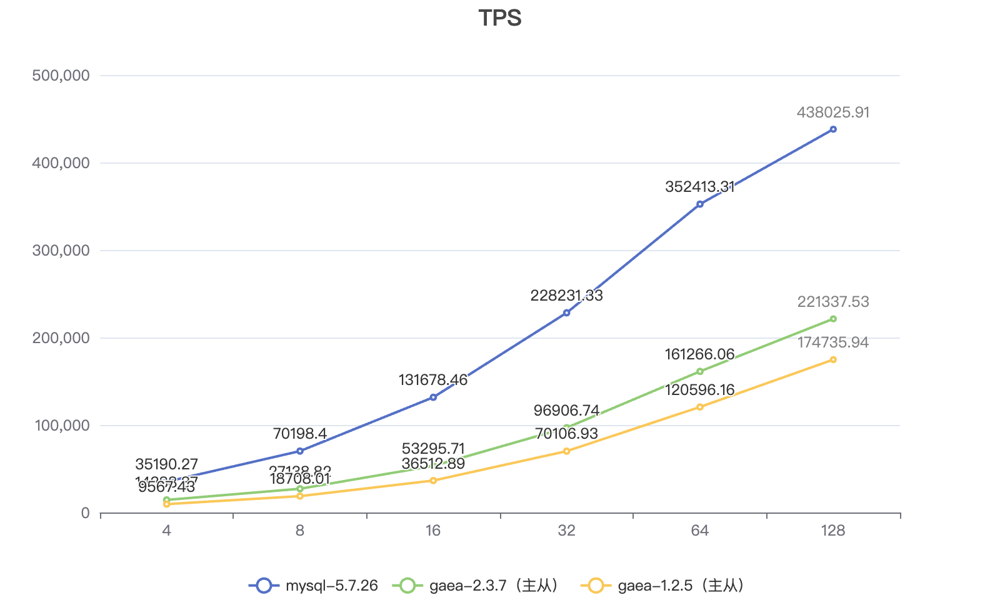

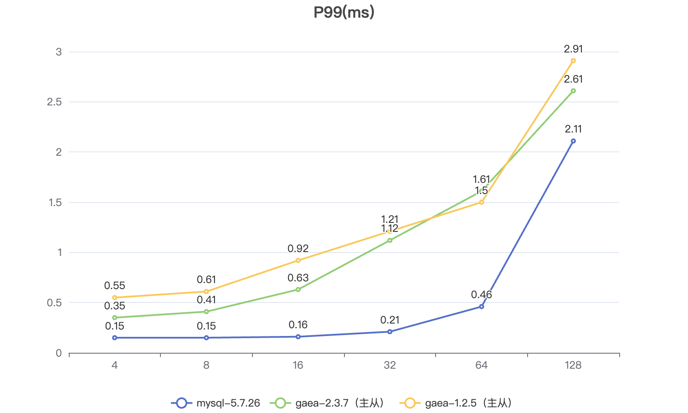

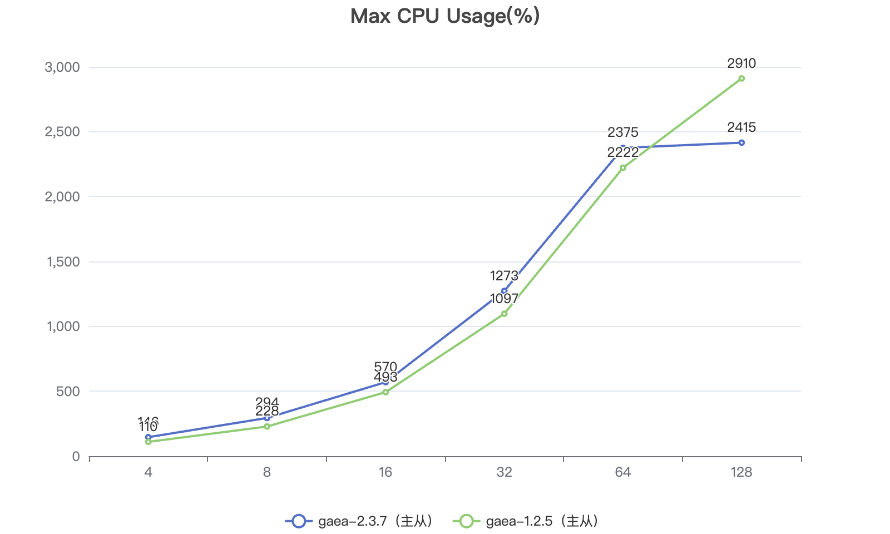
