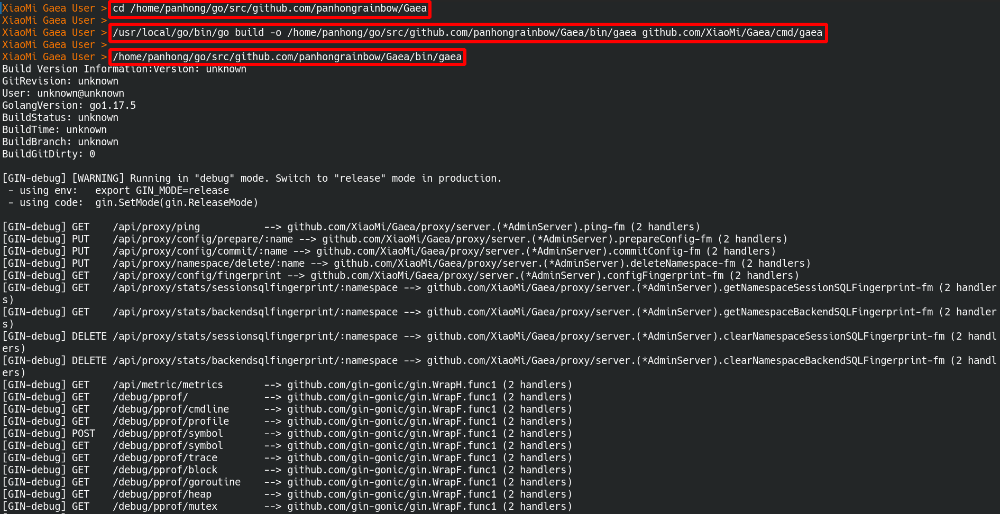

# Gaea 数据库中间件连线说明

> - 整个 Gaea 设定值读取和写入的逻辑由 Gaea/models/store.go 进行处理
> - 这份文档主要在说明 如何在设定文档上，设定对数据库中间件 Gaea 连线相关设定值后，立即进行连线
>   目前支援的设定方式
>   1. 文档 File
>   2. 网路 Etcd V2 API
>   3. 网路 Etcd V3 API
>

## 1 测试环境说明

###  1 测试环境架构

丛集名称为 gaea_cluster，内含两个数据库 Cluster

1. 数据库丛集一 Cluster1，1台 Master 和 2 台 Slave，数据库名称为 novel ，数据表为 Book_0000
2. 数据库丛集二 Cluster2，1台 Master 和 2 台 Slave，数据库名称为 novel ，数据表为 Book_0001

以下为架构图

 

### 2 测试环境的数据库 Schema

表名不管是 Book_0000 或者是 Book_0001，都使用相同的 Schema

```sql
-- 创建数据表 Book_0000
CREATE TABLE `novel`.`Book_0000` (
  `BookID` int(11) NOT NULL,
  `Isbn` bigint(50) NOT NULL,
  `Title` varchar(100) NOT NULL,
  `Author` varchar(30) DEFAULT NULL,
  `Publish` int(4) DEFAULT NULL,
  `Category` varchar(30) NOT NULL,
  PRIMARY KEY (`BookID`)
) ENGINE=InnoDB DEFAULT CHARSET=utf8;

-- 创建数据表 Book_0001
CREATE TABLE `novel`.`Book_0001` (
  `BookID` int(11) NOT NULL,
  `Isbn` bigint(50) NOT NULL,
  `Title` varchar(100) NOT NULL,
  `Author` varchar(30) DEFAULT NULL,
  `Publish` int(4) DEFAULT NULL,
  `Category` varchar(30) NOT NULL,
  PRIMARY KEY (`BookID`)
) ENGINE=InnoDB DEFAULT CHARSET=utf8;
```

## 2 设定值的内容

> 不管是要把设定值储存在文档还是在网路内，设定值会参考以下内容进行设定

### 1 丛集名称设定内容

| 名称项目           | 设定值                  | 说明                                   |
| ------------------ | ----------------------- | -------------------------------------- |
| 丛集名称 Cluster   | gaea_cluster            | 一个 Cluster 可以包含多个 Namespace    |
| 命名空间 Namespace | novel_cluster_namespace | 属于丛集 gaea_cluster 内的一个命名空间 |

### 2 数据库集群设定内容

| 数据库集群编号 |    Mater 服务器    |   Slave 服务器一   |   Slave 服务器二   |  帐号  | 密码  |
| :------------: | :----------------: | :----------------: | :----------------: | :----: | :---: |
|  数据库集群1   | 192.168.122.2:3309 | 192.168.122.2:3310 | 192.168.122.2:3311 | xiaomi | 12345 |
|  数据库集群2   | 192.168.122.2:3312 | 192.168.122.2:3313 | 192.168.122.2:3314 | xiaomi | 12345 |

### 3 切片设定值内容

| 数据库集群编号 | 对应的切片名称 | 数据表名称 | 是否预设 |
| :------------: | :------------: | :--------: | :------: |
|  数据库集群1   |    slice-0     | Book_0000  |    是    |
|  数据库集群2   |    slice-1     | Book_0001  |    否    |

### 4 分片演算法设定值

| 演算法设定项目 | 演算法设定值          | 说明                                                         |
| -------------- | --------------------- | ------------------------------------------------------------ |
| 用户名称       | hash                  | Kingshard Hash 分片演算法                                    |
| 分表依据的键值 | BookID                | 会以 BookID 的数值作为分表的依据                             |
| 数据表数量     | [1,1]                 | 阵列 [1,1] 分别指出每一个切片的数据表数量，比如<br />slice-0 有 1 张 数据表，<br />slice-1 有 1 张 数据表 |
| 切片列表阵列   | ["slice-0","slice-1"] | 此命名空间里，有两个切片，分别为 slice-0 和 slice-1          |

### 5 命名空间操作用户设定值

| 用户设定项目 | 用户设定值                              | 说明                                                         |
| ------------ | --------------------------------------- | ------------------------------------------------------------ |
| 用户名称     | xiaomi                                  |                                                              |
| 用户密码     | 12345                                   |                                                              |
| 命名空间名称 | novel_cluster_namespace                 |                                                              |
| 用户读写标记 | rw_flag 为 2 ，该用户可进行 读写 操作   | rw_flag 为 1，只能进行 唯读 操作<br />rw_flag 为 2，可进行 读写 操作 |
| 读写分离标记 | rw_split 为 1，该用户进行 读写分离 操作 | rw_split 为 0，进行 非读写分离 操作<br />rw_split 为 1，进行 读写分离 操作 |

### 6 命名空间 JSON 格式设定值

命名空间 JSON 格式设定值 内容如下，这份设定值可以储存在 设定文档 里或 网路 中，设定值都一模一样

```json
{
  "name": "novel_cluster_namespace",
  "online": true,
  "read_only": false,
  "allowed_dbs": {
    "novel": true
  },
  "slow_sql_time": "1000",
  "black_sql": [
    ""
  ],
  "allowed_ip": null,
  "slices": [
    {
      "name": "slice-0",
      "user_name": "xiaomi",
      "password": "12345",
      "master": "192.168.122.2:3309",
      "slaves": ["192.168.122.2:3310", "192.168.122.2:3311"],
      "statistic_slaves": null,
      "capacity": 12,
      "max_capacity": 24,
      "idle_timeout": 60
    },
	{
      "name": "slice-1",
      "user_name": "xiaomi",
      "password": "12345",
      "master": "192.168.122.2:3312",
      "slaves": ["192.168.122.2:3313", "192.168.122.2:3314"],
      "statistic_slaves": null,
      "capacity": 12,
      "max_capacity": 24,
      "idle_timeout": 60
    }
  ],
  "shard_rules": [
	{
      "db": "novel",
      "table": "Book",
      "type": "hash",
      "key": "BookID",
      "locations": [
        1,
        1
      ],
      "slices": [
        "slice-0",
        "slice-1"
      ]
    }
  ],
  "users": [
    {
      "user_name": "xiaomi",
      "password": "12345",
      "namespace": "novel_cluster_namespace",
      "rw_flag": 2,
      "rw_split": 1,
      "other_property": 0
    }
  ],
  "default_slice": "slice-0",
  "global_sequences": null
}
```

## 3 命名空间设定值储存方式

> 目前支援设定档的读取方式为，整个逻辑由 Gaea/models/store.go 控制
>
> 1. 方法一：使用文档 File 去储存设定值
> 2. 方法二：使用网路 Etcd V2 API 去储存设定值
> 3. 方法三：使用网路 Etcd V3 API 去储存设定值

### 1 使用文档 File 储存

> 当准备使用文档 File 去储存设定值时，需要修改改两个设定文档
>
> 1. 初始化设定文档，位于 Gaea/etc/gaea.ini
> 2. 命名空间设定文档，集中于目录 Gaea/etc/file/namespace/

修正初始化设定文档 Gaea/etc/gaea.ini，指定以下内容

1. 使用设定文档 File 去储存设定值
2. 丛集名称为 gaea_cluster

把设定文档 Gaea/etc/gaea.ini 修正成以下内容

```ini
; 这里的重点在把 config_type 值改成 file，并修改丛集名称!!!!!

; config type, etcd/file, you can test gaea with file type, you shoud use etcd in production
config_type=file
; file config path, 具体配置放到file_config_path的namespace目录下，该下级目录为固定目录
file_config_path=./etc/file

; 在这里指定丛集名称为 gaea_cluster
cluster_name=gaea_cluster

; 以下略过，因为重点要把前面的 config_type 设定值改成 file
```

- 在目录 Gaea/etc/file/namespace 下新增一个命名空间设定档，档名为 novel_cluster_namespace.json，内容为 小说数据库丛集 的相关设定

- 在命名空间设定文档内 novel_cluster_namespace.json 内指定命名空间名称为 novel_cluster_namespace

把设定文档 Gaea/etc/file/namespace/novel_cluster_namespace.json 填入 命名空间 Json 格式设定值，如以下内容所示

```json
{
  "name": "novel_cluster_namespace",
  "online": true,
  "read_only": false,
  "allowed_dbs": {
    "novel": true
  },
  "slow_sql_time": "1000",
  "black_sql": [
    ""
  ],
  "allowed_ip": null,
  "slices": [
以下略
```

### 2 使用网路 Etcd 储存

> 这次直接用 Gui 工具把设定值写入 Etcd 容器

修正初始化设定文档 Gaea/etc/gaea.ini，指定以下内容

1. 使用 Etcd 服务器去储存设定值
2. 丛集名称为 gaea_cluster
3. 指定 Etcd 的网路位置为 http://127.0.0.1:2379

把设定文档 Gaea/etc/gaea.ini 修正成以下内容

```ini
; 这里的重点在把 config_type 值改成 file，并修改丛集名称!!!!!

; config type, etcd/file/etcdv3, you can test gaea with file type, you shoud use etcd/etcdv3 in production
; 请指定设定方式为 file 或 etcd 或 etcdv3
config_type=etcdv3
; file config path, 具体配置放到file_config_path的namespace目录下，该下级目录为固定目录
file_config_path=./etc/file

; 在这里指定丛集名称为 gaea_cluster
cluster_name=gaea_cluster

; 在这里指定 Etcd 服务器的网路位置
coordinator_addr=http://127.0.0.1:2379

; 以下略过，因为重点要把前面的 config_type 设定值改成 file
```

在 Etcd 服务器内写入以下内容

- key 为 /gaea_cluster/namespace/novel_cluster_namespace
- value 为 之前提到的命名空间 Json 格式设定值

 

## 4 启动数据库中间件 Gaea

> 启动的方式有分两种
>
> 1. 在终端机去下指令启动 Gaea
> 2. 使用 IDE 工具启动 Gaea

### 1 建立执行文档的目录

```bash
# 建立执行档集中目录
$ mkdir -p Gaea/bin/
```

### 2 在终端机去下指令启动 Gaea

先在终端机进行编译，后执行

```bash
# GoRoot 和 GoPath 设定值
# GOROOT 位于 /usr/local/go #gosetup
# GOPATH 位于 /home/panhong/go #gosetup

# 到 Gaea 的专案目录
$ cd /home/panhong/go/src/github.com/panhongrainbow/Gaea

# 对 Gaea 主程式进行编译
$ /usr/local/go/bin/go build -o /home/panhong/go/src/github.com/panhongrainbow/Gaea/bin/gaea github.com/XiaoMi/Gaea/cmd/gaea #gosetup

# 执行数据库中间件 Gaea
$ /home/panhong/go/src/github.com/panhongrainbow/Gaea/bin/gaea
```

执行画面如下



### 3 使用 IDE 工具启动 Gaea

在 IDE 工具内，填入以下内容

| 项目 | 配置       | 参数                                            |
| ---- | ---------- | ----------------------------------------------- |
| １   | 名称       | gaea                                            |
| ２   | 运行种类   | 软体包                                          |
| ３   | 软体包路径 | github.com/XiaoMi/Gaea/cmd/gaea                 |
| ４   | 输出目录   | /home/panhong/go/src/github.com/xiaomi/Gaea/bin |
| ５   | 建构后运行 | 打勾                                            |
| ６   | 工作目录   | /home/panhong/go/src/github.com/xiaomi/Gaea     |

配置如下图

 

运行状况如下图

 

### 4 启动后服务发现

数据库中间件 Gaea 启动后，会在服务器 Etcd 里新增一个 key /gaea_cluster/proxy/proxy-127.0.0.1:13306

其 value 内容如下

```json
{
  "token": "127.0.0.1:13306",
  "start_time": "2022-01-24 11:22:03.46517227 +0800 CST m=+0.066173904",
  "ip": "127.0.0.1",
  "proto_type": "tcp4",
  "proxy_port": "13306",
  "admin_port": "13307",
  "pid": 10628,
  "pwd": "/home/panhong/go/src/github.com/panhongrainbow/Gaea",
  "sys": "Linux debian5 5.10.0-10-amd64 #1 SMP Debian 5.10.84-1 (2021-12-08) x86_64 GNU/Linux"
}
```

执行状况如下图

 

## 5 登入数据库中间件 Gaea

数据库中间件 Gaea 启动后，直接进行登入

```bash
# 登入 Gaea 指令如下
$ mysql -h 127.0.0.1 -P 13306 --protocol=TCP -u xiaomi -p
```

 

## 6 测试数据库中间件 Gaea 的读写

> 登入数据库中间件 Gaea ，执行以下 SQL 语句

登入数据库中间件 Gaea，使用数据库 novel

```bash
# 登入数据库中间件 Gaea
$ mysql -h 127.0.0.1 -P 13306 --protocol=TCP -u xiaomi -p
# Enter password: 
# Welcome to the MariaDB monitor.  Commands end with ; or \g.
# Your MySQL connection id is 10001
# Server version: 5.6.20-gaea Source distribution

# Copyright (c) 2000, 2018, Oracle, MariaDB Corporation Ab and others.

# Type 'help;' or '\h' for help. Type '\c' to clear the current input statement.

# 使用数据库
$ MySQL [(none)]> USE novel
# Reading table information for completion of table and column names
# You can turn off this feature to get a quicker startup with -A

# Database changed
# MySQL [novel]>
```

执行以下 SQL 语句

```sql
-- 第一本小说 三国演义
INSERT INTO novel.Book (BookID, Isbn, Title, Author, Publish, Category) VALUES(1, 9781517191276, 'Romance Of The Three Kingdoms', 'Luo Guanzhong', 1522, 'Hi
storical fiction'); 

-- 第二本小说 水浒传
INSERT INTO novel.Book (BookID, Isbn, Title, Author, Publish, Category) VALUES(2, 9789869442060, 'Water Margin', 'Shi Nai an', 1589, 'Historical fiction'); 

-- 第三本小说 西游记
INSERT INTO novel.Book (BookID, Isbn, Title, Author, Publish, Category) VALUES(3, 9789575709518, 'Journey To The West', 'Wu Cheng en', 1592, 'Gods And Demon
s Fiction'); 
```

登入数据库中间件 Gaea，执行三笔写入小说资料的 SQL 语句


登入第一组丛集，查询 Master 数据库的写入资料，三笔小说资料被分配到一笔


登入第一组丛集，查询第一台 Slave 数据库的写入资料，三笔小说资料被分配到一笔


登入第一组丛集，查询第二台 Slave 数据库的写入资料，三笔小说资料被分配到一笔


登入第二组丛集，查询 Master 数据库的写入资料，三笔小说资料被分配到两笔


登入第二组丛集，查询第一台 Slave 数据库的写入资料，三笔小说资料被分配到两笔


登入第二组丛集，查询第二台 Slave 数据库的写入资料，三笔小说资料被分配到两笔


最后直接在数据库中间件 Gaea 查询全部三笔的小说资料

 
