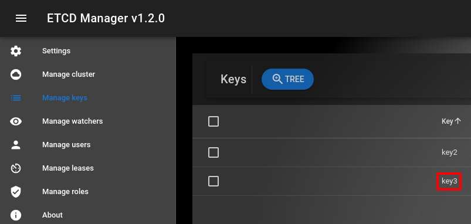
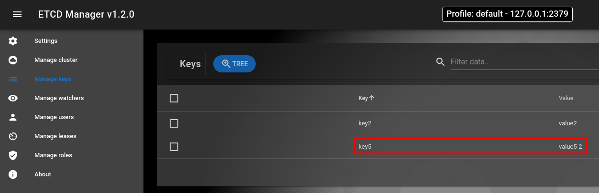
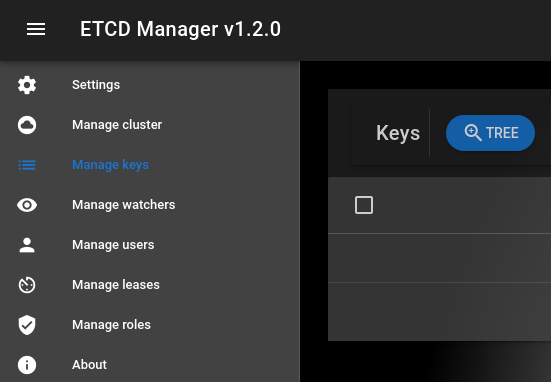

# Gaea 小米数据库中间件 Ectd V3 API 升级过程说明

> 因为 Etcd V3 API 使用 gRPC 作为沟通的协定，效能上会有所提升，有必要进行升级，但是 V2 API  和 V3 API 在功能上有所不同，整理成以下内容作为记录

## 1 Etcd 测试环境设置 

> 直接到 Etcd V3 https://github.com/etcd-io/etcd/releases 找到容器 etcd v3.5.1 的启动方式，以下为启动指令

```bash
# 连结到 Etcd GitHub
$ firefox https://github.com/etcd-io/etcd/releases

# 删除之前容器相关档案
$ docker stop etcd-gcr-v3.5.1
$ docker rm etcd-gcr-v3.5.1
$ sudo rm -rf /tmp/etcd-data.tmp

# 执行以下指令去执行 etcd v3.5.1 容器
$ rm -rf /tmp/etcd-data.tmp && mkdir -p /tmp/etcd-data.tmp && \
  docker rmi gcr.io/etcd-development/etcd:v3.5.1 || true && \
  docker run \
  -p 2379:2379 \
  -p 2380:2380 \
  --mount type=bind,source=/tmp/etcd-data.tmp,destination=/etcd-data \
  --name etcd-gcr-v3.5.1 \
  gcr.io/etcd-development/etcd:v3.5.1 \
  /usr/local/bin/etcd \
  --name s1 \
  --data-dir /etcd-data \
  --listen-client-urls http://0.0.0.0:2379 \
  --advertise-client-urls http://0.0.0.0:2379 \
  --listen-peer-urls http://0.0.0.0:2380 \
  --initial-advertise-peer-urls http://0.0.0.0:2380 \
  --initial-cluster s1=http://0.0.0.0:2380 \
  --initial-cluster-token tkn \
  --initial-cluster-state new \
  --log-level info \
  --logger zap \
  --log-outputs stderr

# 执行以下指令进行初期测试
$ docker exec etcd-gcr-v3.5.1 /bin/sh -c "/usr/local/bin/etcd --version"
$ docker exec etcd-gcr-v3.5.1 /bin/sh -c "/usr/local/bin/etcdctl version"
$ docker exec etcd-gcr-v3.5.1 /bin/sh -c "/usr/local/bin/etcdctl endpoint health"
$ docker exec etcd-gcr-v3.5.1 /bin/sh -c "/usr/local/bin/etcdctl put foo bar"
$ docker exec etcd-gcr-v3.5.1 /bin/sh -c "/usr/local/bin/etcdctl get foo"
$ docker exec etcd-gcr-v3.5.1 /bin/sh -c "/usr/local/bin/etcdutl version"
```

这时发现，用 etcd v2 api 原始程式码会发生以下错误

```bash
# response is invalid json. The endpoint is probably not valid etcd cluster endpoint.
```

## 2 Etcd V3 GUI 介面

可以安装 Etcd 图形介面工具去观察 Etcd 的写入状况

```bash
# 安装 Etcd 图形介面工具
$ snap install etcd-manager
```

只要填入正确的 IP 和 Address，就可以按下连线测试


## 3 Etcd 的连线测试

Etcd V3 只要接通后，就会一直保持连线，所以不用另外在写 Ping 函式进行侦测

所以在 V3 API 版本进行以下修改

执行测试时，如果发生连线错误，会有以下讯息，单元测试还是会通过，但会给出警告

-> 目前找不到可实验的 Etcd 服务器 (红色字体显示)

 

## 4 Etcd 的写入和租约测试

> 整个测试是针对 Etcd V3 进行测试，和之前 V2 版本有些不同，V3 的 API 是利用测式函式 Test_EtcdV3 进行测试功能是否正常

以下为 测式函式 Test_EtcdV3 的代码内容


以下的表会整理所有的测试过程

| 项目编号 | 测试项目     | 测试内容                                                     |
| :------: | :----------- | :----------------------------------------------------------- |
|    1     | 新增测试     | 新增 key1 和 key2                                            |
|    2     | 删除测试     | 删除 key1                                                    |
|    3     | 到时删除测试 | 新增 key3，但 key3 只存在 5 秒                               |
|    4     | 追踪测试     | 监测 key 值的变化，1 秒后，先不设定 TTL，之后 key5 的 TTL 修正为 5 秒<br />因为 key5 被更新两次，所以监控函式 Watch 会传送更新讯息两次到通道内 |
|    5     | 租约测试     | 先建立 5 秒的租约，再利用此租约去建立 key6 和 key7<br />因为租约的关系，key6 和 key7 在 5 秒后会消失 |
|    6     | 复原测试环境 | 在复原测试环境时，要删除测试环境存在所有的 key 值            |

### 测试项目1 新增测试

- 使用 Update 函式，先只新增 key1 和 key2

  

### 测试项目2 删除测试

- 使用 Delete 函式，删除 key1 只留 key2

 

### 测试项目3 到时删除测试

- 使用 UpdateWithTTL 函式，让 key3 只存在 5 秒，5 秒后 key3 会被自动删除

(5 秒之前，key2 和 key3 是存在的)

 

(5 秒之后，key3 会被自动删除，只留 key2)

 

### 测试项目4 追踪测试

1. 使用监控函式 Watch 去观察前缀为 key 的 key 值的新增，只要有一只新的 key 值新增，通道内就会触发讯息通知
2. 先用协程启动 监控函式 Watch，先暂停 1 秒，让 Watch 函式完整启动
3. 用更新函式 Update，先新增 key5，目前还没有 TTL 的设定，为永远保存
4. 监控函式 Watch 会把触发讯息传送到通道，为第 1 则讯息，因为通道可以取出讯息，所以测试可以正常继续执行
5. 用时间更新函式 UpdateWithTTL 更新 key5，TTL 设定为 1 秒，1 秒后 Key5 会自动删除
6. 因为 key5 再一次更新，监控函式 Watch 又会再把触发讯息传送到通道，为第 2 则讯息，通道可以取出讯息，测试又可以正常继续

(1 秒之前，key2 和 key5 是存在的)

  

(1 秒之后，key5 会被自动删除，只留 key2)

 

### 测试项目5 租约测试

- 先用租约函式 Lease 产生 5 秒的租约
- 再利用租约更新函式 UpdateWithLease，把 此 5 秒租约 和 key6 、 key7 绑在一起
- key6 和 key7 因为和 5 秒租约绑定，所以 5 秒后，资料会自动删除
- 5 秒之前，可以使用列表函式 List，查询目前所存在的 key 值，这时会有 key2、key6 和 key7 会存在
- 可以使用读取函式 Read，去查询  key2、key6 和 key7 的资料内容
- 5 秒之后，再使用列表函式 List，查询目前所存在的 key 值，只剩 key2 存在

(5 秒之前，key2、key6 和 key7 是存在的)

 

(5 秒之后，key6 和 key7 会被自动删除，只留 key2)

 

### 测试项目6 复原测试环境

- 使用删除函式 Delete，删除所有资料

(清除所有 key 值，所有的资料在 etcd 会不存在)

 

## 5 Etcd V2 和 V3 API 的差异

V2 版 API 和 V3 版 API 的功能差异整理成下表

| 项目                         | V2 API | V3 API |
| :--------------------------- | :----: | :----: |
| 有目录观念                   |   有   |  没有  |
| 有租约观念                   |  没有  |   有   |
| 建立目录函式 Mkdir           |   有   |  没有  |
| 建立函式 Create              |   有   |  没有  |
| 更新函式 Update              |   有   |   有   |
| 时间更新函式 UpdateWithTTL   |   有   |   有   |
| 租约产生函式 Lease           |  没有  |   有   |
| 租约更新函式 UpdateWithLease |  没有  |   有   |
| 删除函式 Delete              |   有   |   有   |
| 读取函式 Read                |   有   |   有   |
| 列表函式 List                |   有   |   有   |
| 监测函式 Watch               |   有   |   有   |
| 共同路径函式 BasePrefix      |   有   |   有   |

结论为

1. V2 版本 API 有目录的观念，但是 V3 版本没有
2. V3 版本 API 有租约观念，但是 V2 版本没有
3. 其余观念，V2 版本 和 V3 版本重叠
4. 个人认为，在制定接口时，要指定保留特别重要的函式，比如 Update、Delete、List、Read、UpdateWithTTL 和 Watch 函式，剩下由各版本 API 自由自行发展

## 6 Etcd V2 API 错误回报

> 在制作 V3 API 时，同时也发现旧版 V2 API 疑似有死结的问题发生

在 V2 版本的程式码有以下内容，其中在 c.Lock() 和 defer c.Unlock() 这两行会造成死结

- 这会有一个现象，当时用监测函式 Watch 时，会把 EtcdClient 物件上锁
- EtcdClient 物件上锁之后，就无法再用更新函式 Update 进行更新或新增资料等操作
- 监测函式 Watch 也一直去等待资料的更新才会进行解锁
- 更新函式 Update 也要等待解锁后，才能进行更新操作
- 监测函式 Watch 和 更新函式 Update互相等待，造成死结

 

会建议改成以下版本，去避免死结问题发生

- 先移除 defer c.Unlock() 此行，目的是要避免死结
- 如果整个监控函式 Watch 都不上锁，会发生未能及时获得资料的问题
- 只能尽量遵守 上锁后在最佳时机解锁 的原则去防止严重的死结问题发生

```go
func (c *EtcdClientV3) Watch(path string, ch chan string) error {
	c.Lock() // 在这里上锁
	// defer c.Unlock() // 移除此行，避免死结发生
	if c.closed {
		c.Unlock() // 上锁后记得解锁，去防止死结问题发生
		panic(ErrClosedEtcdClient)
	}
	
	rch := c.kapi.Watch(context.Background(), path, clientv3.WithPrefix())
    
    c.Unlock() // 上锁后在适当时机解锁，去防止死结问题发生
    // 在这里解锁是最好的，因为解锁后立刻可以进行监听
    
	for wresp := range rch {
		for _, ev := range wresp.Events {
			ch <- string(ev.Kv.Key)
		}
	}

	return nil
} 
```

## 7 总结

这次工作完成以下内容

- 比较后， Etcd V2 和 Etcd V3 有部份观念和机制不同，保留重复和重要的函式
- 这次把 Etcd V3 版本的 API 修改完成，同时也发现 Etcd V2 版本疑似潜藏的 Bug 找出

PR 准备发两次

1. 第一次，送上 Etcd V3 API 的代码和修改旧的 V2 版本的代码，标题为 Etcd API 更新
2. 第二次，数据库中间件接上 Etcd V3 API ，同时修改 Etcd 的接口，标题为整合数据库中间件和 Etcd V3 API

