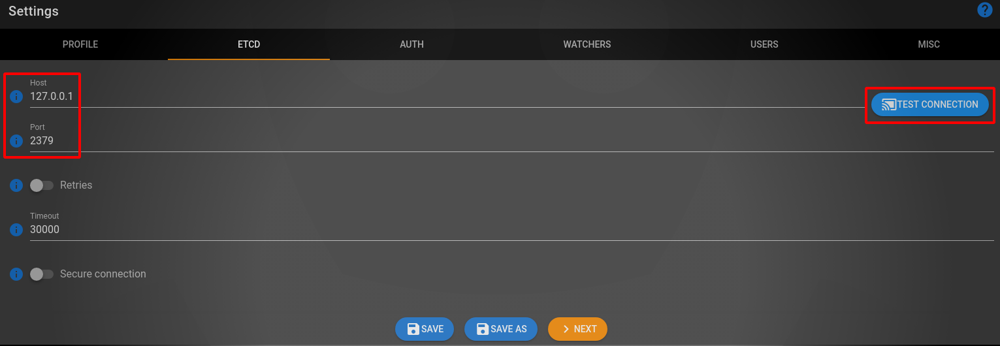
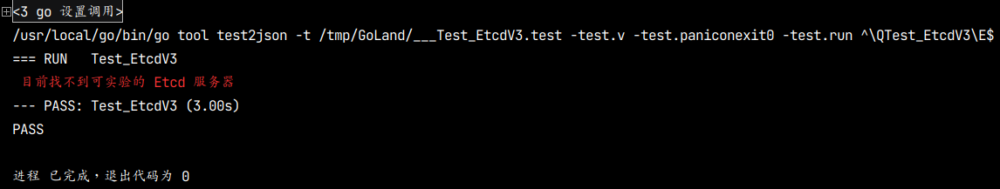
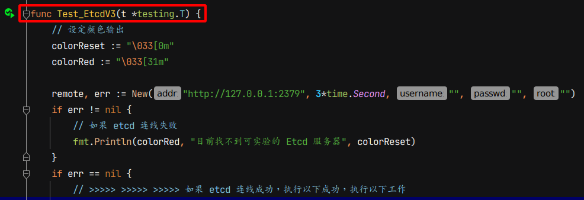
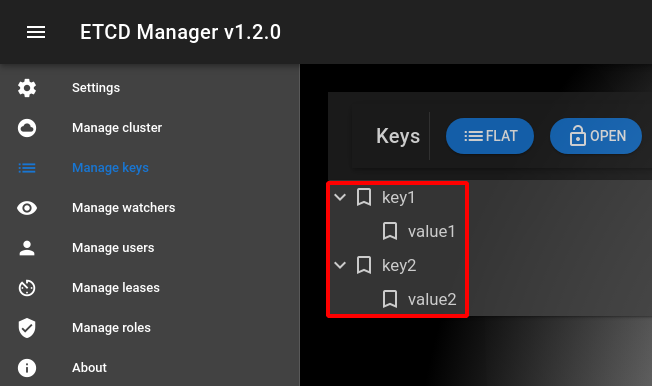
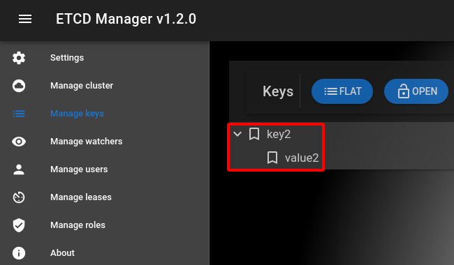
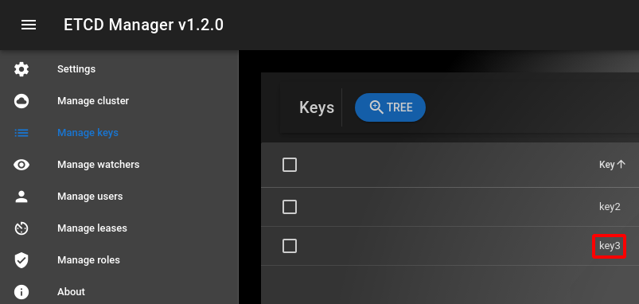
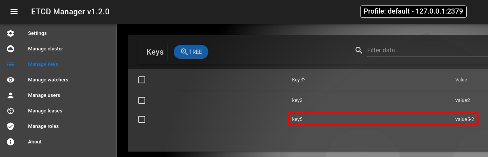
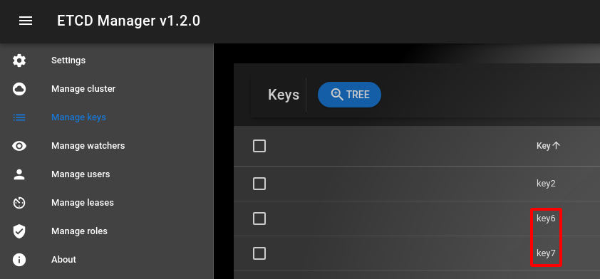
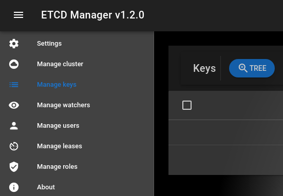
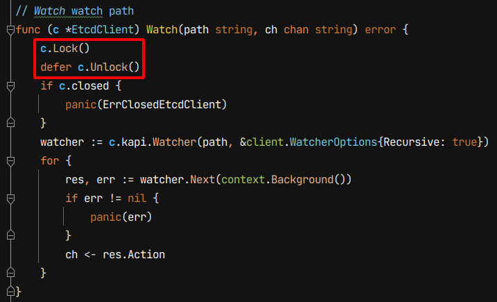

# Gaea 小米數據庫中間件 Ectd V3 API 升級過程說明

> 因為 Etcd V3 API 使用 gRPC 作為溝通的協定，效能上會有所提升，有必要進行升級，但是 V2 API  和 V3 API 在功能上有所不同，整理成以下內容作為記錄

## 1 Etcd 測試環境設置 

> 直接到 Etcd V3 https://github.com/etcd-io/etcd/releases 找到容器 etcd v3.5.1 的啟動方式，以下為啟動指令

```bash
# 連結到 Etcd GitHub
$ firefox https://github.com/etcd-io/etcd/releases

# 刪除之前容器相關檔案
$ docker stop etcd-gcr-v3.5.1
$ docker rm etcd-gcr-v3.5.1
$ sudo rm -rf /tmp/etcd-data.tmp

# 執行以下指令去執行 etcd v3.5.1 容器
$ rm -rf /tmp/etcd-data.tmp && mkdir -p /tmp/etcd-data.tmp && \
  docker rmi gcr.io/etcd-development/etcd:v3.5.1 || true && \
  docker run \
  -p 2379:2379 \
  -p 2380:2380 \
  --mount type=bind,source=/tmp/etcd-data.tmp,destination=/etcd-data \
  --name etcd-gcr-v3.5.1 \
  gcr.io/etcd-development/etcd:v3.5.1 \
  /usr/local/bin/etcd \
  --name s1 \
  --data-dir /etcd-data \
  --listen-client-urls http://0.0.0.0:2379 \
  --advertise-client-urls http://0.0.0.0:2379 \
  --listen-peer-urls http://0.0.0.0:2380 \
  --initial-advertise-peer-urls http://0.0.0.0:2380 \
  --initial-cluster s1=http://0.0.0.0:2380 \
  --initial-cluster-token tkn \
  --initial-cluster-state new \
  --log-level info \
  --logger zap \
  --log-outputs stderr

# 執行以下指令進行初期測試
$ docker exec etcd-gcr-v3.5.1 /bin/sh -c "/usr/local/bin/etcd --version"
$ docker exec etcd-gcr-v3.5.1 /bin/sh -c "/usr/local/bin/etcdctl version"
$ docker exec etcd-gcr-v3.5.1 /bin/sh -c "/usr/local/bin/etcdctl endpoint health"
$ docker exec etcd-gcr-v3.5.1 /bin/sh -c "/usr/local/bin/etcdctl put foo bar"
$ docker exec etcd-gcr-v3.5.1 /bin/sh -c "/usr/local/bin/etcdctl get foo"
$ docker exec etcd-gcr-v3.5.1 /bin/sh -c "/usr/local/bin/etcdutl version"
```

這時發現，用 etcd v2 api 原始程式碼會發生以下錯誤

```bash
# response is invalid json. The endpoint is probably not valid etcd cluster endpoint.
```

## 2 Etcd V3 GUI 介面

可以安裝 Etcd 圖形介面工具去觀察 Etcd 的寫入狀況

```bash
# 安裝 Etcd 圖形介面工具
$ snap install etcd-manager
```

只要填入正確的 IP 和 Address，就可以按下連線測試



## 3 Etcd 的連線測試

Etcd V3 只要接通後，就會一直保持連線，所以不用另外在寫 Ping 函式進行偵測

所以在 V3 API 版本進行以下修改

執行測試時，如果發生連線錯誤，會有以下訊息，單元測試還是會通過，但會給出警告

-> 目前找不到可实验的 Etcd 服务器 (紅色字體顯示)

 

## 4 Etcd 的寫入和租約測試

> 整個測試是針對 Etcd V3 進行測試，和之前 V2 版本有些不同，V3 的 API 是利用測式函式 Test_EtcdV3 進行測試功能是否正常

以下為 測式函式 Test_EtcdV3 的代碼內容



以下的表會整理所有的測試過程

| 項目編號 | 測試項目     | 測試內容                                                     |
| :------: | :----------- | :----------------------------------------------------------- |
|    1     | 新增測試     | 新增 key1 和 key2                                            |
|    2     | 刪除測試     | 刪除 key1                                                    |
|    3     | 到時刪除測試 | 新增 key3，但 key3 只存在 5 秒                               |
|    4     | 追踪測試     | 監測 key 值的變化，1 秒後，先不設定 TTL，之後 key5 的 TTL 修正為 5 秒<br />因為 key5 被更新兩次，所以監控函式 Watch 會傳送更新訊息兩次到通道內 |
|    5     | 租約測試     | 先建立 5 秒的租約，再利用此租約去建立 key6 和 key7<br />因為租約的關係，key6 和 key7 在 5 秒後會消失 |
|    6     | 復原測試環境 | 在復原測試環境時，要刪除測試環境存在所有的 key 值            |

### 測試項目1 新增測試

- 使用 Update 函式，先只新增 key1 和 key2

  

### 測試項目2 刪除測試

- 使用 Delete 函式，刪除 key1 只留 key2

 

### 測試項目3 到時刪除測試

- 使用 UpdateWithTTL 函式，讓 key3 只存在 5 秒，5 秒後 key3 會被自動刪除

(5 秒之前，key2 和 key3 是存在的)

 

(5 秒之後，key3 會被自動刪除，只留 key2)

 

### 測試項目4 追踪測試

1. 使用監控函式 Watch 去觀察前綴為 key 的 key 值的新增，只要有一隻新的 key 值新增，通道內就會觸發訊息通知
2. 先用協程啟動 監控函式 Watch，先暫停 1 秒，讓 Watch 函式完整啟動
3. 用更新函式 Update，先新增 key5，目前還沒有 TTL 的設定，為永遠保存
4. 監控函式 Watch 會把觸發訊息傳送到通道，為第 1 則訊息，因為通道可以取出訊息，所以測試可以正常繼續執行
5. 用時間更新函式 UpdateWithTTL 更新 key5，TTL 設定為 1 秒，1 秒後 Key5 會自動刪除
6. 因為 key5 再一次更新，監控函式 Watch 又會再把觸發訊息傳送到通道，為第 2 則訊息，通道可以取出訊息，測試又可以正常繼續

(1 秒之前，key2 和 key5 是存在的)

  

(1 秒之後，key5 會被自動刪除，只留 key2)

 

### 測試項目5 租約測試

- 先用租約函式 Lease 產生 5 秒的租約
- 再利用租約更新函式 UpdateWithLease，把 此 5 秒租約 和 key6 、 key7 綁在一起
- key6 和 key7 因為和 5 秒租約綁定，所以 5 秒後，資料會自動刪除
- 5 秒之前，可以使用列表函式 List，查詢目前所存在的 key 值，這時會有 key2、key6 和 key7 會存在
- 可以使用讀取函式 Read，去查詢  key2、key6 和 key7 的資料內容
- 5 秒之後，再使用列表函式 List，查詢目前所存在的 key 值，只剩 key2 存在

(5 秒之前，key2、key6 和 key7 是存在的)

 

(5 秒之後，key6 和 key7 會被自動刪除，只留 key2)

 

### 測試項目6 復原測試環境

- 使用刪除函式 Delete，刪除所有資料

(清除所有 key 值，所有的資料在 etcd 會不存在)

 

## 5 Etcd V2 和 V3 API 的差異

V2 版 API 和 V3 版 API 的功能差異整理成下表

| 項目                         | V2 API | V3 API |
| :--------------------------- | :----: | :----: |
| 有目錄觀念                   |   有   |  沒有  |
| 有租約觀念                   |  沒有  |   有   |
| 建立目錄函式 Mkdir           |   有   |  沒有  |
| 建立函式 Create              |   有   |  沒有  |
| 更新函式 Update              |   有   |   有   |
| 時間更新函式 UpdateWithTTL   |   有   |   有   |
| 租約產生函式 Lease           |  沒有  |   有   |
| 租約更新函式 UpdateWithLease |  沒有  |   有   |
| 刪除函式 Delete              |   有   |   有   |
| 讀取函式 Read                |   有   |   有   |
| 列表函式 List                |   有   |   有   |
| 監測函式 Watch               |   有   |   有   |
| 共同路徑函式 BasePrefix      |   有   |   有   |

結論為

1. V2 版本 API 有目錄的觀念，但是 V3 版本沒有
2. V3 版本 API 有租約觀念，但是 V2 版本沒有
3. 其餘觀念，V2 版本 和 V3 版本重疊
4. 個人認為，在制定接口時，要指定保留特別重要的函式，比如 Update、Delete、List、Read、UpdateWithTTL 和 Watch 函式，剩下由各版本 API 自由自行發展

## 6 Etcd V2 API 錯誤回報

> 在製作 V3 API 時，同時也發現舊版 V2 API 疑似有死結的問題發生

在 V2 版本的程式碼有以下內容，其中在 c.Lock() 和 defer c.Unlock() 這兩行會造成死結

- 這會有一個現象，當時用監測函式 Watch 時，會把 EtcdClient 物件上鎖
- EtcdClient 物件上鎖之後，就無法再用更新函式 Update 進行更新或新增資料等操作
- 監測函式 Watch 也一直去等待資料的更新才會進行解鎖
- 更新函式 Update 也要等待解鎖後，才能進行更新操作
- 監測函式 Watch 和 更新函式 Update互相等待，造成死結

 

會建議改成以下版本，去避免死結問題發生

- 先移除 defer c.Unlock() 此行，目的是要避免死結
- 如果整個監控函式 Watch 都不上鎖，會發生未能及時獲得資料的問題
- 只能儘量遵守 上鎖後在最佳時機解鎖 的原則去防止嚴重的死結問題發生

```go
func (c *EtcdClientV3) Watch(path string, ch chan string) error {
	c.Lock() // 在這裡上鎖
	// defer c.Unlock() // 移除此行，避免死結髮生
	if c.closed {
		c.Unlock() // 上鎖後記得解鎖，去防止死結問題發生
		panic(ErrClosedEtcdClient)
	}
	
	rch := c.kapi.Watch(context.Background(), path, clientv3.WithPrefix())
    
    c.Unlock() // 上鎖後在適當時機解鎖，去防止死結問題發生
    // 在这里解锁是最好的，因为解锁后立刻可以进行监听
    
	for wresp := range rch {
		for _, ev := range wresp.Events {
			ch <- string(ev.Kv.Key)
		}
	}

	return nil
} 
```

## 7 總結

這次工作完成以下內容

- 比較後， Etcd V2 和 Etcd V3 有部份觀念和機制不同，保留重複和重要的函式
- 這次把 Etcd V3 版本的 API 修改完成，同時也發現 Etcd V2 版本疑似潛藏的 Bug 找出

PR 準備發兩次

1. 第一次，送上 Etcd V3 API 的代碼和修改舊的 V2 版本的代碼，標題為 Etcd API 更新
2. 第二次，數據庫中間件接上 Etcd V3 API ，同時修改 Etcd 的接口，標題為整合數據庫中間件和 Etcd V3 API

