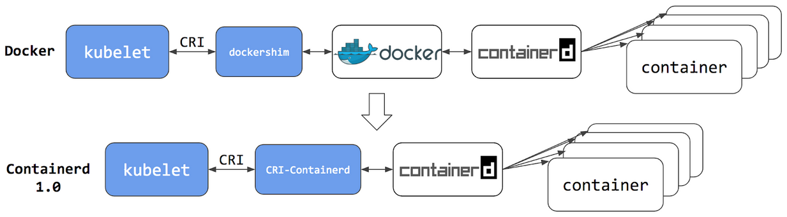
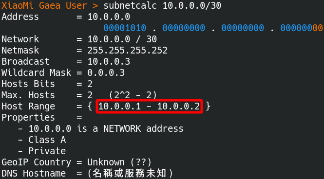
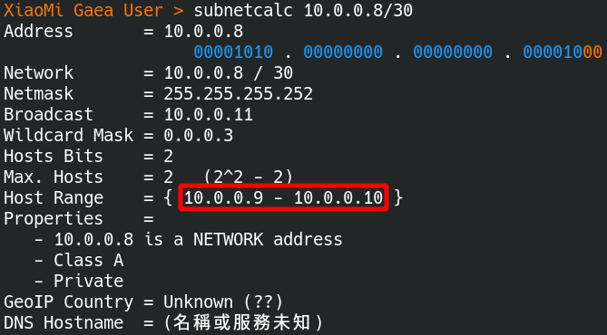

# 容器单元测试

## 说明

### 会面临的问题如下

- **Docker** 重要性将会下降，未来将会直接操作 **Containerd** ，不经由 Docker 去控制
- 这次测试准备把 **Containerd** 集成到单元测试内，测试包命名为 **containerTest**

## Containerd 容器的安装

### 简介

此为 **Containerd** 的早期版本，已经去除 **Docker** 那一层去进行性能的提升 

### Containerd 主体安装

> 参考以下网址进行安装 [Containerd套件](https://containerd.io/downloads/)

```bash
# 先安装依赖，libseccomp2 套件将会指定 process 去调用特定的 system call，以增加安全性
$ sudo apt-get update
$ sudo apt-get install libseccomp2

# 下载 Containerd 套件，目前最新版本为 1.6.4 版
$ wget https://github.com/containerd/containerd/releases/download/v1.6.4/cri-containerd-cni-1.6.4-linux-amd64.tar.gz

# 这份压缩包含 Containerd 运行时所需要的 runc 
$ tar -tf cri-containerd-cni-1.6.4-linux-amd64.tar.gz | grep runc
usr/local/bin/containerd-shim-runc-v2
usr/local/bin/containerd-shim-runc-v1
usr/local/sbin/runc # 存在

# 进行安装整个 Containerd
$ sudo tar -C / -xzf cri-containerd-cni-1.6.4-linux-amd64.tar.gz

# 检查 Systemd 设定档是否存在
$ tar -tf cri-containerd-cni-1.6.4-linux-amd64.tar.gz | grep containerd.service
etc/systemd/system/containerd.service # 存在

# 启动 Containerd 服务
$ sudo systemctl daemon-reload # 重新加载 Systemd
$ sudo systemctl enable --now containerd.service # 开机时启动 Containerd 服务
$ sudo systemctl start containerd.service # 启动 Containerd 服务


# 检查 ctr 指令是否存在
$ tar -tf cri-containerd-cni-1.6.4-linux-amd64.tar.gz | grep ctr
usr/local/bin/ctr # 存在

# 执行 ctr 指令进行简易测试
$ ctr container list
# 会显示 CONTAINER    IMAGE    RUNTIME
```

### Containerd 插件设置

```bash
# 检查 cni 组件是否存在
$ tar -tf cri-containerd-cni-1.6.4-linux-amd64.tar.gz | grep opt/cni
# 会显示以下内容
# opt/cni/
# opt/cni/bin/
# opt/cni/bin/tuning
# opt/cni/bin/vrf
# opt/cni/bin/loopback
# opt/cni/bin/portmap
# opt/cni/bin/ptp
# opt/cni/bin/ipvlan
# opt/cni/bin/host-device
# opt/cni/bin/macvlan
# opt/cni/bin/host-local
# opt/cni/bin/firewall
# opt/cni/bin/bandwidth
# opt/cni/bin/sbr
# opt/cni/bin/vlan
# opt/cni/bin/static
# opt/cni/bin/bridge
# opt/cni/bin/dhcp

# 产生 config.toml 设置
$ tar -tf cri-containerd-cni-1.6.4-linux-amd64.tar.gz | grep config.toml # 压缩包未含设定档
$ containerd config default > /etc/containerd/config.toml # 用命令产生预设文档
```

### 编译设定工具 cnitool

```bash
# 先编译 cnitool
$ git clone https://github.com/containernetworking/cni.git
$ cd cni
$ go mod tidy
$ cd cnitool
$ go build .

# 把 cnitool 移动到 bin 目录下
$ mv ./cnitool /usr/local/bin
```

## 子网切割计算

### 计算容器子网

> - 目的为保留 **两个可分配 IP**，其中 **一个会被路由使用**，让 containerTest 包可以快速在网路上找到容器的网路位置并进行连线
> - 使用 **class A 私有网络** 的网络位置 **10.0.0.0 至 10.255.255.255**

快速计算子网

| 子网区块 | 计算命令                  | 子网细节                                                     |
| -------- | ------------------------- | ------------------------------------------------------------ |
| 第1区块  | $ subnetcalc 10.0.0.0/30  | 网域位置 10.0.0.0<br />路由位置 10.0.0.1<br />**主机位置 10.0.0.2**<br />广播位置 10.0.0.3 |
| 第2区块  | $ subnetcalc 10.0.0.4/30  | 网域位置 10.0.0.4<br />路由位置 10.0.0.5<br />**主机位置 10.0.0.6**<br />广播位置 10.0.0.7 |
| 第3区块  | $ subnetcalc 10.0.0.8/30  | 网域位置 10.0.0.8<br />路由位置 10.0.0.9<br />**主机位置 10.0.0.10**<br />广播位置 10.0.0.11 |
| 第4区块  | $ subnetcalc 10.0.0.12/30 | 网域位置 10.0.0.12<br />路由位置 10.0.0.13<br />**主机位置 10.0.0.14**<br />广播位置 10.0.0.15 |

以下为使用命令去计算子网的过程

- 第一个区块可用的网路位置为 **10.0.0.2**
  
- 第二个区块可用的网路位置为 **10.0.0.6**
  
- 第三个区块可用的网路位置为 **10.0.0.10**
  
- 第四个区块可用的网路位置为 **10.0.0.14**
  

### 子网路位置分配说明

> 以最后一个子网区块 **10.10.10.12/30** 为例

- 规划子网为 **10.10.10.12/30**，只预留 2 个 bits ( 值为 32 - 30) 可以变化，共有四种组合可变动的 IP，分别为 **10.10.10.12 、 10.10.10.13、 10.10.10.14、 10.10.10.15**

- 网路位置的使用如下表

  |    网路位置     |     用途     |
  | :-------------: | :----------: |
  |   10.10.10.12   |   网域位置   |
  |   10.10.10.13   |   路由位置   |
  | **10.10.10.14** | **主机位置** |
  |   10.10.10.15   |   广播位置   |

  由上表可知，新建的容器会被分配的 IP 为 **10.10.10.14**

### 创建子网设定档

```bash
# 以下使用 root 身份执行
$ sudo su -

# 写入网路设定档，并指定子网分割为 10.0.0.0/30
# 在 gaea 环境下，用于容器的预设环境测试
$ cat << EOF | tee /etc/cni/net.d/gaea-default.conf
{
    "cniVersion": "0.4.0",
    "name": "gaea-default",
    "type": "bridge",
    "bridge": "cni0",
    "isDefaultGateway": true,
    "forceAddress": false,
    "ipMasq": true,
    "hairpinMode": true,
    "ipam": {
        "type": "host-local",
        "subnet": "10.0.0.0/30"
    }
}
EOF

# 写入网路设定档，并指定子网分割为 10.0.0.4/30
# 在 gaea 环境下，用 etcd 容器测试
$ cat << EOF | tee /etc/cni/net.d/gaea-etcd.conf
{
    "cniVersion": "0.4.0",
    "name": "gaea-etcd",
    "type": "bridge",
    "bridge": "cni1",
    "isDefaultGateway": true,
    "forceAddress": false,
    "ipMasq": true,
    "hairpinMode": true,
    "ipam": {
        "type": "host-local",
        "subnet": "10.0.0.4/30"
    }
}
EOF

# 写入网路设定档，并指定子网分割为 10.0.0.8/30
# 在 gaea 环境下，用 mariaDB 容器测试
$ cat << EOF | tee /etc/cni/net.d/gaea-mariadb.conf
{
    "cniVersion": "0.4.0",
    "name": "gaea-mariadb",
    "type": "bridge",
    "bridge": "cni2",
    "isDefaultGateway": true,
    "forceAddress": false,
    "ipMasq": true,
    "hairpinMode": true,
    "ipam": {
        "type": "host-local",
        "subnet": "10.0.0.8/30"
    }
}
EOF
```

### 群组容器设置

> 目前暂不开发这一部份，但先指定子网位位置为 **10.255.255.248/29**

使用以下命令去计算子网

````bash
$ subnetcalc 10.255.255.248/29
````

### 设定测试子网

请依照以下步骤进行网路设定

```bash
# 创建 namespace 进行网路隔离
$ ip netns add gaea-default
$ ip netns add gaea-etcd
$ ip netns add gaea-mariadb

$ ip netns list
# 将会显示
# gaea-default
# gaea-etcd
# gaea-mariadb
# gaea-mariadb-sakila

$ ls /var/run/netns/
# 将会显示 gaea-default gaea-etcd gaea-mariadb

# 加入 namespace
$ export CNI_PATH=/opt/cni/bin
$ cnitool add gaea-default /var/run/netns/gaea-default
$ cnitool add gaea-etcd /var/run/netns/gaea-etcd
$ cnitool add gaea-mariadb /var/run/netns/gaea-mariadb

# 进行连线测试
$ ip a | grep cni0
# 6: cni0: <BROADCAST,MULTICAST,UP,LOWER_UP> mtu 1500 qdisc noqueue state UP group default qlen 1000
#     inet 10.0.0.0/30 brd 10.10.10.3 scope global cni0
# 7: veth8e852839@if2: <BROADCAST,MULTICAST,UP,LOWER_UP> mtu 1500 qdisc noqueue master cni0 state UP group default

# 连线测试
$ ping -c 5 10.10.10.1
# PING 10.10.10.1 (10.10.10.1) 56(84) bytes of data.
# 64 bytes from 10.10.10.1: icmp_seq=1 ttl=64 time=0.107 ms
# 64 bytes from 10.10.10.1: icmp_seq=2 ttl=64 time=0.099 ms
# 64 bytes from 10.10.10.1: icmp_seq=3 ttl=64 time=0.099 ms
# 64 bytes from 10.10.10.1: icmp_seq=4 ttl=64 time=0.100 ms
# 64 bytes from 10.10.10.1: icmp_seq=5 ttl=64 time=0.099 ms
```

### 网路设定脚本

Linux 的 namespace 并 **不是永远储存的**，所以要在创建设定 **namespace 的脚本**

- **export CNI_PATH=/opt/cni/bin 这一行写到 /etc/bash.bashrc**
  
  ```bash
  # 添加以下内容
  
  # 添加 containerd 设定 
  export CNI_PATH=/opt/cni/bin
  ```
  
- 使用脚本去管理容器的网路
  
  ```bash
  #!/bin/bash
  
  # 先开启防火墙转发
  iptables -P FORWARD ACCEPT
  
  # 先删除 network
  cnitool del gaea-default /var/run/netns/gaea-default
  cnitool del gaea-etcd /var/run/netns/gaea-etcd
  cnitool del gaea-mariadb /var/run/netns/gaea-mariadb
  
  # 先删除 namespace
  ip netns del gaea-default
  ip netns del gaea-etcd
  ip netns del gaea-mariadb
  
  # 先新建 namespace
  ip netns add gaea-default
  ip netns add gaea-etcd
  ip netns add gaea-mariadb
  
  # 先新建 network
  export CNI_PATH=/opt/cni/bin
  cnitool add gaea-default /var/run/netns/gaea-default
  cnitool add gaea-etcd /var/run/netns/gaea-etcd
  cnitool add gaea-mariadb /var/run/netns/gaea-mariadb
  ```

## 容器 ctr 命令操作

> 当子网切割完成后，接下来就可以直接使用 **命令去操作 Contained**

### 下载容器镜像

```bash
# >>>>> >>>>> >>>>> 下载容器镜像

# 创建 namespace
$ ctr ns create default

# 下载镜像档 debian
$ ctr -n default image pull docker.io/library/debian:latest

# 检查镜像档 default
$ ctr -n default i ls
# 会显示以下内容
# REF TYPE DIGEST SIZE PLATFORMS LABELS 
# docker.io/library/debian:latest application/vnd.docker.distribution.manifest.list.v2+json sha256:87eefc7c15610cca61db5c0fd280911c6a737c0680d807432c0bd80cd0cca39b 52.4 MiB linux/386,linux/amd64,linux/arm/v5,linux/arm/v7,linux/arm64/v8,linux/mips64le,linux/ppc64le,linux/s390x -
```

### 容器工作新建

```bash
# >>>>> >>>>> >>>>> 创建容器

# 启动容器 default
$ ctr -n default run --with-ns=network:/var/run/netns/gaea-default -d docker.io/library/debian:latest default

# 检查容器 default
$ ctr -n default container ls
# 会显示以下内容
# CONTAINER    IMAGE                              RUNTIME                  
# default      docker.io/library/debian:latest    io.containerd.runc.v2 

# 检查容器 default 的工作
$ ctr -n default task ls
# 会显示以下内容
# TASK      PID      STATUS 
# default    8371    RUNNING
```

### 进入容器内部

```bash
# 进入容器
$ ctr -n default task exec -t --exec-id default default sh
```

### 容器工作移除

```bash
# >>>>> >>>>> >>>>> 删除容器

# 中止容器运行
$ ctr -n default task kill -s SIGKILL default

# 检查容器 default 的工作是否停止
$ ctr -n default task ls
# TASK      PID      STATUS    
# default    8371    STOPPED

# 删除容器 default 的工作
$ ctr -n default task rm default
# 会显示以下内容
# WARN[0000] task default exit with non-zero exit code 137

# 删除容器 default
$ ctr -n default container rm default
```

## 重新打包数据库镜像

> 因为现有的数据库容器都无法在 Containerd 上正常启动，所以要进行修正和重新打包，**使用以下命令重新打包镜像**

### 创建帐户资料档案

档案位于 Gaea/util/mocks/containerTest/images/mariadb_testing/mariadb/user.sql

```sql
-- SQL 档案，当容器启动时，会立即执行以下命令，就会创建新用户 xiaomi ，和 root 相同权限
CREATE USER 'xiaomi'@'%' IDENTIFIED BY '12345';
GRANT ALL PRIVILEGES ON *.* TO 'xiaomi'@'%' WITH GRANT OPTION;
FLUSH PRIVILEGES;
```

### 数据库容器的执行脚本

档案位于 Gaea/util/mocks/containerTest/images/mariadb_testing/mariadb/mysqld_init.sh

```bash
#!/bin/bash

# 一般原本 Docker 的数据库容器无法在 containerd 上执行，进行以下修正
mkdir /var/run/mysqld
# RUN useradd -m mysql
chown mysql:mysql /var/run/mysqld
chmod 777 /var/run/mysqld

# user.sql 为一开始执行 mysqld 服务时，所需要执行的 SQL 脚本，会创建一个用户 xiaomi，并且设置密码
mysqld --init-file=/home/mariadb/user.sql
```

### 数据库容器的 Dockerfile

档案位于 Gaea/util/mocks/containerdTest/images/mariadb_testing/Dockerfile

```dockerfile
FROM debian:latest

# 安装数据库
RUN apt-get update && apt-get install -y mariadb-server && apt-get clean

# 修改数据库连线设置 (正规表达式为 bind-address(\s*?)=(\s*?)127\.0\.0\.1)
RUN sed -i "s/bind-address.*/bind-address=0.0.0.0/g" /etc/mysql/mariadb.conf.d/50-server.cnf

# 设定用户密码和修正
RUN mkdir -p /home/mariadb/
ADD mariadb /home/mariadb/

# 进行修正
RUN chmod +x /home/mariadb/mysqld_init.sh

# 启动数据库
ENTRYPOINT ["/home/mariadb/mysqld_init.sh"]
```

### 进行容器镜像档打包

执行以下命令进行打包

```bash
# 安装打包工具 buildah
$ apt-get install buildah

# 进行打包
$ buildah bud -t mariadb:testing .

# 查询打包结果
$ buildah images
# 会显示以下内容
# REPOSITORY        TAG    IMAGE ID     CREATED        SIZE
# localhost/mariadb latest e4fe0437050b 5 minutes ago  484 MB # 产生新的镜像
```

### 镜像档打包后保存

执行以下命令进行保存

```bash
# 安装容器工具 podman
$ apt-get install -y podman

# 保存容器镜像为 tar 档 mariadb-latest.tar
$ podman image save localhost/mariadb:testing -o mariadb-testing.tar
# 会显示以下内容
# WARN[0000] Error validating CNI config file /etc/cni/net.d/10-containerd-net.conflist: [plugin bridge does not support config version "1.0.0" plugin portmap does not support config version "1.0.0"]

# 检查保存结果
$ ls
# 会显示以下内容
# Dockerfile  mariadb-latest.tar # 新的 tar 档产生
```

### 载入镜像 tar 档到 Containerd

```bash
# 创建名称空间 mariadb 
$ ctr namespace create mariadb

# containerd 载入打包的镜像
$ ctr -n mariadb i import mariadb-latest.tar

# 检查载入容器结果
$ ctr -n mariadb i ls
# 会显示以下内容
# REF TYPE DIGEST SIZE PLATFORMS LABELS # 镜像 tar 档载入成功
# localhost/mariadb:latest application/vnd.docker.distribution.manifest.v2+json sha256:47db1ba681c4ebcf56370ad22d9f9a5c72bc08414b7f2d54c5cd2112502b5931 461.7 MiB linux/amd64 -
```

### 上传镜像档到远端仓库

> 目前容器的远端仓库有 [docker hub](https://hub.docker.com/) 和 [qury io](https://quay.io/)，目前打算在 [docker hub](https://hub.docker.com/) 上进行测试，功能较完整的镜象档上传到 [qury io](https://quay.io/)

先把测试用的数据库镜像上传到 [docker hub](https://hub.docker.com/)

```bash
# 到容器目录之下
$ cd gaea/util/mocks/containerdTest/images/mariadb_testing

# 打包容器镜像档
$ buildah bud -t mariadb:testing .

# 上传容器镜象
# <token> 为在 docker 网站中产生的验证 token 
$ skopeo copy docker-archive:./mariadb-testing.tar docker://docker.io/panhongrainbow/mariadb:testing --dest-creds panhongrainbow:<token>
```

## 容器单元测试触发代码

### 运作说明

下面为单元测试的类图


各个类的说明

| 类或接口            | 说明                                                         |
| ------------------- | ------------------------------------------------------------ |
| containerManager 类 | **容器管理员**，进行容器环境的管理                           |
| ContainderList 类   | 容器管理员的容器列表，**先由这里上锁**                       |
| Builder 接口        | 用来组成容器管理员的容器列表，内含 **容器的集成操作方法**    |
| ContainerdClient 类 | ContainerdClient 类会根据设定档，去回传 **符合 Builder 接口** 的对象 |
| Run 接口            | Run 接口列出容器管理的 **操作细节**，为 ContainerdClient 的一部份 |
| 各不同种类的容器    | 包含 **defaults类、etcd类 和 mariadb类**，都实现 **Run 接口** |

### 操作演示

使用实际的代码进行演示

```go
// 注册函数，会回传执行函数或协程的名称
regFunc := func() string {
	return containerTest.AppendCurrentFunction(3, "-mariadb-"+strconv.Itoa(j))
}

// 先取得 builder 对象，先取得控制容器环境的机会
builder, err := containerTest.Manager.GetBuilder("mariadb-server", regFunc)

// 创建容器环境，必须在 300 秒内创建完成，不然测试失败
// 设定在 300 秒内完成的原因为要花时间去下载镜像档
err = builder.Build(300 * time.Second)

// 容器必须在 60 秒内准备服务完成
err = builder.OnService(60 * time.Second)

// 创建直连的登录资讯
var dc = DirectConnection{
	user:      "xiaomi",
	password:  "12345",
	charset:   "utf8mb4",
	collation: 46,
	addr:      "10.0.0.10:3306",
}

// 如果直连连线成功就脱离回圈继续执行
LOOP:
for i := 0; i < 10; i++ {
	err = dc.connect()
	if err == nil { break LOOP }
	time.Sleep(1 * time.Second)
}

// 拆除容器环境
err = builder.TearDown(60 * time.Second)

// 容器使用完毕，让出容器环境给其他测试使用
err = containerTest.Manager.ReturnBuilder("mariadb-server", regFunc)
```

在容器运行中，可以登录容器内部去进行测试

```bash
# 直接登录容器内部进行测试
$ ctr -n default task exec -t --exec-id mariadb-server mariadb-server sh

# 或者是远端登录进行测试
$ mysql -h 10.0.0.10 -P 3306 -u root -p
```

## 容器单元测试操作方式

### 启用容器管理员单元测试

单元测试管理员启用方式

在设定文档  Gaea/util/mocks/containerTest/etc/containerTest.ini 中设定

1. 这是 **未** 启用容器理员的设定
   ```ini
   ; 是否要启用容器测试
   container_test_enable=false
   ```

   这是启用容器理员的设定

   ```ini
   ; 是否要启用容器测试
   container_test_enable=true # 一定都要小写
   ```

### 容器单元测试未启用的日志

步骤如下

1. 先停止使用容器管理员
   ```ini
   ; 是否要启用容器测试
   container_test_enable=fasle
   ```

2. 执行测试
   ```bash
   # 到 Gaea 目录
   $ cd /home/panhong/go/src/github.com/panhongrainbow/Gaea
   
   # 执行测试
   $ make test
   # 会显示以下内容
   # ok      github.com/XiaoMi/Gaea/util/timer       0.671s  coverage: 96.2% of statements
   # go tool cover -func=.coverage.out -o .coverage.func
   # tail -1 .coverage.func
   # total:                                                                                                  (statements)                                            58.2%
   # go tool cover -html=.coverage.out -o .coverage.html
   ```

3. 检查执行的日志
   ```bash
   # 到日志目录里
   $ cd /home/panhong/go/src/github.com/panhongrainbow/Gaea/util/mocks/containerTest/logs
   
   $ ls
   # 没有任何日志档案产生
   ```

### 容器单元测试启用的日志

步骤如下

1. 先启用容器管理员
   ```ini
   ; 是否要启用容器测试
   container_test_enable=true
   ```

2. 执行测试
   ```bash
   # 到 Gaea 目录
   $ cd /home/panhong/go/src/github.com/panhongrainbow/Gaea
   
   # 执行测试
   $ make test
   # 会显示以下内容
   # go tool cover -func=.coverage.out -o .coverage.func
   # tail -1 .coverage.func
   # total:                                                                                                  (statements)                                            58.4%
   # go tool cover -html=.coverage.out -o .coverage.html
   ```

3. 检查执行的日志
   ````bash
   # 到日志目录里
   $ cd /home/panhong/go/src/github.com/panhongrainbow/Gaea/util/mocks/containerTest/logs
   
   $ ls
   # 有日志档案产生
   containerTest2022-05-15-22-36-00.log  containerTest2022-05-15-22-36-00.log.wf  containerTest2022-05-15-22-36-06.log  containerTest2022-05-15-22-36-06.log.wf
   
   $ cat containerTest2022-05-15-22-36-00.log
   # 日志内容如下
   # [2022-05-15 22:36:00] [containerTest] [debian5] [NOTICE] [900000001] [github.com/XiaoMi/Gaea/util/mocks/containerTest.(*ContainerManager).getBuilder:manager.go:165] github.com/XiaoMi/Gaea/util/mocks/containerTest.GetBuilder-mariadb-1 occupies mariadb-server
   
   # [2022-05-15 22:36:00] [containerTest] [debian5] [NOTICE] [900000001] [github.com/XiaoMi/Gaea/util/mocks/containerTest.(*ContainerManager).getBuilder:manager.go:165] github.com/XiaoMi/Gaea/util/mocks/containerTest.GetBuilder-default-1 occupies default-server
   
   # [2022-05-15 22:36:09] [containerTest] [debian5] [NOTICE] [900000001] [github.com/XiaoMi/Gaea/util/mocks/containerTest.(*ContainerManager).returnBuilder:manager.go:191]  releases default-server
   
   # [2022-05-15 22:36:09] [containerTest] [debian5] [NOTICE] [900000001] [github.com/XiaoMi/Gaea/util/mocks/containerTest.(*ContainerManager).getBuilder:manager.go:165] github.com/XiaoMi/Gaea/util/mocks/containerTest.GetBuilder-default-0 occupies default-server
   
   # [2022-05-15 22:36:12] [containerTest] [debian5] [NOTICE] [900000001] [github.com/XiaoMi/Gaea/util/mocks/containerTest.(*ContainerManager).returnBuilder:manager.go:191]  releases mariadb-server
   
   # [2022-05-15 22:36:12] [containerTest] [debian5] [NOTICE] [900000001] [github.com/XiaoMi/Gaea/util/mocks/containerTest.(*ContainerManager).getBuilder:manager.go:165] github.com/XiaoMi/Gaea/util/mocks/containerTest.GetBuilder-mariadb-0 occupies mariadb-server
   
   # [2022-05-15 22:36:17] [containerTest] [debian5] [NOTICE] [900000001] [github.com/XiaoMi/Gaea/util/mocks/containerTest.(*ContainerManager).returnBuilder:manager.go:191]  releases default-server
   
   # [2022-05-15 22:36:21] [containerTest] [debian5] [NOTICE] [900000001] [github.com/XiaoMi/Gaea/util/mocks/containerTest.(*ContainerManager).returnBuilder:manager.go:191]  releases mariadb-server
   ````

### 重置 Containerd 容器测试环境

依以下方式进行重置

```bash
# 停止所有的容器工作
$ ctr -n default task kill -s SIGKILL default
$ ctr -n mariadb task kill -s SIGKILL mariadb-server

# 删除所有的容器工作
$ ctr -n default task rm default
$ ctr -n mariadb task rm mariadb-server

# 删除容器储存目录
$ rm -rf /var/lib/containerd/*

# 重新启动容器服务
$ systemctl restart containerd.service
```

### 重置 Containerd 容器网路环境

先创建网路脚本 init_cni.sh

```bash
#!/bin/bash

# 先打开防火
iptables -P FORWARD ACCEPT

# 先删除 network
cnitool del gaea-default /var/run/netns/gaea-default
cnitool del gaea-etcd /var/run/netns/gaea-etcd
cnitool del gaea-mariadb /var/run/netns/gaea-mariadb

# 先删除 namespace
ip netns del gaea-default
ip netns del gaea-etcd
ip netns del gaea-mariadb

# 先新建 namespace
ip netns add gaea-default
ip netns add gaea-etcd
ip netns add gaea-mariadb

# 先新建 network
export CNI_PATH=/opt/cni/bin
cnitool add gaea-default /var/run/netns/gaea-default
cnitool add gaea-etcd /var/run/netns/gaea-etcd
cnitool add gaea-mariadb /var/run/netns/gaea-mariadb
```

依以下方式进行重置

```bash
# 执行网路重置
$ sh init_cni.sh
```

