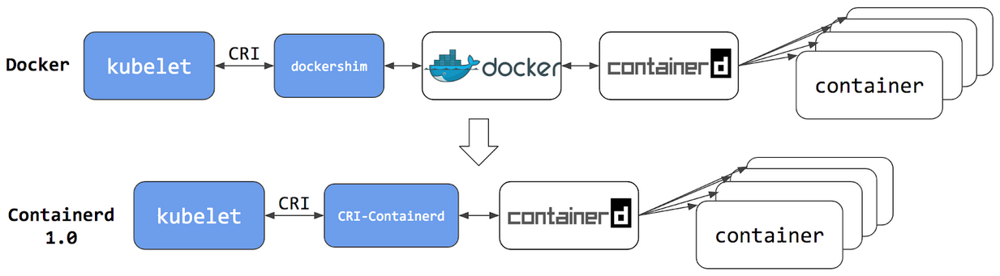
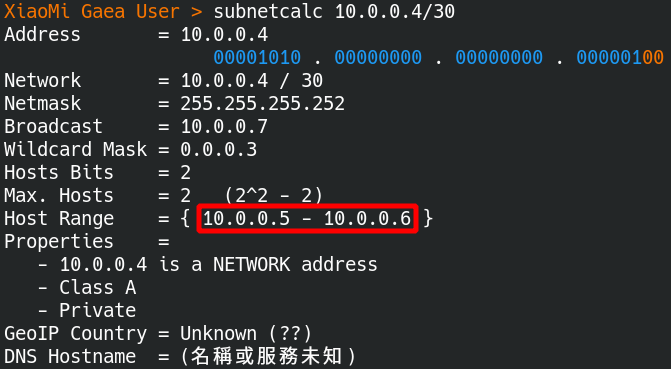
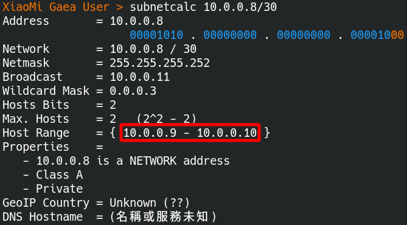
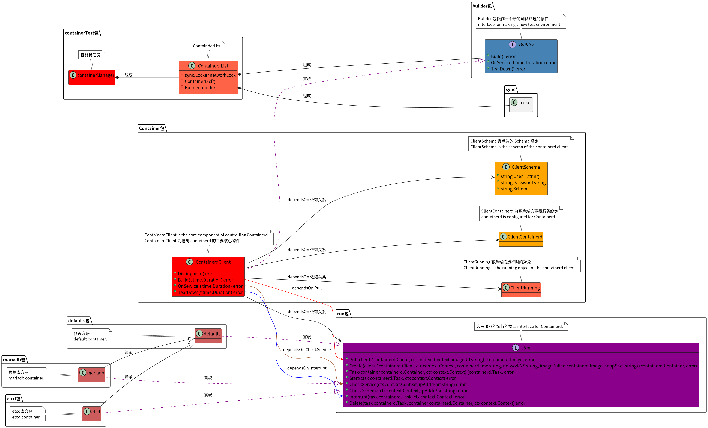

# Running Unit Tests With Containerd

> - The test environment is complex for the programmer to set up.
> - Fortunately, **Docker** is popular for people to learn and love as a common language for **temporarily creating test environments**.
> - However, there are many alternatives for Docker, such as **Containerd**, Kata Container, and gVisor.
> - Most likely, there is a high probability that **Containerd** replaces Docker in **the container management ecosystem** because Containerd is **less dependent and more efficient**.
> - Indeed, **Containerd** does not have **Docker cli layer**.

## Installation

### Introduction

What is **Containerd**？

**Containerd** has been *used* for *a long time* as **a container management tool**. However, People cannot be aware of its existence because it is **a container runtime** with simplicity and does not have **Docker cli layer**.

 

### Install main component

> Please refer to [the installation guide](https://containerd.io/downloads/) for specific details.

install Containerd components

```bash
# libseccomp2 is a security package used to prevent attackers bypass intended access restrictions for argument-filtered system calls.
$ sudo apt-get update
$ sudo apt-get install libseccomp2

# download containerd package. current version is 1.6.4.
$ wget https://github.com/containerd/containerd/releases/download/v1.6.4/cri-containerd-cni-1.6.4-linux-amd64.tar.gz

# cri-containerd-cni includes runc and internet components.
$ tar -tf cri-containerd-cni-1.6.4-linux-amd64.tar.gz | grep runc
usr/local/bin/containerd-shim-runc-v2
usr/local/bin/containerd-shim-runc-v1
usr/local/sbin/runc # runc is a CLI tool for running containers.

# install Containerd
$ sudo tar -C / -xzf cri-containerd-cni-1.6.4-linux-amd64.tar.gz

# check the existence of Systemd config.
$ tar -tf cri-containerd-cni-1.6.4-linux-amd64.tar.gz | grep containerd.service
etc/systemd/system/containerd.service # Systemd config.

# start Containerd Service.
$ sudo systemctl daemon-reload # reload Systemd.
$ sudo systemctl enable --now containerd.service # start Containerd service at boot.
$ sudo systemctl start containerd.service # start Containerd service.

# check the existence of ctr cli tool.
$ tar -tf cri-containerd-cni-1.6.4-linux-amd64.tar.gz | grep ctr
usr/local/bin/ctr # ctr cli tool.

# test ctr cli tool.
$ ctr container list
# display CONTAINER    IMAGE    RUNTIME
```

### Managing plugins

set up Containerd plugins

```bash
# check the existence of cni component.
$ tar -tf cri-containerd-cni-1.6.4-linux-amd64.tar.gz | grep opt/cni
# The result is displayed as follows.
# opt/cni/
# opt/cni/bin/
# opt/cni/bin/tuning
# opt/cni/bin/vrf
# opt/cni/bin/loopback
# opt/cni/bin/portmap
# opt/cni/bin/ptp
# opt/cni/bin/ipvlan
# opt/cni/bin/host-device
# opt/cni/bin/macvlan
# opt/cni/bin/host-local
# opt/cni/bin/firewall
# opt/cni/bin/bandwidth
# opt/cni/bin/sbr
# opt/cni/bin/vlan
# opt/cni/bin/static
# opt/cni/bin/bridge
# opt/cni/bin/dhcp

# does not have config.toml config
$ tar -tf cri-containerd-cni-1.6.4-linux-amd64.tar.gz | grep config.toml # does not contain config file.

# Containerd cli tool
$ which containerd
# The result is displayed as follows.
# /usr/local/bin/containerd

# generate config.toml config
$ containerd config default > /etc/containerd/config.toml # create default config file.
```

### Compile cni tool

```bash
# compile cnitool
$ git clone https://github.com/containernetworking/cni.git
$ cd cni
$ go mod tidy
$ cd cnitool
$ go build .

# move cnitool to bin folder
$ mv ./cnitool /usr/local/bin
```

# Subnetwork

> - to force containers to be isolated with a small subnetwork of **limited hosts numbers**.
> - to use **class A** Private IP addesses, **10.0.0.0 - 10.255.255.255**.

## calculate subnetwork

### calculate four subnetworks

There are four subnets *listed in the table below*.

| Subnetwork            | Command                   | Details                                                      |
| :-------------------- | :------------------------ | ------------------------------------------------------------ |
| The first subnetwork  | $ subnetcalc 10.0.0.0/30  | network: 10.0.0.0<br />router: 10.0.0.1<br />**host: 10.0.0.2**<br />broadcast: 10.0.0.3 |
| The second subnetwork | $ subnetcalc 10.0.0.4/30  | network: 10.0.0.4<br />router: 10.0.0.5<br />**host: 10.0.0.6**<br />broadcast: 10.0.0.7 |
| The third subnetwork  | $ subnetcalc 10.0.0.8/30  | network: 10.0.0.8<br />router: 10.0.0.9<br />**host: 10.0.0.10**<br />broadcast: 10.0.0.11 |
| The fourth subnetwork | $ subnetcalc 10.0.0.12/30 | network: 10.0.0.12<br />router: 10.0.0.13<br />**host: 10.0.0.14**<br />broadcast: 10.0.0.15 |

The Linux command, **subnetcalc**, calculates subnet quickly.

- The host IP is **10.0.0.2** in the **first** subnetwork.
  
- The host IP is **10.0.0.6** in the **second** subnetwork.
  
- The host IP is **10.0.0.10** in the **third** subnetwork.
  
- The host IP is **10.0.0.14** in the **fourth** subnetwork.
  

### Explain how to calculate subnetwork

> To use the last subnetwork,**10.10.10.12/30**, as an example to explain **how to calculate the subnetwork**.

- **The variable-length subnet** is **2** (32 - 30 = 2). This subnetwork has four IP addresses: **10.10.10.12 , 10.10.10.13, 10.10.10.14 and 10.10.10.15 .**

- Some details *listed in the table below*.

  | IP address | Usage               |
  | ---------- | ------------------- |
  | 10.0.0.12  | network address     |
  | 10.0.0.13  | router IP address   |
  | 10.0.0.14  | **host IP address** |
  | 10.0.0.15  | broadcast address   |

  All in all, the created container uses **the IP address 10.0.0.14** repeatedly.

### Subnetwork config files

Create subnetwork config files

````bash
# take the security privileges of root
$ sudo su -

# the subnetwork is 10.0.0.0/30
# for default test in gaea
$ cat << EOF | tee /etc/cni/net.d/gaea-default.conf
{
    "cniVersion": "0.4.0",
    "name": "gaea-default",
    "type": "bridge",
    "bridge": "cni0",
    "isDefaultGateway": true,
    "forceAddress": false,
    "ipMasq": true,
    "hairpinMode": true,
    "ipam": {
        "type": "host-local",
        "subnet": "10.0.0.0/30"
    }
}
EOF

# the subnetwork is 10.0.0.4/30
# for etcd test in gaea
$ cat << EOF | tee /etc/cni/net.d/gaea-etcd.conf
{
    "cniVersion": "0.4.0",
    "name": "gaea-etcd",
    "type": "bridge",
    "bridge": "cni1",
    "isDefaultGateway": true,
    "forceAddress": false,
    "ipMasq": true,
    "hairpinMode": true,
    "ipam": {
        "type": "host-local",
        "subnet": "10.0.0.4/30"
    }
}
EOF

# the subnetwork is 10.0.0.8/30
# for mariadb test in gaea
$ cat << EOF | tee /etc/cni/net.d/gaea-mariadb.conf
{
    "cniVersion": "0.4.0",
    "name": "gaea-mariadb",
    "type": "bridge",
    "bridge": "cni2",
    "isDefaultGateway": true,
    "forceAddress": false,
    "ipMasq": true,
    "hairpinMode": true,
    "ipam": {
        "type": "host-local",
        "subnet": "10.0.0.8/30"
    }
}
EOF
````

### Setup subnetwork for a group of containers

> Use subnetwork **10.255.255.248/29** and develop later.

Calculate the subnetwork immediately.

````bash
$ subnetcalc 10.255.255.248/29
````

### Setup subnetwork step by step

run the below commands 

```bash
# add namespaces
$ ip netns add gaea-default
$ ip netns add gaea-etcd
$ ip netns add gaea-mariadb

$ ip netns list
# The result is displayed as follows.
# gaea-default
# gaea-etcd
# gaea-mariadb
# gaea-mariadb-sakila

# list namespaces
$ ls /var/run/netns/
# The result is displayed as follows.
# gaea-default gaea-etcd gaea-mariadb

# add namespaces
$ export CNI_PATH=/opt/cni/bin
$ cnitool add gaea-default /var/run/netns/gaea-default
$ cnitool add gaea-etcd /var/run/netns/gaea-etcd
$ cnitool add gaea-mariadb /var/run/netns/gaea-mariadb

# test connections
$ ip a | grep cni0
# 6: cni0: <BROADCAST,MULTICAST,UP,LOWER_UP> mtu 1500 qdisc noqueue state UP group default qlen 1000
#     inet 10.0.0.0/30 brd 10.10.10.3 scope global cni0
# 7: veth8e852839@if2: <BROADCAST,MULTICAST,UP,LOWER_UP> mtu 1500 qdisc noqueue master cni0 state UP group default

$ ping -c 5 10.10.10.1
# PING 10.10.10.1 (10.10.10.1) 56(84) bytes of data.
# 64 bytes from 10.10.10.1: icmp_seq=1 ttl=64 time=0.107 ms
# 64 bytes from 10.10.10.1: icmp_seq=2 ttl=64 time=0.099 ms
# 64 bytes from 10.10.10.1: icmp_seq=3 ttl=64 time=0.099 ms
# 64 bytes from 10.10.10.1: icmp_seq=4 ttl=64 time=0.100 ms
# 64 bytes from 10.10.10.1: icmp_seq=5 ttl=64 time=0.099 ms
```

### subnetwork script

> Linux **won't keep the subnetwork configuration permanently**, so we should create a bash script to maintain it.

Append **export CNI_PATH=/opt/cni/bin** to **/etc/bash.bashrc**

```bash
# append below

# add containerd config path
export CNI_PATH=/opt/cni/bin
```

Run the below commands

```bash
#!/bin/bash

# allow firewall to forward packets
iptables -P FORWARD ACCEPT

# remove networks
cnitool del gaea-default /var/run/netns/gaea-default
cnitool del gaea-etcd /var/run/netns/gaea-etcd
cnitool del gaea-mariadb /var/run/netns/gaea-mariadb

# remove namespaces
ip netns del gaea-default
ip netns del gaea-etcd
ip netns del gaea-mariadb

# create namespaces
ip netns add gaea-default
ip netns add gaea-etcd
ip netns add gaea-mariadb

# create networks
export CNI_PATH=/opt/cni/bin
cnitool add gaea-default /var/run/netns/gaea-default
cnitool add gaea-etcd /var/run/netns/gaea-etcd
cnitool add gaea-mariadb /var/run/netns/gaea-mariadb
```

## CTR Command Line

> To start Containerd container depends on the subnetworks.

### Download container image

Run the below commands

```bash
# >>>>> >>>>> >>>>> download container image

# create namespace
$ ctr ns create default

# pull debian image
$ ctr -n default image pull docker.io/library/debian:latest

# list images in default namespace
$ ctr -n default i ls
# The result is displayed as follows.
# REF TYPE DIGEST SIZE PLATFORMS LABELS 
# docker.io/library/debian:latest application/vnd.docker.distribution.manifest.list.v2+json sha256:87eefc7c15610cca61db5c0fd280911c6a737c0680d807432c0bd80cd0cca39b 52.4 MiB linux/386,linux/amd64,linux/arm/v5,linux/arm/v7,linux/arm64/v8,linux/mips64le,linux/ppc64le,linux/s390x -
```

### Create container and task

Run the below commands

```bash
# >>>>> >>>>> >>>>> create container and task

# start a default container with network namespace gaea-default
$ ctr -n default run --with-ns=network:/var/run/netns/gaea-default -d docker.io/library/debian:latest default

# check default container
$ ctr -n default container ls
# The result is displayed as follows.
# CONTAINER    IMAGE                              RUNTIME                  
# default      docker.io/library/debian:latest    io.containerd.runc.v2 

# check default container task
$ ctr -n default task ls
# The result is displayed as follows.
# TASK      PID      STATUS 
# default    8371    RUNNING
```

### Get into container inside

Run the below commands

```bash
# get into container inside
$ ctr -n default task exec -t --exec-id default default sh
```

### Remove container task

Run the below commands

```bash
# >>>>> >>>>> >>>>> remove container

# interrupt the default container immediately.
$ ctr -n default task kill -s SIGKILL default

# check the default container whether it stops or not.
$ ctr -n default task ls
# TASK      PID      STATUS    
# default    8371    STOPPED

# remove the task of the default container.
$ ctr -n default task rm default
# The result is displayed as follows.
# WARN[0000] task default exit with non-zero exit code 137

# remove the default container
$ ctr -n default container rm default
```

## Rebuild container image

> Many of the original docker images are **not workable** in Containerd. Then we **must rebuild** the container images.

### Create account file

The file is *located on* **Gaea/util/mocks/containerTest/images/mariadb_testing/mariadb/user.sql**.

```sql
-- When the database is created initially, it makes the account "xiaomi" and its password "12345".
CREATE USER 'xiaomi'@'%' IDENTIFIED BY '12345';
GRANT ALL PRIVILEGES ON *.* TO 'xiaomi'@'%' WITH GRANT OPTION;
FLUSH PRIVILEGES;
```

### Create container's script

The file is *located on* **Gaea/util/mocks/containerTest/images/mariadb_testing/mariadb/mysqld_init.sh**.

```bash
#!/bin/bash

# Use this script to correct the docker image and make it workable.
mkdir /var/run/mysqld
# RUN useradd -m mysql
chown mysql:mysql /var/run/mysqld
chmod 777 /var/run/mysqld

# start mariadb
# makes the account "xiaomi" and its password "12345" initially.
mysqld --init-file=/home/mariadb/user.sql
```

### Create Docker file

The file is *located on* **Gaea/util/mocks/containerTest/images/mariadb_testing/mariadb/mysqld_init.sh**.

````dockerfile
FROM debian:latest

# install database
RUN apt-get update && apt-get install -y mariadb-server && apt-get clean

# correct connection config
# (The regular expression is bind-address(\s*?)=(\s*?)127\.0\.0\.1)
RUN sed -i "s/bind-address.*/bind-address=0.0.0.0/g" /etc/mysql/mariadb.conf.d/50-server.cnf

# correct docker image
RUN mkdir -p /home/mariadb/
ADD mariadb /home/mariadb/

# make mysqld_init.sh executable
RUN chmod +x /home/mariadb/mysqld_init.sh

# start database
ENTRYPOINT ["/home/mariadb/mysqld_init.sh"]
````

### Rebuild Docker image

Run the below commands

```bash
# install buildah
$ apt-get install buildah

# rebuild mariadb container
$ buildah bud -t mariadb:testing .

# check docker images
$ buildah images
# The result is displayed as follows.
# REPOSITORY        TAG    IMAGE ID     CREATED        SIZE
# localhost/mariadb latest e4fe0437050b 5 minutes ago  484 MB # 产生新的镜像
```

### Save Images as Tar files

Run the below commands

```bash
# create database mariadb 
$ ctr namespace create mariadb

# Containerd imports the tar file
$ ctr -n mariadb i import mariadb-latest.tar

# Check docker images
$ ctr -n mariadb i ls
# The result is displayed as follows.
# REF TYPE DIGEST SIZE PLATFORMS LABELS # import successfully
# localhost/mariadb:latest application/vnd.docker.distribution.manifest.v2+json sha256:47db1ba681c4ebcf56370ad22d9f9a5c72bc08414b7f2d54c5cd2112502b5931 461.7 MiB linux/amd64 -
```

### Upload docker images

> Push Docker images to [docker hub](https://hub.docker.com/) or [qury io](https://quay.io/). I decided to use [docker hub](https://hub.docker.com/) for testing and [qury io](https://quay.io/) for sharing images.

Run the below commands

```bash
# go into the container folder
$ cd gaea/util/mocks/containerdTest/images/mariadb_testing

# build the docker image
$ buildah bud -t mariadb:testing .

# upload the Docker image
# create personal access tokens from docker hub website. 
$ skopeo copy docker-archive:./mariadb-testing.tar docker://docker.io/panhongrainbow/mariadb:testing --dest-creds panhongrainbow:<token>
```

## UnitTest by using Containerd

> To explain how to use Containerd to make unit tests.

### Unified Modeling Language

Class diagram for package **containerTest**

 

The class components in package **containerTest**

| class or interface         | description                                                  |
| :------------------------- | :----------------------------------------------------------- |
| class **containerManager** | **class containerManager** is **a container manager** to manipulate the container environments. |
| class **ContainderList**   | **class ContainerList** is used to **list Containerd clients**. |
| interface **Builder**      | **interface Builder** is an interface for making **a new container test environment**. |
| class **ContainerdClient** | **class ContainerdClient** is **the core component** for the container manager to control the container environment. |
| interface **Run**          | **Interface Run** implements every step for **Builder** to control the controller. |
| others                     | **Class defaults, etcd, and mariadb** implement **Interface Run**. |

### Implementing container Manager

> To use an example to demonstrate how to create your own container Manager.

```go
// regFunc is used to register the current function.
regFunc := func() string {
	return containerTest.AppendCurrentFunction(3, "-mariadb-"+strconv.Itoa(j))
}

// get builder object to control the container environment.
builder, err := containerTest.Manager.GetBuilder("mariadb-server", regFunc)

// The container manager must finish building the container environment within 300 seconds, including pulling the image.
err = builder.Build(300 * time.Second)

// checking the container service within 60 seconds.
err = builder.OnService(60 * time.Second)

// create DC object.
var dc = DirectConnection{
	user:      "xiaomi",
	password:  "12345",
	charset:   "utf8mb4",
	collation: 46,
	addr:      "10.0.0.10:3306",
}

// If the container service is ready, break the loop and continue.
LOOP:
for i := 0; i < 10; i++ {
	err = dc.connect()
	if err == nil { break LOOP }
	time.Sleep(1 * time.Second)
}

// tear down the container environment.
err = builder.TearDown(60 * time.Second)

// return the container environment for other goroutine or function to use it.
err = containerTest.Manager.ReturnBuilder("mariadb-server", regFunc)
```

go into the container inside to make more tests.

```bash
# go into the container inside.
$ ctr -n default task exec -t --exec-id mariadb-server mariadb-server sh

# get more details or make more tests.
$ mysql -h 10.0.0.10 -P 3306 -u root -p
```

## Container test operation

### Enable container manager

To use this method to enable **container manager**

The config file is *located on* **Gaea/util/mocks/containerTest/etc/containerTest.ini**.

1. to make container manager **disable**

   ```ini
   ; disable
   container_test_enable=false
   ```

   to make container manager **enable**

   ```ini
   ; enable
   container_test_enable=true # must be lower case
   ```

### Check logs when disabling container manager

Run the below commands

1. To **disable** container manager first

   ```ini
   ; disable
   container_test_enable=fasle
   ```

2. To run test

   ```bash
   # go into the Gaea folder
   $ cd /home/panhong/go/src/github.com/panhongrainbow/Gaea
   
   # run test
   $ make test
   # The result is displayed as follows.
   # ok      github.com/XiaoMi/Gaea/util/timer       0.671s  coverage: 96.2% of statements
   # go tool cover -func=.coverage.out -o .coverage.func
   # tail -1 .coverage.func
   # total:                                                                                                  (statements)                                            58.2%
   # go tool cover -html=.coverage.out -o .coverage.html
   ```

3. To check log

   ```bash
   # go into the log folder
   $ cd /home/panhong/go/src/github.com/panhongrainbow/Gaea/util/mocks/containerTest/logs
   
   $ ls
   # no log files
   ```

### Check logs when enabling container manager

Run the below commands

1. To **enable** container manager first

   ```ini
   ; enable
   container_test_enable=true
   ```

2. To run test

   ```bash
   # go into the Gaea folder
   $ cd /home/panhong/go/src/github.com/panhongrainbow/Gaea
   
   # run test
   $ make test
   # The result is displayed as follows.
   # go tool cover -func=.coverage.out -o .coverage.func
   # tail -1 .coverage.func
   # total:                                                                                                  (statements)                                            58.4%
   # go tool cover -html=.coverage.out -o .coverage.html
   ```

3. To check log

   ````bash
   # go into the log folder
   $ cd /home/panhong/go/src/github.com/panhongrainbow/Gaea/util/mocks/containerTest/logs
   
   $ ls
   # There are some log files generated.
   # containerTest2022-05-15-22-36-00.log  containerTest2022-05-15-22-36-00.log.wf  containerTest2022-05-15-22-36-06.log  containerTest2022-05-15-22-36-06.log.wf
   
   $ cat containerTest2022-05-15-22-36-00.log
   # 日志内容如下
   # [2022-05-15 22:36:00] [containerTest] [debian5] [NOTICE] [900000001] [github.com/XiaoMi/Gaea/util/mocks/containerTest.(*ContainerManager).getBuilder:manager.go:165] github.com/XiaoMi/Gaea/util/mocks/containerTest.GetBuilder-mariadb-1 occupies mariadb-server
   
   # [2022-05-15 22:36:00] [containerTest] [debian5] [NOTICE] [900000001] [github.com/XiaoMi/Gaea/util/mocks/containerTest.(*ContainerManager).getBuilder:manager.go:165] github.com/XiaoMi/Gaea/util/mocks/containerTest.GetBuilder-default-1 occupies default-server
   
   # [2022-05-15 22:36:09] [containerTest] [debian5] [NOTICE] [900000001] [github.com/XiaoMi/Gaea/util/mocks/containerTest.(*ContainerManager).returnBuilder:manager.go:191]  releases default-server
   
   # [2022-05-15 22:36:09] [containerTest] [debian5] [NOTICE] [900000001] [github.com/XiaoMi/Gaea/util/mocks/containerTest.(*ContainerManager).getBuilder:manager.go:165] github.com/XiaoMi/Gaea/util/mocks/containerTest.GetBuilder-default-0 occupies default-server
   
   # [2022-05-15 22:36:12] [containerTest] [debian5] [NOTICE] [900000001] [github.com/XiaoMi/Gaea/util/mocks/containerTest.(*ContainerManager).returnBuilder:manager.go:191]  releases mariadb-server
   
   # [2022-05-15 22:36:12] [containerTest] [debian5] [NOTICE] [900000001] [github.com/XiaoMi/Gaea/util/mocks/containerTest.(*ContainerManager).getBuilder:manager.go:165] github.com/XiaoMi/Gaea/util/mocks/containerTest.GetBuilder-mariadb-0 occupies mariadb-server
   
   # [2022-05-15 22:36:17] [containerTest] [debian5] [NOTICE] [900000001] [github.com/XiaoMi/Gaea/util/mocks/containerTest.(*ContainerManager).returnBuilder:manager.go:191]  releases default-server
   
   # [2022-05-15 22:36:21] [containerTest] [debian5] [NOTICE] [900000001] [github.com/XiaoMi/Gaea/util/mocks/containerTest.(*ContainerManager).returnBuilder:manager.go:191]  releases mariadb-server
   ````

### Reset Containerd environment

Run the below commands

```bash
# stop all container task
$ ctr -n default task kill -s SIGKILL default
$ ctr -n mariadb task kill -s SIGKILL mariadb-server

# rm all container task
$ ctr -n default task rm default
$ ctr -n mariadb task rm mariadb-server

# wipe out container folder inside
$ rm -rf /var/lib/containerd/*

# restart container service
$ systemctl restart containerd.service
```

### Reset Containerd network

create the script **init_cni.sh**

```bash
#!/bin/bash

# enable firewall forward
iptables -P FORWARD ACCEPT

# remove network
cnitool del gaea-default /var/run/netns/gaea-default
cnitool del gaea-etcd /var/run/netns/gaea-etcd
cnitool del gaea-mariadb /var/run/netns/gaea-mariadb

# remove namespace
ip netns del gaea-default
ip netns del gaea-etcd
ip netns del gaea-mariadb

# create namespace
ip netns add gaea-default
ip netns add gaea-etcd
ip netns add gaea-mariadb

# create network
export CNI_PATH=/opt/cni/bin
cnitool add gaea-default /var/run/netns/gaea-default
cnitool add gaea-etcd /var/run/netns/gaea-etcd
cnitool add gaea-mariadb /var/run/netns/gaea-mariadb
```

Run the below commands

```bash
# reset container network
$ sh init_cni.sh
```